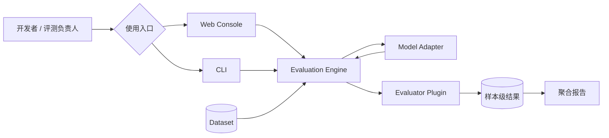
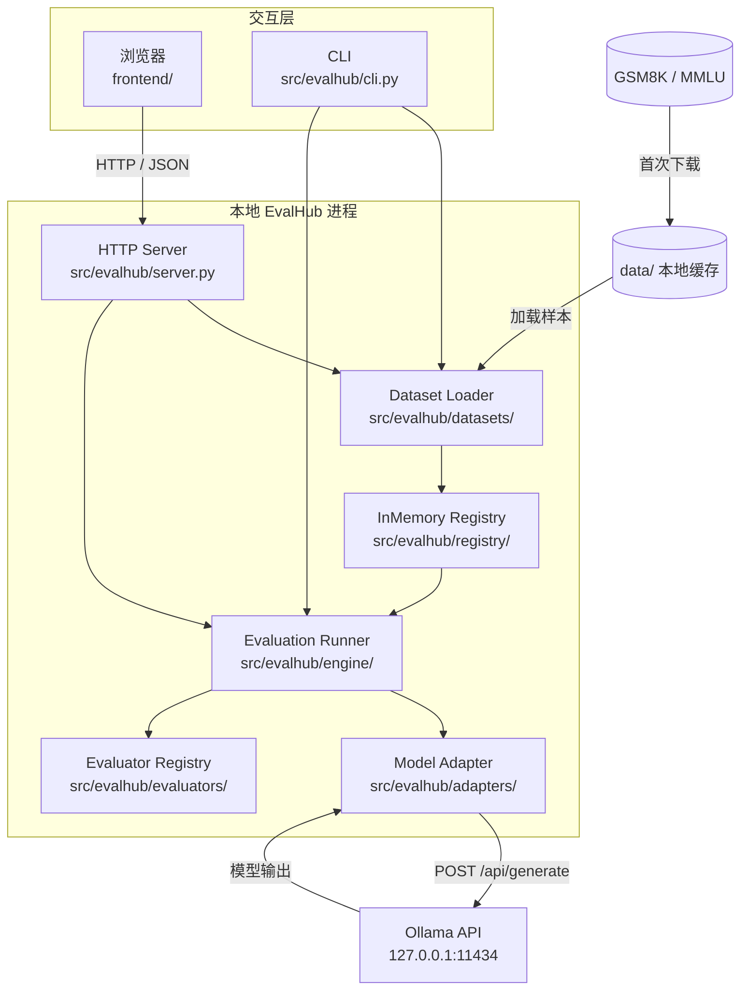

# EvalHub

EvalHub 是一个面向企业大模型研发流程的统一评测基础设施。它的目标不是做简单 CRUD 后台，而是把 Model Registry、Dataset Registry、Benchmark Registry、Evaluator Plugin、Evaluation Engine、Result Store、Report、Leaderboard 和 Release Gate 串成一条可追踪、可复现、可扩展的评测链路。

当前仓库先落地 Python 后端核心骨架和一个本地 Web 控制台，保证真实公开 Benchmark 可以下载到本地、用本地模型服务试跑，并产出样本级结果和聚合分数。后续再接入 FastAPI、PostgreSQL、Celery、RabbitMQ、MinIO 和 React Console。

## 当前能力

- 模型适配器抽象：统一不同模型、本地推理服务和 API 模型的调用入口。
- 评测器插件抽象：内置 `exact_match`，后续可扩展 Rouge、BLEU、LLM-as-a-Judge、Safety、Agent Eval。
- Benchmark 配置模型：表达 Dataset + Evaluator + Config 的组合。
- Evaluation Runner：按样本执行推理、打分、聚合报告。
- 内存 Registry：用于 MVP、单元测试和后续数据库 Repository 的接口参考。
- 真实数据集：支持下载并本地缓存 `GSM8K test` 和 `MMLU test`。
- 本地模型：支持调用 Ollama 本地模型服务。
- 本地控制台：一个 Python 进程同时提供前端页面和后端 API。

## 30 秒理解 EvalHub



### 当前本地 MVP 架构



当前 MVP 是单机、同步、零前端构建依赖的实现。Web 与 CLI 复用同一条 Python 评测核心链路。

`data/` 和 Ollama 都在本机；本图只展示当前实现，不把规划中的组件混入其中。

## 快速开始

```bash
cd /Users/nedonion/PycharmProjects/evalhub
.venv/bin/python -m pip install -e ".[dev]"
.venv/bin/python -m pytest
evalhub run-example
```

如果暂时不安装依赖，也可以直接运行核心示例：

```bash
cd /Users/nedonion/PycharmProjects/evalhub
.venv/bin/python run_evalhub.py run-example
```

或者显式指定 `src` 包路径：

```bash
PYTHONPATH=src .venv/bin/python -m evalhub.cli run-example
```

## 真实 Benchmark 试跑

当前支持两个真实主流公开数据集：

- `gsm8k`：OpenAI Grade School Math，官方 GitHub `test.jsonl`。
- `mmlu`：Hendrycks MMLU，官方 `data.tar`，默认先跑 `abstract_algebra` 科目。

查看支持的数据集：

```bash
cd /Users/nedonion/PycharmProjects/evalhub
.venv/bin/python run_evalhub.py list-datasets
```

下载并缓存真实数据集：

```bash
.venv/bin/python run_evalhub.py prepare-dataset gsm8k
.venv/bin/python run_evalhub.py prepare-dataset mmlu
```

使用 Ollama 本地模型跑 GSM8K：

```bash
ollama serve
ollama pull qwen2.5:0.5b

cd /Users/nedonion/PycharmProjects/evalhub
.venv/bin/python run_evalhub.py run-benchmark \
  --dataset gsm8k \
  --adapter ollama \
  --model qwen2.5:0.5b \
  --limit 5
```

不传 `--limit` 时会默认跑完整数据集：

```bash
.venv/bin/python run_evalhub.py run-benchmark \
  --dataset gsm8k \
  --adapter ollama \
  --model qwen2.5:0.5b
```

使用 Ollama 本地模型跑 MMLU：

```bash
.venv/bin/python run_evalhub.py run-benchmark \
  --dataset mmlu \
  --adapter ollama \
  --model qwen2.5:0.5b \
  --subject abstract_algebra \
  --limit 5
```

`--adapter oracle` 只用于验证 EvalHub 管线是否正常，不代表真实模型评测。

Ollama 安装和故障排查见：[docs/OLLAMA.md](docs/OLLAMA.md)。
Codex 对话后的文档沉淀流程见：[docs/CODEX_WORKFLOW.md](docs/CODEX_WORKFLOW.md)。

## 本地前后端一键启动

```bash
cd /Users/nedonion/PycharmProjects/evalhub
./scripts/start_local.sh
```

打开：

```text
http://127.0.0.1:8000
```

这个命令会启动一个本地 Python 服务，同时提供：

- 前端页面：`frontend/index.html`
- 后端 API：`/api/health`、`/api/datasets`、`/api/datasets/prepare`、`/api/evaluations/run`
- Ollama 状态 API：`/api/ollama/status`

如果检测到 Ollama 已安装但未运行，脚本会尝试自动启动 `ollama serve`，日志写入 `.runtime/ollama.log`。不需要 npm、React 构建或 FastAPI 依赖。

## 目录结构

```text
evalhub/
├── docs/
│   ├── PRD.md
│   ├── ARCHITECTURE.md
│   ├── API.md
│   ├── DATA_MODEL.md
│   ├── LOCAL_RUN.md
│   ├── OLLAMA.md
│   ├── CODEX_WORKFLOW.md
│   └── ROADMAP.md
├── examples/
│   ├── benchmarks/
│   └── datasets/
├── frontend/
├── scripts/
├── src/evalhub/
│   ├── adapters/
│   ├── api/
│   ├── datasets/
│   ├── domain/
│   ├── engine/
│   ├── evaluators/
│   └── registry/
└── tests/
```

## 下一步建议

1. 把内存 Registry 替换成 SQLAlchemy + PostgreSQL。
2. 用 FastAPI 暴露 Model/Dataset/Benchmark/Job/Result API。
3. 引入 Celery Worker，实现异步 Evaluation Job。
4. 接入对象存储，保存 Dataset、Report、Trace 和 Artifact。
5. 增加 LLM-as-a-Judge、Leaderboard、Release Gate 和 Agent Evaluation。
