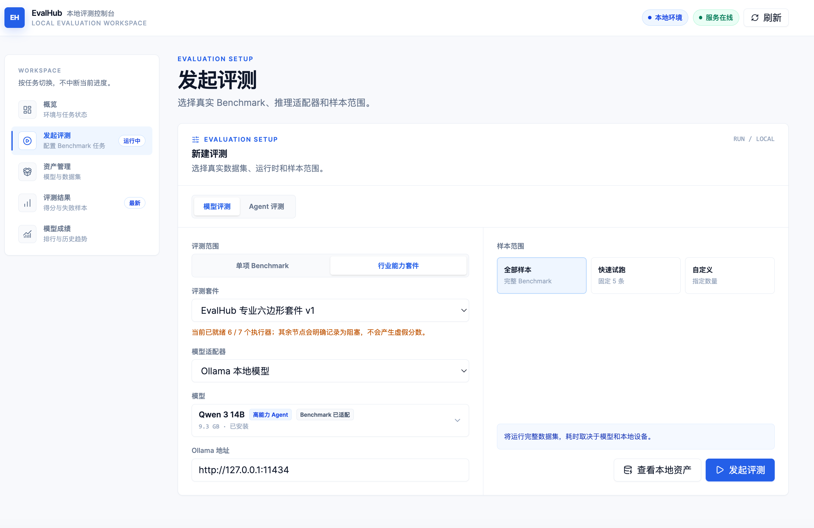
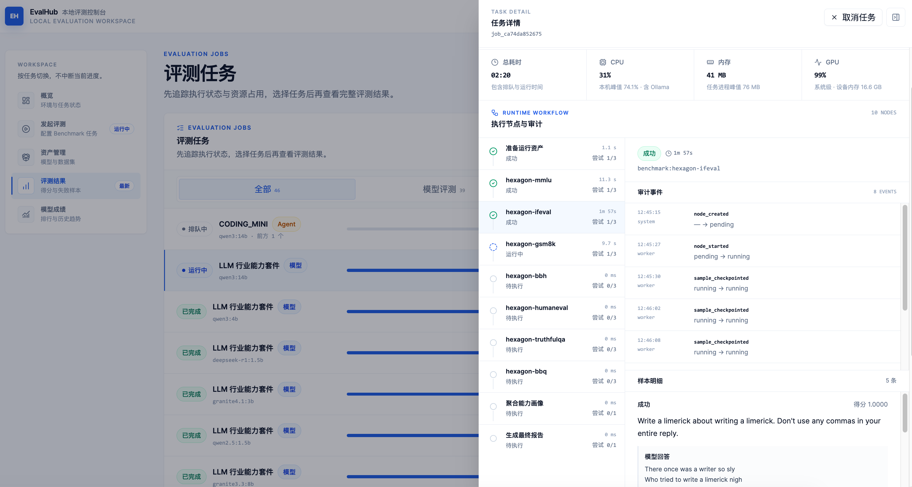
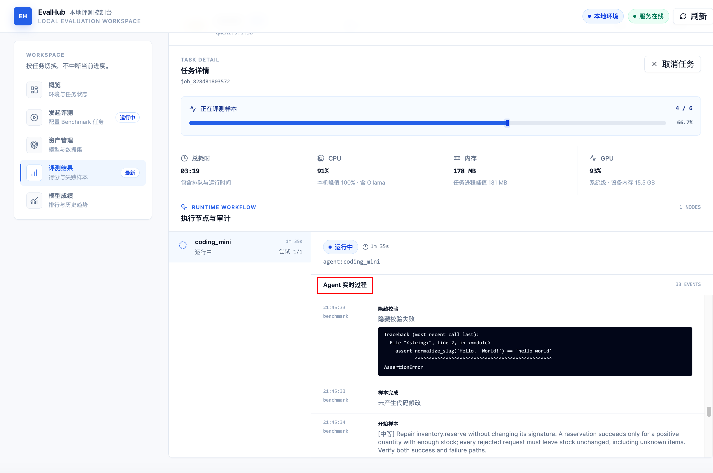
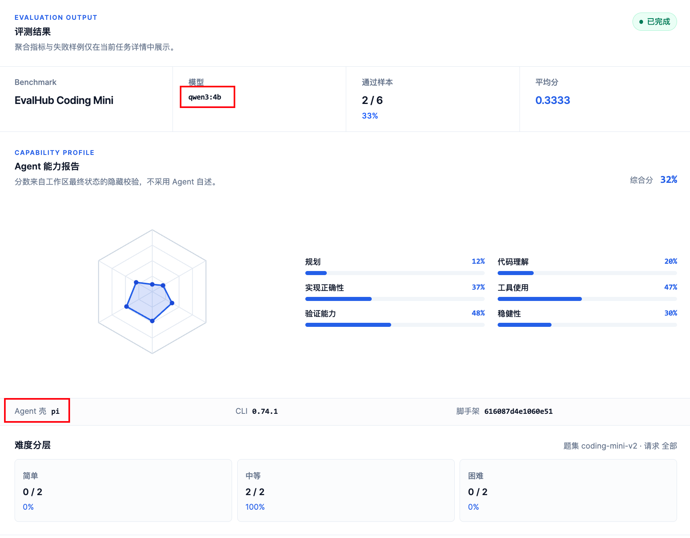
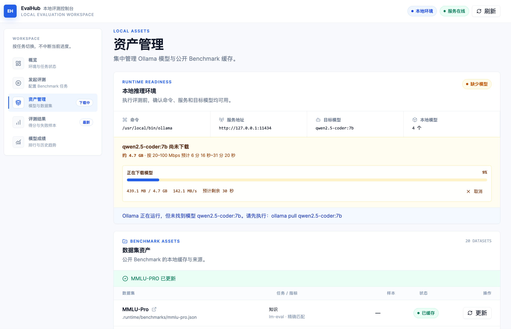
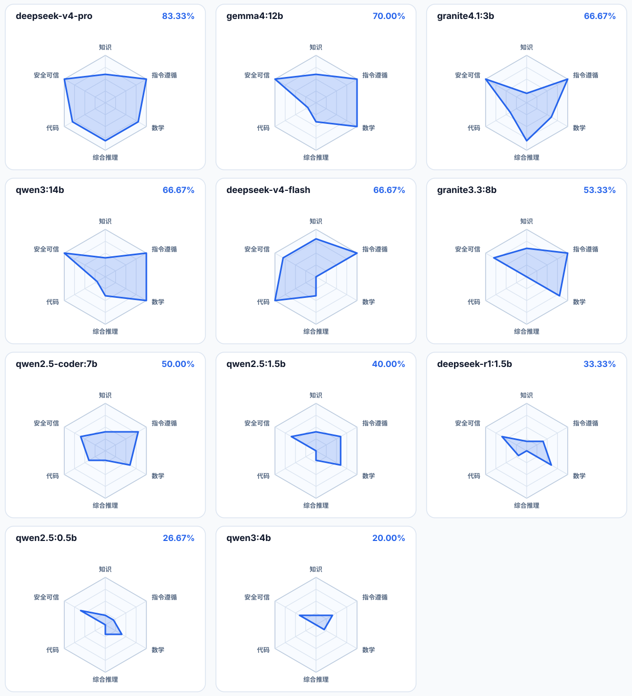
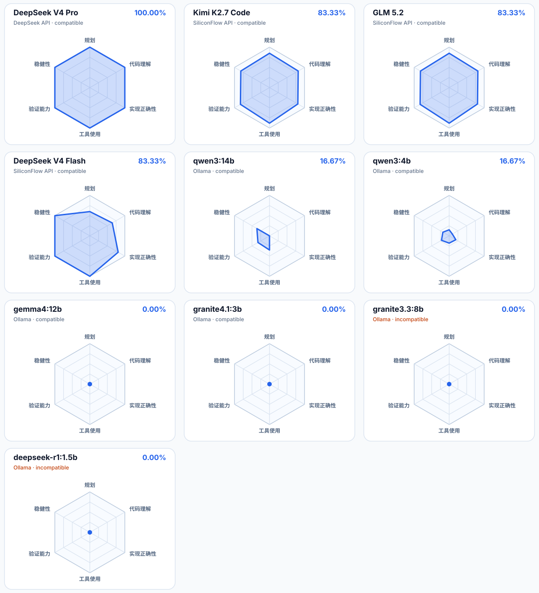
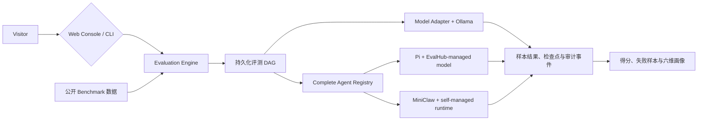

<h1 align="center">EvalHub</h1>

<p align="center"><strong>Local-first Benchmark evaluation for LLMs and coding agents.</strong></p>

<p align="center">
  把公开数据集、本地模型、持久化工作流、样本证据和六维能力报告放进同一条可复现评测链路。
</p>

<p align="center">
  
  
  
</p>

<p align="center">
  <a href="#features">功能</a> ·
  <a href="#quick-start">快速开始</a> ·
  <a href="#screenshots">界面预览</a> ·
  <a href="#model-benchmark-report">模型报告</a> ·
  <a href="#agent-benchmark-report">Agent 报告</a> ·
  <a href="#how-it-works">工作原理</a> ·
  <a href="#benchmarks">评测范围</a> ·
  <a href="#documentation">文档</a>
</p>

EvalHub 是一个面向本地大模型研发的统一评测平台。它既能运行真实公开 Benchmark，也能让 Pi、
MiniClaw 等完整编码 Agent 接受同一套任务和隐藏 Verifier；每次运行都会保留样本结果、节点状态、
资源指标和审计证据，而不只给出一个最终分数。

<a href="https://raw.githubusercontent.com/NEDONION/evalhub/main/docs/assets/screenshots/model-evaluation-setup.png">
  
</a>

<p align="center"><sub>从同一控制台选择 Benchmark、模型和样本范围，并跟踪完整评测过程。点击图片查看原图。</sub></p>

## Features

| 能力 | EvalHub 当前提供的行为 |
| --- | --- |
| **模型 Benchmark** | 运行真实公开数据集，通过 Ollama 调用本地模型，保留样本级结果和聚合得分 |
| **Agent 评测** | 通过受控 Registry 运行 Pi CLI 或 MiniClaw 完整 Agent，共用 Coding Mini 和隐藏 Verifier |
| **可复现工作流** | 使用持久化 DAG 记录节点状态、检查点、重试、资源指标和审计事件 |
| **六维能力画像** | 分别展示知识、指令遵循、数学、综合推理、代码和安全可信，不把未评测维度算作 0 分 |

## Quick Start

### Prerequisites

- Python 3.11+
- Node.js 20+ 与 npm
- [Ollama](https://ollama.com/)：本地模型推理
- Docker Desktop：HumanEval、MBPP 等代码类 Benchmark

```bash
git clone https://github.com/NEDONION/evalhub.git
cd evalhub
python3 -m venv .venv
.venv/bin/python -m pip install -e ".[dev]"
npm --prefix frontend install
./scripts/start_local.sh
```

启动后打开 [http://127.0.0.1:8000](http://127.0.0.1:8000)。脚本会构建 React 控制台、准备固定版本的
Benchmark 运行时，并在本机可用时连接或启动 Ollama。完整安装、Agent Runtime、CLI 和故障排查见
[本地运行指南](docs/getting-started/20260804_本地运行指南.md)。

要评测相邻目录之外的 MiniClaw，可在启动前显式指定项目根目录；EvalHub 不读取或保存 MiniClaw
的 API Key，模型、Provider、工具、策略和记忆继续由 MiniClaw 自己管理：

```bash
export EVALHUB_MINICLAW_ROOT=/absolute/path/to/miniclaw
./scripts/start_local.sh
```

无头评测只会对已经通过 MiniClaw 策略校验、且由 EvalHub 再次确认位于当前临时样本工作区内的
`write_file` / `edit_file` 做一次性批准；命令、网络、记忆和工作区外操作仍沿用 MiniClaw 的审批边界。

## Screenshots

<table>
  <tr>
    <td width="50%" valign="top">
      <strong>模型 Benchmark 工作流</strong><br />
      <sub>查看任务 DAG、节点进度、资源指标和执行审计。</sub><br /><br />
      <a href="https://raw.githubusercontent.com/NEDONION/evalhub/main/docs/assets/screenshots/model-benchmark-workflow.png">
        
      </a>
    </td>
    <td width="50%" valign="top">
      <strong>Agent 失败样本审计</strong><br />
      <sub>回放 Agent 消息、工具调用、文件变化和失败分类。</sub><br /><br />
      <a href="https://raw.githubusercontent.com/NEDONION/evalhub/main/docs/assets/screenshots/agent-failure-audit.png">
        
      </a>
    </td>
  </tr>
  <tr>
    <td width="50%" valign="top">
      <strong>Agent 六维评测结果</strong><br />
      <sub>按规划、理解、实现、工具、验证和稳健性查看能力画像。</sub><br /><br />
      <a href="https://raw.githubusercontent.com/NEDONION/evalhub/main/docs/assets/screenshots/agent-six-dimension-result.png">
        
      </a>
    </td>
    <td width="50%" valign="top">
      <strong>模型与数据集资产</strong><br />
      <sub>管理 Ollama 模型下载以及真实 Benchmark 数据缓存。</sub><br /><br />
      <a href="https://raw.githubusercontent.com/NEDONION/evalhub/main/docs/assets/screenshots/model-dataset-assets.png">
        
      </a>
    </td>
  </tr>
</table>

## Model Benchmark Report

以下结果是 2026-08-05 在同一份 `evalhub-hexagon-v1` `1.2.0` 固定套件上的实测快照：
9 个本地 Ollama 模型与 2 个线上 DeepSeek 模型均完成 30/30 个样本，共执行 330 次模型评测。
综合分为通过样本数除以 30；每个维度包含 5 个样本，因此单题会使该维度变化 20 分。

| 排名 | 模型 | 运行方式 | 通过样本 | 综合分 |
| ---: | --- | --- | ---: | ---: |
| 1 | `deepseek-v4-pro` | DeepSeek API | 25 / 30 | **83.33%** |
| 2 | `gemma4:12b` | Ollama | 21 / 30 | **70.00%** |
| 3 | `granite4.1:3b` | Ollama | 20 / 30 | **66.67%** |
| 3 | `qwen3:14b` | Ollama | 20 / 30 | **66.67%** |
| 3 | `deepseek-v4-flash` | DeepSeek API | 20 / 30 | **66.67%** |
| 6 | `granite3.3:8b` | Ollama | 16 / 30 | **53.33%** |
| 7 | `qwen2.5-coder:7b` | Ollama | 15 / 30 | **50.00%** |
| 8 | `qwen2.5:1.5b` | Ollama | 12 / 30 | **40.00%** |
| 9 | `deepseek-r1:1.5b` | Ollama | 10 / 30 | **33.33%** |
| 10 | `qwen2.5:0.5b` | Ollama | 8 / 30 | **26.67%** |
| 11 | `qwen3:4b` | Ollama | 6 / 30 | **20.00%** |

<a href="https://raw.githubusercontent.com/NEDONION/evalhub/main/docs/assets/hexagon-model-comparison.svg">
  
</a>

六边形均使用相同的 0–100 刻度，轴顺序与 EvalHub 控制台一致：知识、指令遵循、数学、综合推理、
代码、安全可信。每个能力多边形都是闭合路径，可直接比较轮廓和短板。

| 模型 | 知识 | 指令遵循 | 数学 | 综合推理 | 代码 | 安全可信 |
| --- | ---: | ---: | ---: | ---: | ---: | ---: |
| `deepseek-v4-pro` | 60 | 100 | 80 | 80 | 80 | 100 |
| `gemma4:12b` | 60 | 100 | 100 | 40 | 20 | 100 |
| `granite4.1:3b` | 20 | 100 | 60 | 80 | 40 | 100 |
| `qwen3:14b` | 40 | 100 | 100 | 40 | 20 | 100 |
| `deepseek-v4-flash` | 80 | 100 | 0 | 40 | 100 | 80 |
| `granite3.3:8b` | 60 | 100 | 80 | 0 | 0 | 80 |
| `qwen2.5-coder:7b` | 40 | 80 | 60 | 20 | 40 | 60 |
| `qwen2.5:1.5b` | 40 | 60 | 60 | 20 | 0 | 60 |
| `deepseek-r1:1.5b` | 20 | 40 | 60 | 0 | 20 | 60 |
| `qwen2.5:0.5b` | 20 | 20 | 40 | 20 | 0 | 60 |
| `qwen3:4b` | 20 | 40 | 20 | 0 | 0 | 40 |

本轮结果中，`deepseek-v4-pro` 的总分和轮廓完整性最高；本地模型里 `gemma4:12b` 总分最高。
`deepseek-v4-flash` 呈现明显的代码强、数学弱特征。指令遵循在多数中大型模型上已经饱和，而代码与
综合推理更能拉开差异。

> [!NOTE]
> 这是一组 Mini Suite 能力画像，不是上游 Benchmark 的完整官方成绩。普通 Ollama、显式
> `think=false` 的思考模型和 OpenAI-compatible DeepSeek API 属于三个生成协议组；它们使用同一套
> 样本和评分器，但跨协议组排名仅供观察。生成温度均为 0，MMLU/IFEval/GSM8K/BBH/HumanEval/
> TruthfulQA/BBQ 的最大生成预算依次为 256/1024/512/512/1024/256/256 tokens，HumanEval 使用固定
> Docker 镜像执行隐藏测试。本轮基线提交为 `4e9107c`。

## Agent Benchmark Report

以下结果是 2026-08-05 在同一份 `coding-mini-v3` 上的实测快照：固定 Pi Agent 壳，只替换底层
模型，4 个 API 模型与 6 个本地 Ollama 模型均完成 6/6 个正式样例，共完成 60 次 Agent 任务。
正式题合计通过 23 次、调用工具 311 次、发生 60 次工具错误。协议预检独立执行，不计入通过率和
工具调用汇总。

| 排名 | 模型 | 运行方式 | 协议预检 | 通过样例 | 工具调用 | 工具错误 | 平均耗时/题 |
| ---: | --- | --- | --- | ---: | ---: | ---: | ---: |
| 1 | `deepseek-v4-pro` | DeepSeek API | compatible | 6 / 6 | 64 | 10 | 61.78 s |
| 2 | `moonshotai/Kimi-K2.7-Code` | SiliconFlow API | compatible | 5 / 6 | 59 | 11 | 83.00 s |
| 2 | `zai-org/GLM-5.2` | SiliconFlow API | compatible | 5 / 6 | 62 | 9 | 122.41 s |
| 2 | `deepseek-ai/DeepSeek-V4-Flash` | SiliconFlow API | compatible | 5 / 6 | 75 | 19 | 133.97 s |
| 5 | `qwen3:14b` | Ollama | compatible | 1 / 6 | 7 | 2 | 175.23 s |
| 5 | `qwen3:4b` | Ollama | compatible | 1 / 6 | 13 | 1 | 169.05 s |
| 7 | `gemma4:12b` | Ollama | compatible | 0 / 6 | 19 | 0 | 155.52 s |
| 7 | `granite4.1:3b` | Ollama | compatible | 0 / 6 | 12 | 8 | 11.73 s |
| 7 | `granite3.3:8b` | Ollama | incompatible | 0 / 6 | 0 | 0 | 17.42 s |
| 7 | `deepseek-r1:1.5b` | Ollama | incompatible | 0 / 6 | 0 | 0 | 30.11 s |

<a href="https://raw.githubusercontent.com/NEDONION/evalhub/main/docs/assets/agent-model-comparison.svg">
  
</a>

六边形共用 0–100 刻度，轴顺序为规划、代码理解、实现正确性、工具使用、验证能力、稳健性；所有
能力路径均为闭合多边形。点击图片可直接打开仓库中的 SVG 原图并放大。

| 模型 | 规划 | 代码理解 | 实现正确性 | 工具使用 | 验证能力 | 稳健性 |
| --- | ---: | ---: | ---: | ---: | ---: | ---: |
| `deepseek-v4-pro` | 100 | 100 | 100 | 100 | 100 | 100 |
| `moonshotai/Kimi-K2.7-Code` | 85 | 82 | 81 | 88 | 83 | 82 |
| `zai-org/GLM-5.2` | 85 | 82 | 81 | 88 | 83 | 82 |
| `deepseek-ai/DeepSeek-V4-Flash` | 60 | 64 | 81 | 100 | 100 | 100 |
| `qwen3:14b` | 0 | 0 | 0 | 35 | 33 | 36 |
| `qwen3:4b` | 15 | 9 | 19 | 18 | 22 | 18 |
| `gemma4:12b` | 0 | 0 | 0 | 0 | 0 | 0 |
| `granite4.1:3b` | 0 | 0 | 0 | 0 | 0 | 0 |
| `granite3.3:8b` | 0 | 0 | 0 | 0 | 0 | 0 |
| `deepseek-r1:1.5b` | 0 | 0 | 0 | 0 | 0 | 0 |

过程证据能解释同为 0 分的不同原因：`gemma4:12b` 和 `granite4.1:3b` 已通过协议预检并实际调用
工具，但最终工作区未通过隐藏校验；`granite3.3:8b` 与 `deepseek-r1:1.5b` 未完成结构化工具协议，
因此被标记为 `incompatible`。`qwen3:14b` 与 `qwen3:4b` 均为 `compatible`，其低分不是协议误判。

> [!NOTE]
> 这是一组 6 题日常诊断集成绩，不是官方 SWE-bench 成绩。全部运行使用 Pi CLI `0.74.1`、脚手架
> `d8a7cbaf0d432018` 和隐藏工作区校验；API 延迟与本机 Ollama 耗时受不同硬件和网络影响，不应把
> 耗时直接解释为模型推理速度。独立的 6 题 SWE-bench Verified Mini 只会在官方 Docker Harness
> 的 gold patch 先达到 6/6 后发布成绩，本轮未用未就绪结果补零或混入排名。

## How It Works



Web 与 CLI 复用同一条 Python 评测核心链路。模型任务和 Agent 任务进入同一个持久化任务中心，运行中
可以查看进度和资源，结束后可以回放节点证据。模型评测按模型聚合；Agent 评测按完整候选聚合，
例如 `Pi · qwen` 与 `MiniClaw`，两种口径不会混排。

## Benchmarks

| 入口 | 当前范围 | 主要输出 |
| --- | --- | --- |
| **单项模型 Benchmark** | MMLU、GSM8K、IFEval、HumanEval、MBPP 等已注册公开评测 | 官方或固定评测指标、样本结果、失败样本 |
| **Hexagon Mini Suite** | `evalhub-hexagon-v1` `1.2.0`，固定 30 次模型调用，覆盖六个能力维度 | 六维画像、覆盖率和可复现性元数据 |
| **Coding Mini Agent** | `coding-mini-v3`，Pi CLI / MiniClaw、6 道分级编码任务、协议预检和隐藏 Verifier | 通过率、难度报告、Agent 六维画像和过程指标 |
| **SWE-bench Verified Mini** | 固定 6 个官方实例；仅在官方 Docker Harness 的 gold patch 6/6 后开放 | 独立官方任务报告，不与 Coding Mini 混排 |

> [!IMPORTANT]
> Hexagon Mini Suite 是本地能力画像，不是七个上游 Benchmark 的完整官方分数，不能直接复述为论文
> 或排行榜成绩。代码评测需要 Docker；当前 Ollama 适配器缺少 prompt logprobs，因此部分单项官方
> 协议会明确阻塞，而不会用生成式近似产生虚假分数。

Hexagon 1.2 将模型传输和答案评分分开冻结：已登记的思考模型在 Ollama `/api/generate` 顶层使用
`think=false`，七项 Benchmark 分别使用选择题、IFEval 原文规则、数值、BBH 子任务和 HumanEval
代码协议。空最终回答会阻塞节点，不再被保存为零分；非空但答错的回答仍按统一标准记零分。

## Project Status

EvalHub 当前是 **Local MVP**：React 控制台、Python 服务、SQLite 持久化任务、公开数据集缓存和
Ollama 本地推理均已落地。它适合本地研发与可复现实验，但尚未定位为多租户生产评测服务。

## Documentation

| 文档 | 内容 |
| --- | --- |
| [文档中心](docs/README.md) | 全部使用、架构、产品和开发文档的入口 |
| [本地运行指南](docs/getting-started/20260804_本地运行指南.md) | 安装、Web、CLI、Agent Runtime 与故障排查 |
| [系统架构](docs/architecture/20260804_系统架构.md) | 模块边界、数据流和扩展原则 |
| [Agent 评测路线图](docs/product/20260804_Agent评测路线图.md) | Agent Benchmark 的当前边界和演进方向 |
| [六边形评测复盘](docs/development/20260804_专业六边形评测集建设与交付复盘.md) | 数据集固定、评分安全、恢复和验证经验 |

## Contributing

欢迎通过 [Issues](https://github.com/NEDONION/evalhub/issues) 提交问题和建议，也欢迎提交小而聚焦的
Pull Request。提交前请运行：

```bash
.venv/bin/python -m ruff check .
.venv/bin/python -m pytest
```

项目的开发约束与常用命令见 [AGENTS.md](AGENTS.md)。
