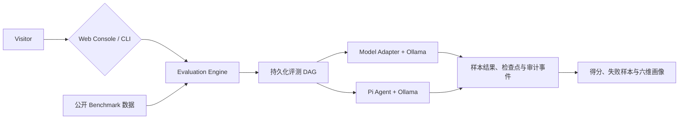

<h1 align="center">EvalHub</h1>

<p align="center"><strong>Local-first Benchmark evaluation for LLMs and coding agents.</strong></p>

<p align="center">
  把公开数据集、本地模型、持久化工作流、样本证据和六维能力报告放进同一条可复现评测链路。
</p>

<p align="center">
  
  
  
</p>

<p align="center">
  <a href="#features">功能</a> ·
  <a href="#quick-start">快速开始</a> ·
  <a href="#screenshots">界面预览</a> ·
  <a href="#how-it-works">工作原理</a> ·
  <a href="#benchmarks">评测范围</a> ·
  <a href="#documentation">文档</a>
</p>

EvalHub 是一个面向本地大模型研发的统一评测平台。它既能运行真实公开 Benchmark，也能在固定
Agent 壳、任务和隐藏 Verifier 下比较编码 Agent 的基模能力；每次运行都会保留样本结果、节点状态、
资源指标和审计证据，而不只给出一个最终分数。


<p align="center"><sub>从同一控制台选择 Benchmark、模型和样本范围，并跟踪完整评测过程。</sub></p>

## Features

| 能力 | EvalHub 当前提供的行为 |
| --- | --- |
| **模型 Benchmark** | 运行真实公开数据集，通过 Ollama 调用本地模型，保留样本级结果和聚合得分 |
| **Agent 评测** | 固定 Pi CLI Agent 壳、Coding Mini 任务和隐藏 Verifier，只替换底层基模 |
| **可复现工作流** | 使用持久化 DAG 记录节点状态、检查点、重试、资源指标和审计事件 |
| **六维能力画像** | 分别展示知识、指令遵循、数学、综合推理、代码和安全可信，不把未评测维度算作 0 分 |

## Quick Start

### Prerequisites

- Python 3.11+
- Node.js 20+ 与 npm
- [Ollama](https://ollama.com/)：本地模型推理
- Docker Desktop：HumanEval、MBPP 等代码类 Benchmark

```bash
git clone https://github.com/NEDONION/evalhub.git
cd evalhub
python3 -m venv .venv
.venv/bin/python -m pip install -e ".[dev]"
npm --prefix frontend install
./scripts/start_local.sh
```

启动后打开 [http://127.0.0.1:8000](http://127.0.0.1:8000)。脚本会构建 React 控制台、准备固定版本的
Benchmark 运行时，并在本机可用时连接或启动 Ollama。完整安装、Agent Runtime、CLI 和故障排查见
[本地运行指南](docs/getting-started/20260804_本地运行指南.md)。

## Screenshots

<table>
  <tr>
    <td width="50%" valign="top">
      <strong>模型 Benchmark 工作流</strong><br />
      <sub>查看任务 DAG、节点进度、资源指标和执行审计。</sub><br /><br />
      

    </td>
    <td width="50%" valign="top">
      <strong>Agent 失败样本审计</strong><br />
      <sub>回放 Agent 消息、工具调用、文件变化和失败分类。</sub><br /><br />
      
    </td>
  </tr>
  <tr>
    <td width="50%" valign="top">
      <strong>Agent 六维评测结果</strong><br />
      <sub>按规划、理解、实现、工具、验证和稳健性查看能力画像。</sub><br /><br />
      
    </td>
    <td width="50%" valign="top">
      <strong>模型与数据集资产</strong><br />
      <sub>管理 Ollama 模型下载以及真实 Benchmark 数据缓存。</sub><br /><br />
      
    </td>
  </tr>
</table>

## How It Works



Web 与 CLI 复用同一条 Python 评测核心链路。模型任务和 Agent 任务进入同一个持久化任务中心，运行中
可以查看进度和资源，结束后可以回放节点证据，并按模型评测或固定 Agent 壳的独立口径比较同一
Benchmark 或 Suite 下的基模成绩。

## Benchmarks

| 入口 | 当前范围 | 主要输出 |
| --- | --- | --- |
| **单项模型 Benchmark** | MMLU、GSM8K、IFEval、HumanEval、MBPP 等已注册公开评测 | 官方或固定评测指标、样本结果、失败样本 |
| **Hexagon Mini Suite** | `evalhub-hexagon-v1` `1.2.0`，固定 30 次模型调用，覆盖六个能力维度 | 六维画像、覆盖率和可复现性元数据 |
| **Coding Mini Agent** | `coding-mini-v2`，固定 Pi CLI 壳、6 道分级编码任务和隐藏 Verifier | 通过率、难度报告、Agent 六维画像和过程审计 |

> [!IMPORTANT]
> Hexagon Mini Suite 是本地能力画像，不是七个上游 Benchmark 的完整官方分数，不能直接复述为论文
> 或排行榜成绩。代码评测需要 Docker；当前 Ollama 适配器缺少 prompt logprobs，因此部分单项官方
> 协议会明确阻塞，而不会用生成式近似产生虚假分数。

Hexagon 1.2 将模型传输和答案评分分开冻结：已登记的思考模型在 Ollama `/api/generate` 顶层使用
`think=false`，七项 Benchmark 分别使用选择题、IFEval 原文规则、数值、BBH 子任务和 HumanEval
代码协议。空最终回答会阻塞节点，不再被保存为零分；非空但答错的回答仍按统一标准记零分。

## Project Status

EvalHub 当前是 **Local MVP**：React 控制台、Python 服务、SQLite 持久化任务、公开数据集缓存和
Ollama 本地推理均已落地。它适合本地研发与可复现实验，但尚未定位为多租户生产评测服务。

## Documentation

| 文档 | 内容 |
| --- | --- |
| [文档中心](docs/README.md) | 全部使用、架构、产品和开发文档的入口 |
| [本地运行指南](docs/getting-started/20260804_本地运行指南.md) | 安装、Web、CLI、Agent Runtime 与故障排查 |
| [系统架构](docs/architecture/20260804_系统架构.md) | 模块边界、数据流和扩展原则 |
| [Agent 评测路线图](docs/product/20260804_Agent评测路线图.md) | Agent Benchmark 的当前边界和演进方向 |
| [六边形评测复盘](docs/development/20260804_专业六边形评测集建设与交付复盘.md) | 数据集固定、评分安全、恢复和验证经验 |

## Contributing

欢迎通过 [Issues](https://github.com/NEDONION/evalhub/issues) 提交问题和建议，也欢迎提交小而聚焦的
Pull Request。提交前请运行：

```bash
.venv/bin/python -m ruff check .
.venv/bin/python -m pytest
```

项目的开发约束与常用命令见 [AGENTS.md](AGENTS.md)。
