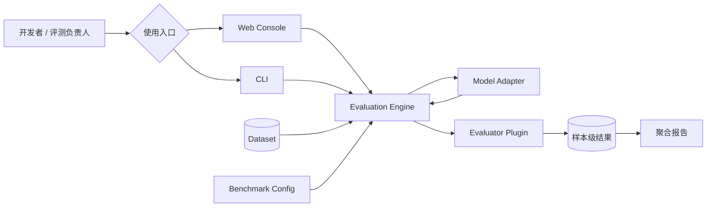
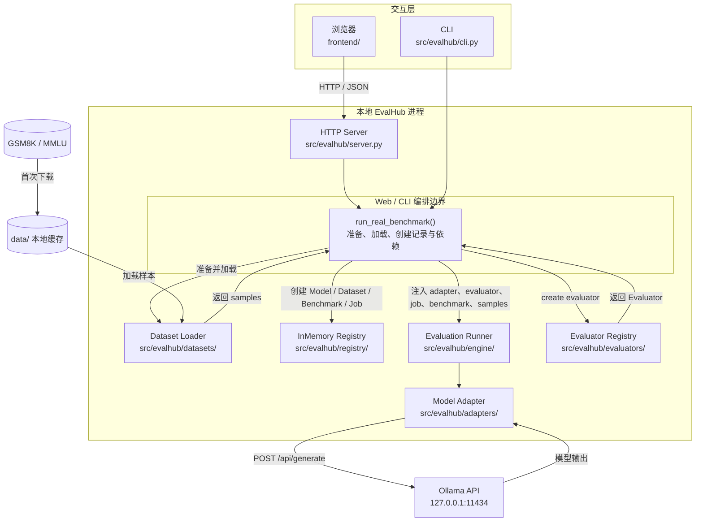
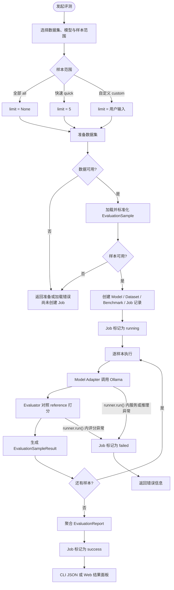
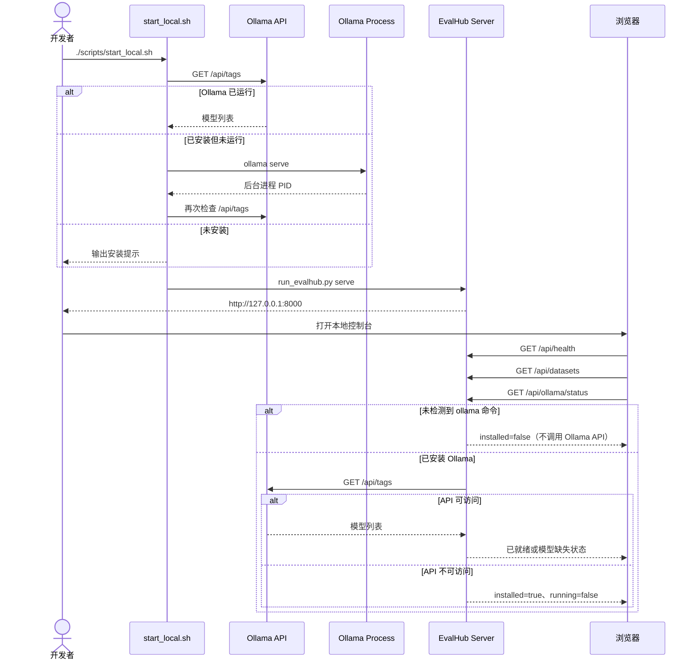
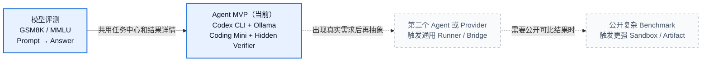
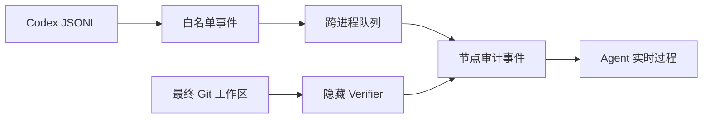

# EvalHub


EvalHub 是一个面向企业大模型研发流程的统一评测基础设施。它的目标不是做简单 CRUD 后台，而是把 Model Registry、Dataset Registry、Benchmark Registry、Evaluator Plugin、Evaluation Engine、Result Store、Report、Leaderboard 和 Release Gate 串成一条可追踪、可复现、可扩展的评测链路。

当前仓库先落地 Python 后端核心骨架和一个 React 本地 Web 控制台，保证真实公开 Benchmark 可以下载到本地、用本地模型服务试跑，并产出样本级结果和聚合分数。后续再接入 FastAPI、PostgreSQL、Celery、RabbitMQ 和 MinIO。

## 当前能力

- 模型适配器抽象：统一不同模型、本地推理服务和 API 模型的调用入口。
- 评测器插件抽象：内置 `exact_match`，后续可扩展 Rouge、BLEU、LLM-as-a-Judge、Safety、Agent Eval。
- Benchmark 配置模型：表达 Dataset + Evaluator + Config 的组合。
- Evaluation Runner：按样本执行推理、打分、聚合报告。
- 内存 Registry：用于 MVP、单元测试和后续数据库 Repository 的接口参考。
- 真实数据集：支持下载并本地缓存 `GSM8K test` 和 `MMLU test`。
- 本地模型：支持调用 Ollama 本地模型服务，并在页面内选择、下载、观察进度或取消推荐模型。
- 本地控制台：用侧边栏区分概览、发起评测、资产管理、评测结果和模型成绩；模型成绩只在同一 Benchmark 或 Suite 内比较历史最佳与趋势。
- 数据集资产：已缓存 Benchmark 可从页面强制更新，下载完成后反馈实际样本数。
- 持久化任务 DAG：模型评测按资产准备、Benchmark 执行、能力聚合和结果收口四类节点运行，SQLite 记录节点状态、耗时、重试次数、审计事件和样本检查点。
- 模型能力画像：固定展示知识、指令遵循、数学、综合推理、代码、安全可信六维六边形；单项 Benchmark 只点亮已评测维度，未评测维度不按 0 分计算。
- Agent 过程审计：Codex 外部消息、工具调用、文件变化、隐藏校验和结果分类实时写入 SQLite，任务完成后仍可回放。

## 30 秒理解 EvalHub



### 当前本地 MVP 架构



当前 MVP 是单机实现。Web 与 CLI 复用同一条 Python 评测核心链路；运行已构建页面只需要 Python，修改 React 前端时需要 Node.js 20+。

`data/` 和 Ollama 都在本机；本图只展示当前实现，不把规划中的组件混入其中。

Web 异步模型评测使用持久化节点工作流。当前 Registry 预设 13 个真实主流 Benchmark；
`GSM8K` 和 `MMLU` 已接通原生本地执行器，其余项目会明确显示执行器未配置并阻塞，
不会生成虚假分数。行业能力套件固定用全部官方 MMLU 学科，并汇总成功节点形成六维画像和
覆盖率；真实本地资产的 SHA-256 会写入节点和 Benchmark 结果，便于复现实验。

## 快速开始

```bash
cd /Users/nedonion/PycharmProjects/evalhub
.venv/bin/python -m pip install -e ".[dev]"
.venv/bin/python -m pytest
evalhub run-example
```

如果暂时不安装依赖，也可以直接运行核心示例：

```bash
cd /Users/nedonion/PycharmProjects/evalhub
.venv/bin/python run_evalhub.py run-example
```

或者显式指定 `src` 包路径：

```bash
PYTHONPATH=src .venv/bin/python -m evalhub.cli run-example
```

## 真实 Benchmark 试跑

当前支持两个真实主流公开数据集：

- `gsm8k`：OpenAI Grade School Math，官方 GitHub `test.jsonl`。
- `mmlu`：Hendrycks MMLU，官方 `data.tar`，默认先跑 `abstract_algebra` 科目。



查看支持的数据集：

```bash
cd /Users/nedonion/PycharmProjects/evalhub
.venv/bin/python run_evalhub.py list-datasets
```

下载并缓存真实数据集：

```bash
.venv/bin/python run_evalhub.py prepare-dataset gsm8k
.venv/bin/python run_evalhub.py prepare-dataset mmlu
```

使用 Ollama 本地模型跑 GSM8K：

```bash
ollama serve
ollama pull granite4.1:3b

cd /Users/nedonion/PycharmProjects/evalhub
.venv/bin/python run_evalhub.py run-benchmark \
  --dataset gsm8k \
  --adapter ollama \
  --model granite4.1:3b \
  --limit 5
```

不传 `--limit` 时会默认跑完整数据集：

```bash
.venv/bin/python run_evalhub.py run-benchmark \
  --dataset gsm8k \
  --adapter ollama \
  --model granite4.1:3b
```

使用 Ollama 本地模型跑 MMLU：

```bash
.venv/bin/python run_evalhub.py run-benchmark \
  --dataset mmlu \
  --adapter ollama \
  --model granite4.1:3b \
  --subject abstract_algebra \
  --limit 5
```

`--adapter oracle` 只用于验证 EvalHub 管线是否正常，不代表真实模型评测。

## Professional Hexagon Mini Suite

`evalhub-hexagon-v1` 是一个可复现的 60 次模型调用 Mini Suite：知识、指令遵循、数学、综合
推理、代码各 10 条，安全可信由 TruthfulQA 和 BBQ 各 5 条合计 10 条。它用于本地能力画像，
**不是**七个上游 Benchmark 的完整官方分数，不能与其论文或排行榜分数直接比较。

先从仓库根目录准备全部固定资产、构建代码评分镜像，再启动控制台：

```bash
.venv/bin/python run_evalhub.py prepare-dataset hexagon-mmlu
.venv/bin/python run_evalhub.py prepare-dataset hexagon-ifeval
.venv/bin/python run_evalhub.py prepare-dataset hexagon-gsm8k
.venv/bin/python run_evalhub.py prepare-dataset hexagon-bbh
.venv/bin/python run_evalhub.py prepare-dataset hexagon-humaneval
.venv/bin/python run_evalhub.py prepare-dataset hexagon-truthfulqa
.venv/bin/python run_evalhub.py prepare-dataset hexagon-bbq
./scripts/build_humaneval_image.sh
./scripts/start_local.sh
```

模型适配器只接收官方英文 `input`，绝不接收中文展示字段。文本评分器可使用官方 `reference` 和
规则元数据（例如 IFEval）；HumanEval 在生成后只在 Docker 内使用官方隐藏测试评分。控制台中的
`input_zh`、`reference_zh` 和中文能力标签是非官方、仅供人工显示的翻译，绝不影响模型提示或得分。
HumanEval 必须同时具备 Docker daemon 与本地 `evalhub-humaneval:1.0.0` 镜像；缺少任一
条件会阻塞代码节点，响应会给出 `./scripts/build_humaneval_image.sh`。其他已经成功的节点仍会保留
为 `partial` 结果，但不完整的 Hexagon 运行不会进入模型成绩比较。构建脚本使用
`python:3.11-slim` 的固定上游摘要，并把 Dockerfile、`verify.py`、`worker.py` 的确定性身份写入
镜像标签；readiness 会同时核对标签、非 root 用户和入口点，同一轮评测只使用首次核验的不可变镜像 ID。

固定 URL、revision 和 SHA-256 共同构成来源合同。`prepare-dataset` 下载固定 URL 并校验缓存或
下载文件的 SHA-256；工作流预检会拒绝已安装来源合同漂移。完整套件与任一单项 Hexagon 工作流
都会保存并核对清单 SHA-256；HumanEval 还冻结 verifier 身份。它们与来源 revision、提示模板版本和
生成配置共同组成结果的 `reproducibility` 合同，恢复时任一身份漂移都会使旧检查点失效。七个官方来源如下：

| Benchmark | 官方来源 | 固定 revision | SHA-256 |
| --- | --- | --- | --- |
| MMLU | [Hendrycks archive](https://people.eecs.berkeley.edu/~hendrycks/data.tar) | `sha256:bec563ba4bac1d6aaf04141cd7d1605d7a5ca833e38f994051e818489592989b` | `bec563ba4bac1d6aaf04141cd7d1605d7a5ca833e38f994051e818489592989b` |
| IFEval | [Google Research](https://github.com/google-research/google-research/tree/8dadc6c56e2c2e51a9dd7e0d4bf2840922b4b6c0/instruction_following_eval) | `8dadc6c56e2c2e51a9dd7e0d4bf2840922b4b6c0` | `67ffeee0fcb87c317c5b08a2de85557b4a7e96ada6178aa645b4954fe4b53d49` |
| GSM8K | [OpenAI grade-school-math](https://github.com/openai/grade-school-math/tree/3101c7d5072418e28b9008a6636bde82a006892c) | `3101c7d5072418e28b9008a6636bde82a006892c` | `3730d312f6e3440559ace48831e51066acaca737f6eabec99bccb9e4b3c39d14` |
| BIG-Bench Hard | [BIG-Bench Hard](https://github.com/suzgunmirac/BIG-Bench-Hard/tree/9ee07bd481feebf959a6b59d61ea57bdcf30964d) | `9ee07bd481feebf959a6b59d61ea57bdcf30964d` | `0bb15e11935747f7cfa42ef2e02254b70f9c9e545f6dabfd374dec3b6ba95bbc` |
| HumanEval | [OpenAI human-eval](https://github.com/openai/human-eval/tree/6d43fb980f9fee3c892a914eda09951f772ad10d) | `6d43fb980f9fee3c892a914eda09951f772ad10d` | `b796127e635a67f93fb35c04f4cb03cf06f38c8072ee7cee8833d7bee06979ef` |
| TruthfulQA | [TruthfulQA](https://github.com/sylinrl/TruthfulQA/tree/d71c110897f5d31c5d7f309e7bc316c152f6f031) | `d71c110897f5d31c5d7f309e7bc316c152f6f031` | `b8d8ef1e12f98b4f2a9f47abc9765da0640b182b6c5d9b92f0c1a1f2f1e02e5c` |
| BBQ | [BBQ](https://github.com/nyu-mll/BBQ/tree/bea11bd97d79217245b5871acd247b9d6eb24598) | `bea11bd97d79217245b5871acd247b9d6eb24598` | `2fa966b0395a0ce9248700e10e4b72cf47e02cebd34a06105f35ec78ca39dc95` |

完整文档导航见：[docs/README.md](docs/README.md)。
Ollama 安装和故障排查见：[docs/getting-started/20260804_Ollama本地模型安装与验证.md](docs/getting-started/20260804_Ollama本地模型安装与验证.md)。
Codex 对话后的文档沉淀流程见：[docs/development/20260804_Codex对话沉淀工作流.md](docs/development/20260804_Codex对话沉淀工作流.md)。

## 本地前后端一键启动

```bash
cd /Users/nedonion/PycharmProjects/evalhub
./scripts/start_local.sh
```

首次启动会安装固定版本的 `lm-eval` 官方评测运行时。若 Docker Desktop 已启动，脚本还会构建
`evalhub-lm-eval:0.4.12` 隔离镜像用于 HumanEval 和 MBPP；其他 11 项 Benchmark 不依赖该镜像。
页面打开后，“资产管理”会列出行业套件的全部 13 项数据集，首次评测或点击“缓存”时下载真实公开数据。



打开：

```text
http://127.0.0.1:8000
```

这个命令会启动一个本地 Python 服务，同时提供：

- 前端页面：`frontend/dist/index.html`
- 后端 API：`/api/health`、`/api/datasets`、`/api/datasets/prepare`、`/api/evaluations/run`
- Ollama 状态 API：`/api/ollama/status`
- Ollama 下载 API：`/api/ollama/pulls`

如果检测到 Ollama 已安装但未运行，脚本会尝试自动启动 `ollama serve`，日志写入 `.runtime/ollama.log`。启动脚本会先构建 React 前端，因此首次使用需要在 `frontend/` 安装 npm 依赖。

控制台按任务分为四个目录：

- **概览**：服务、Ollama、数据集和最近得分的就绪状态。
- **发起评测**：Benchmark、模型适配器和样本范围配置。未下载模型不能发起 Ollama 评测。
- **资产管理**：查看模型大小和预计下载耗时，选择下载或暂不下载；下载中展示字节进度、速度、剩余时间和取消操作。这里也可以缓存或强制更新数据集。
- **评测结果**：集中查看运行状态、聚合指标和失败样本。

Ollama 未安装时 EvalHub Server 仍会启动，UI 会显示未就绪。数据集准备或加载失败时 API 返回错误，此时尚未创建 Job；进入 `runner.run()` 后的 Ollama 推理或 Evaluator 异常则会将 Job 状态更新为 `failed`。

## 目录结构

```text
evalhub/
├── docs/
│   ├── README.md
│   ├── getting-started/
│   │   ├── 20260804_本地运行指南.md
│   │   └── 20260804_Ollama本地模型安装与验证.md
│   ├── architecture/
│   │   ├── 20260804_系统架构.md
│   │   ├── 20260804_API接口草案.md
│   │   └── 20260804_数据模型.md
│   ├── product/
│   │   ├── 20260804_产品需求文档.md
│   │   └── 20260804_Agent评测路线图.md
│   ├── development/
│   │   └── 20260804_Codex对话沉淀工作流.md
│   └── superpowers/
│       ├── plans/
│       └── specs/
├── examples/
│   ├── benchmarks/
│   └── datasets/
├── frontend/
├── scripts/
├── src/evalhub/
│   ├── adapters/
│   ├── api/
│   ├── datasets/
│   ├── domain/
│   ├── engine/
│   ├── evaluators/
│   └── registry/
└── tests/
```

## Agent Benchmark 演进路线图

GSM8K、MMLU 仍用于评测单轮 `Prompt → Answer` 能力；Agent MVP 已提供另一条独立路径：
固定 Codex CLI 壳和 Coding Mini Benchmark，只替换 Ollama 基模，在隔离 Git 工作区执行任务，
再由隐藏 Verifier 评分。这样首先回答“同一个 Agent 壳下哪个基模更适合编码任务”，而不提前建设
通用 Agent 平台。



在 Web 控制台切换到“Agent 评测”，选择本地已安装的 Ollama 模型即可发起任务。页面会实时展示
Agent 收到的任务、对外消息、工具调用和截断输出、受控文件变化、隐藏校验及最终分类；完成后再展示
规划、代码理解、实现、工具使用、验证、稳健性六维能力图。分数只取最终工作区的隐藏校验，不采信
Agent 自述。详细边界、流程图和验收标准见
[Codex 固定 Agent 壳基模评测工程设计](docs/superpowers/specs/20260804_Codex固定Agent壳基模评测工程设计.md)。



## 下一步建议

1. 先用支持工具调用的代码模型做多轮实测，扩充 Coding Mini 样本前先验证六维分数是否有区分度。
2. 只有接入第二个 Agent CLI 时才提取通用 `AgentRunner` Registry。
3. 只有接入远程 Provider 时才增加协议 Bridge；本地 Ollama 继续复用 Codex 原生 Provider。
4. 只有进入不可信或共享部署时才增加外层容器 Sandbox。
5. 需要公开横向对比后，再评估 SWE-bench Verified Mini 等公开 Benchmark。
