# EvalHub 借鉴 EvalScope 的目标架构设计

## 文档状态

- 状态：目标设计，尚未实现。
- 日期：2026-08-04。
- 适用范围：EvalHub 评测执行内核、Agent 评测扩展和平台边界。
- EvalHub 基线：当前 `main` 的同步单轮评测实现。
- EvalScope 参考基线：本地仓库提交 `45b52392`。
- 关联文档：[EvalScope 与 EvalHub Agent 评测设计 Diff](20260804_EvalScope与EvalHub的Agent评测设计差异.md)。

本文描述 EvalHub 的目标架构和迁移原则，不代表当前代码已经具备其中列出的模块、接口和运行能力。每个阶段只有在实现、测试和文档同步完成后，才能进入正式能力说明。

## 1. 核心结论

EvalHub 可以并且适合吸收 EvalScope 的工程思想，但不应重写成 EvalScope 的复制品。

推荐采用“平台外壳 + 评测内核”的混合架构：

- EvalHub 保留 `Model / Dataset / Benchmark / EvaluationJob / Result / Report` 等平台领域模型。
- EvalHub 保留 Repository、API、任务状态、审计和未来分布式调度能力。
- 在平台领域层之下增加类似 EvalScope 的可执行评测内核。
- 单轮补全、Native Agent 和 External Agent 都实现为统一执行后端。
- Benchmark、模型、评分器、聚合器和 Agent 组件通过小型协议独立扩展。
- 推理、评分、聚合和报告分阶段执行，支持缓存恢复和单独重评。

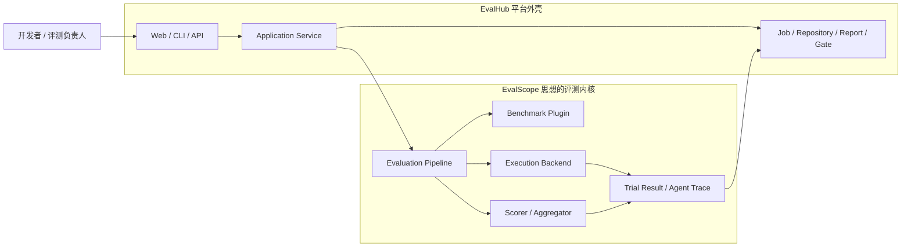

这套组合保留了 EvalHub 面向企业评测平台的长期价值，同时获得 EvalScope 在 Benchmark 执行、结构化输出、扩展机制、AgentLoop 和结果恢复方面的成熟思想。

## 2. 设计目标与非目标

### 2.1 设计目标

1. 保持现有 CLI、Ollama Adapter、Evaluator 和单轮 Benchmark 的兼容路径。
2. 让 Benchmark 从“配置记录”升级为“可执行插件”，但不让行为进入领域实体。
3. 用结构化请求和输出支持消息、工具调用、停止原因、用量和错误。
4. 将每条样本视为独立 Trial，允许部分失败、缓存恢复和单独重评。
5. 让单轮、Native Agent 和 External Agent 产出统一的 `TrialResult`。
6. 让 Native 与 External Agent 共用 `AgentTrace`、报告和回放能力。
7. 保持核心包轻量，沙箱、MCP、外部 Agent 和基础设施依赖按需安装。
8. 为后续并发 Worker、分布式调度和 Artifact Store 保留稳定边界。

### 2.2 非目标

- 第一阶段不追求 EvalScope 的全部 Benchmark 数量和多模态覆盖率。
- 第一阶段不实现完整 Docker、远端沙箱或 MCP 传输栈。
- 第一阶段不实现 Codex、Claude Code 等 External Agent Bridge。
- 不直接复制 EvalScope 的大型 `TaskConfig`、全局注册表和导入扫描机制。
- 不把 Pydantic、FastAPI、SQLAlchemy 或 Celery 引入领域核心。
- 不为了目标架构一次性破坏现有 `ModelAdapter.generate(prompt) -> str` 调用方。

## 3. 当前架构与关键约束

当前 EvalHub 已经具备清晰的平台领域骨架，但执行链路仍是同步单轮模型：

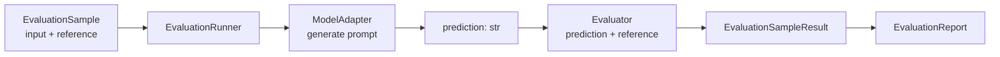

这条链路适合 GSM8K、MMLU 等问答型任务，但存在以下限制：

| 限制 | 直接影响 |
| --- | --- |
| 输入只有字符串 | 无法稳定表达消息历史、多模态内容、工具和附件 |
| 模型输出只有字符串 | 无法表达 Tool Call、Stop Reason、Token Usage 和模型错误 |
| Benchmark 只有数据记录 | 数据转换、提示词、答案提取和官方评分协议散落在入口或 Loader |
| 推理与评分在同一循环 | 无法只重跑评分，也难以恢复中断任务 |
| 任一样本异常会终止 Job | 无法区分样本失败、预算耗尽和基础设施故障 |
| 结果只有预测与分数 | 无法存放 Trace、Artifact、成本和过程证据 |
| Repository 与插件概念未分开 | 后续增加扩展点时容易产生命名和职责混淆 |

因此，AgentLoop 不应直接叠加在当前字符串接口上。应先建立通用评测契约，再把 Agent 作为一种执行后端接入。

## 4. 方案对比与架构决策

| 方案 | 优点 | 代价 | 结论 |
| --- | --- | --- | --- |
| 混合架构 | 保留平台领域模型；执行内核可独立演进；兼容现有功能 | 需要逐步引入新契约和兼容层 | 推荐 |
| EvalScope 作为外部执行后端 | Benchmark 覆盖快；短期接入成本低 | 依赖重；结果映射复杂；版本与运行环境受上游约束 | 可作为后续可选 Backend |
| 完整仿照 EvalScope 重写 | 结构表面统一 | 丢失平台边界；迁移风险高；容易继承大型对象和全局状态 | 不采用 |

### 架构决策

EvalHub 采用混合架构，并遵循以下决策：

1. `domain` 保存业务事实，不承担插件发现和运行时装配。
2. `engine` 编排通用流水线，不按模型或 Agent 类型写业务分支。
3. `BenchmarkRecord` 是可持久化定义，`BenchmarkPlugin` 是运行时代码能力。
4. Execution Backend 负责如何得到预测，Scorer 负责如何判断结果。
5. Repository 和 Plugin Catalog 使用不同命名、不同生命周期和不同依赖方向。
6. 结构化新接口先通过兼容适配器接住现有字符串接口，再逐步切换实现。

## 5. 目标分层架构

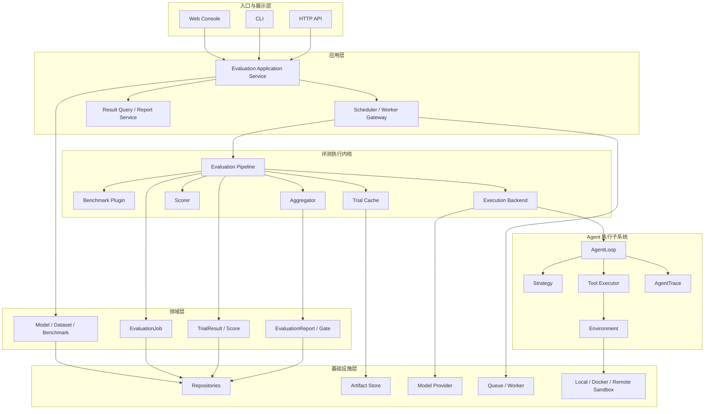

### 5.1 依赖方向

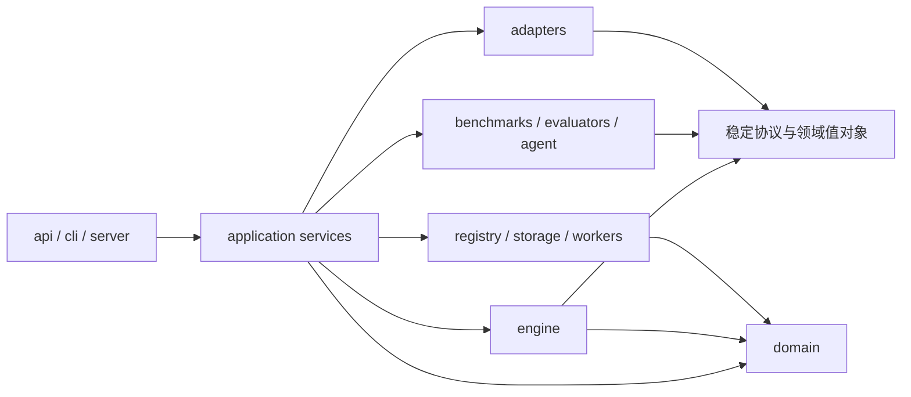

依赖必须指向稳定抽象。`engine` 不依赖具体 Ollama、具体 Benchmark、具体 Tool 或具体数据库；入口层负责组装这些实现。

## 6. 目标模块职责

| 模块 | 目标职责 | 不应承担 |
| --- | --- | --- |
| `evalhub.domain` | 平台实体、值对象、状态枚举、Repository 协议 | 框架配置解析、插件扫描、网络调用 |
| `evalhub.engine` | Job 和 Trial 编排、阶段分派、失败策略、报告生成 | 具体模型、Benchmark 和工具判断 |
| `evalhub.adapters` | 结构化模型请求、模型提供商适配、旧字符串接口兼容 | Benchmark 提示词和评分逻辑 |
| `evalhub.datasets` | 数据源获取、缓存、原始记录读取 | 决定最终提示词和评分规则 |
| `evalhub.benchmarks` | 原始记录转 Sample、默认运行配置、结果提取、官方评分衔接 | Job 持久化和全局调度 |
| `evalhub.evaluators` | Sample Score、批量评分、聚合器 | 模型生命周期和数据下载 |
| `evalhub.agent` | Loop、Strategy、Tool、Environment、Trace | 平台 Job 和 Repository |
| `evalhub.plugins` | 实例级 Plugin Catalog 和显式装配 | 保存领域记录 |
| `evalhub.registry` | Repository 的内存或数据库实现 | 运行时代码插件注册 |
| `evalhub.api/cli/server` | 输入转换、依赖选择、输出转换 | 可复用评测业务逻辑 |

其中 `evalhub.benchmarks`、`evalhub.agent` 和 `evalhub.plugins` 是目标模块，只有进入相应实施阶段后才创建。

## 7. Repository 与 Plugin Catalog 的边界

当前 `InMemoryRegistry` 实际上是多类 Repository 的组合，而 EvalScope 的 Registry 是运行时代码插件表。两者必须显式分开。

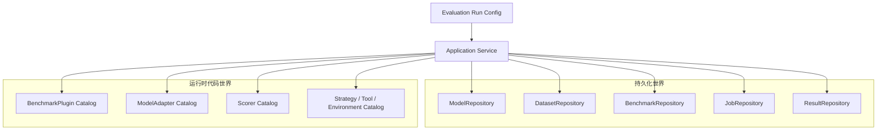

### Repository 规则

- 保存具有业务身份和生命周期的数据。
- 可以由内存、PostgreSQL、对象存储等实现替换。
- 缺失记录、并发更新和事务是 Repository 的问题。

### Plugin Catalog 规则

- 保存稳定名称到代码工厂的映射。
- 默认由应用启动时显式装配，避免导入整个目录触发注册副作用。
- 重复名称默认报错，不允许静默覆盖。
- 查询失败应列出可用名称和相近建议。
- 单元测试使用独立 Catalog，避免全局状态污染。

## 8. 核心运行契约

### 8.1 `EvaluationRunConfig`

目标配置应拆成小型、类型化子配置，而不是形成单个大型配置对象：

```text
EvaluationRunConfig
├── model: ModelRunConfig
├── dataset: DatasetRunConfig
├── benchmark: BenchmarkRunConfig
├── execution: ExecutionConfig
│   ├── mode: single_turn | native_agent | external_agent
│   ├── concurrency
│   ├── timeout
│   └── retry_policy
├── scoring: ScoringConfig
├── cache: CachePolicy
└── failure: FailurePolicy
```

API 和 CLI 边界负责把 JSON、YAML 或命令参数校验为类型化配置；领域层只接收已经验证的值，不依赖具体配置框架。

### 8.2 `EvaluationSample`

建议在保留字符串兼容的前提下逐步增加：

| 字段 | 用途 |
| --- | --- |
| `input` | 字符串或结构化消息列表 |
| `reference` | 单个或多个参考答案 |
| `choices` | 选择题候选项 |
| `tools` | 样本可用工具声明 |
| `files` | 与样本关联的 Artifact 引用 |
| `setup` | 环境初始化声明，不直接承载任意未审查脚本 |
| `sandbox` | 样本级环境需求 |
| `metadata` | 数据集特有信息和可复现性字段 |
| `group_id` | 重复采样和 `pass@k` 聚合分组 |

### 8.3 `ModelRequest` 与 `ModelOutput`

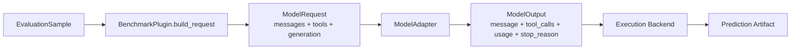

`ModelOutput` 至少应包含：

- 最终 assistant message。
- 结构化 Tool Calls。
- `stop_reason`。
- 输入、输出和总 Token Usage。
- 请求时延和模型标识。
- 可诊断但经过脱敏的错误。
- Provider Metadata。

兼容期可以提供 `TextModelAdapterBridge`：将旧 `generate(prompt) -> str` 包装成只包含文本消息的 `ModelOutput`，避免一次性修改所有调用方。

### 8.4 `TrialState` 与 `TrialResult`

每个 Sample 在一次 Job 中形成一个 Trial：

```text
TrialState
├── sample
├── messages
├── latest_model_output
├── prediction_artifact
├── agent_trace
├── status
└── error

TrialResult
├── job_id / sample_id / attempt
├── status / termination_reason
├── prediction / artifacts
├── scores
├── usage / latency / cost
├── agent_trace_ref
└── reproducibility_metadata
```

`TrialState` 是执行期可变状态；`TrialResult` 是完成后持久化的事实。两者不应混为一个长期可变对象。

### 8.5 Score 与聚合

评分不应再假设“一条样本只有一个 float”：

- `SampleScore`：单条 Trial 的一个或多个指标。
- `BatchScore`：需要整批结果才能计算的 Judge 或排名指标。
- `AggregateScore`：subset、category、overall 等层级的聚合结果。
- `RepeatedScore`：基于 `group_id` 的 `pass@k`、`vote@k`、`pass^k`。

## 9. 通用评测流水线

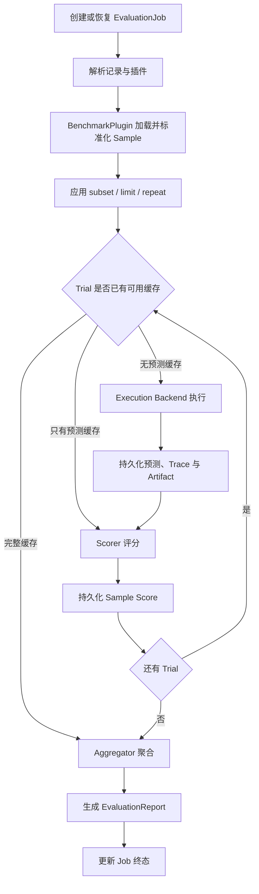

流水线阶段应具有稳定输入输出，使缓存、重试和未来 Worker 分发可以发生在阶段边界，而不需要复制业务逻辑。

## 10. 单轮执行链路

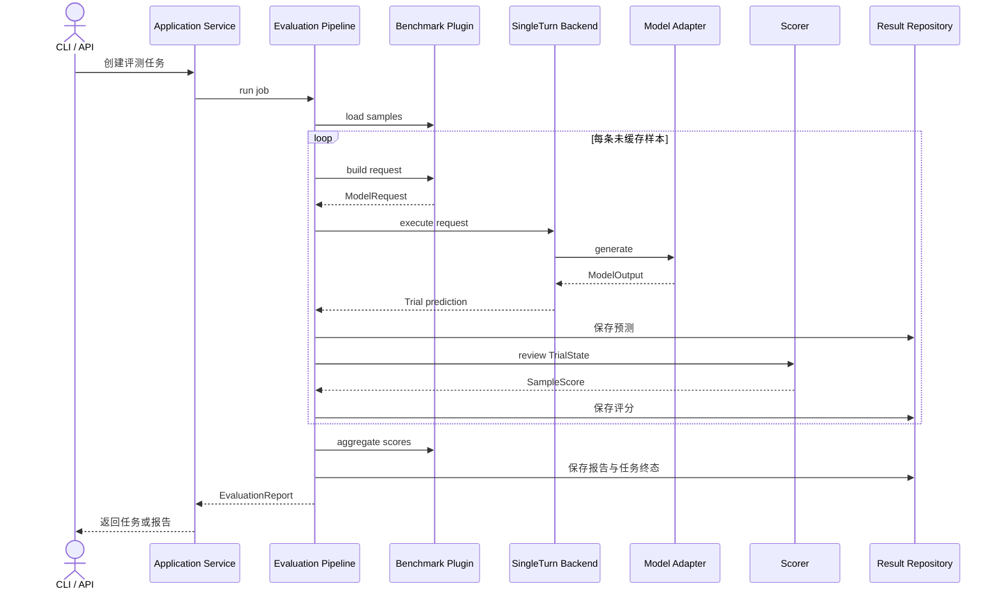

单轮模式仍然是最小、最快路径，但它和 Agent 模式使用相同的 Sample、ModelOutput、TrialResult、Score 和 Repository 契约。

## 11. Native Agent 执行链路

### 11.1 Agent 子系统边界

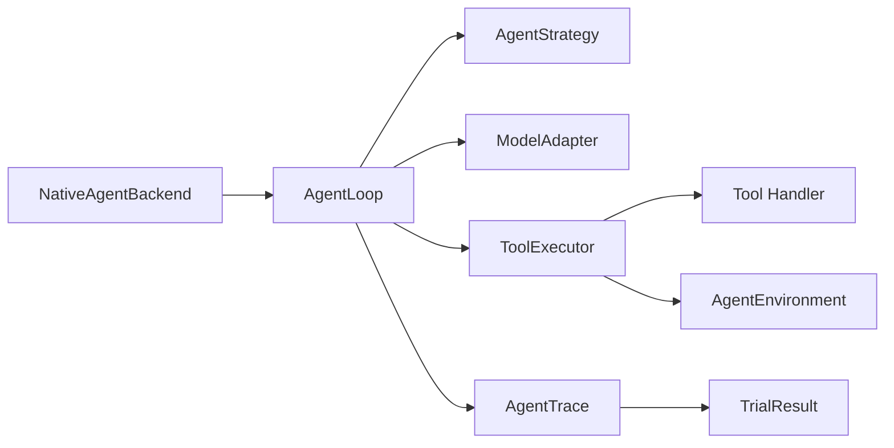

- `AgentLoop` 只负责 `generate → parse → act → observe` 编排。
- `AgentStrategy` 负责系统提示、工具暴露方式、输出解析和终止判断。
- `ToolExecutor` 负责名称分派、超时和将工具异常转换为 Observation。
- `AgentEnvironment` 提供样本级隔离资源，并由明确的所有者关闭。
- `AgentTrace` 记录模型、工具、环境、错误、提交、时延和用量事件。

### 11.2 Native Agent 时序

```mermaid
sequenceDiagram
    participant Pipeline as Evaluation Pipeline
    participant Backend as NativeAgent Backend
    participant Env as Agent Environment
    participant Loop as AgentLoop
    participant Strategy as Strategy
    participant Model as Model Adapter
    participant Tools as Tool Executor

    Pipeline->>Backend: execute Sample
    Backend->>Env: create and initialize
    Backend->>Loop: run context
    loop 未提交且未达到预算
        Loop->>Strategy: prepare messages and tools
        Strategy-->>Loop: request context
        Loop->>Model: generate async
        Model-->>Loop: ModelOutput
        Loop->>Strategy: parse output
        Strategy-->>Loop: ParsedAction
        alt 已得到最终答案
            Loop-->>Backend: AgentLoopResult
        else 包含 Tool Calls
            Loop->>Tools: execute calls
            Tools->>Env: optional exec
            Env-->>Tools: ExecResult
            Tools-->>Loop: Observation or ToolError
        else 无动作
            Loop->>Loop: nudge or implicit submit
        end
    end
    Backend->>Env: close in finally
    Backend-->>Pipeline: TrialResult with AgentTrace
```

### 11.3 终止语义

正常终止不用异常控制：

- `submitted`：Agent 显式提交最终答案或制品。
- `implicit_submit`：策略允许把最后文本视为答案。
- `max_steps`：步数预算耗尽。
- `timeout`：Trial 墙钟预算耗尽。
- `model_length`：模型上下文长度不足。
- `canceled`：用户或调度器取消。
- `infrastructure_error`：环境、存储或平台不可恢复错误。

其中预算耗尽和模型长度不足是 Trial 结果，不必默认让整个 Job 失败。

## 12. Benchmark Plugin 设计

`BenchmarkRecord` 继续保存业务可见的名称、数据集、版本、评分器和默认配置；`BenchmarkPlugin` 提供运行行为。

建议把 EvalScope 较宽的 DataAdapter 职责拆成小型钩子：

```text
BenchmarkPlugin
├── load_samples(context) -> Iterable[EvaluationSample]
├── build_request(sample, config) -> ModelRequest
├── build_execution_defaults(sample) -> ExecutionDefaults
├── extract_prediction(trial_state) -> PredictionArtifact
├── scorer_specs() -> list[ScorerSpec]
├── aggregate(scores) -> list[AggregateScore]
└── finalize(context) -> None
```

### 默认值与覆盖规则

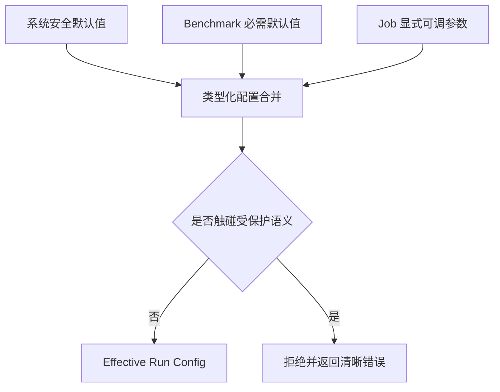

优先级按字段类型确定，而不是简单字典覆盖：

1. 系统安全约束不能被 Job 降低。
2. Benchmark 必需 Tool、Verifier、镜像和提交协议不能被静默替换。
3. Job 只能覆盖 Benchmark 明确公开的参数，例如温度、最大步数和额外工具。
4. 最终生效配置必须写入 Trial 可复现性元数据。

## 13. 失败模型与任务状态

### 13.1 错误分类

| 分类 | 示例 | 默认行为 |
| --- | --- | --- |
| `model_error` | Provider 超时、限流、响应格式错误 | 按策略重试，耗尽后标记 Trial 失败 |
| `tool_error` | 未知工具、参数错误、工具超时 | 转为 Observation，允许 Agent 修正 |
| `environment_error` | 沙箱创建或执行失败 | 标记基础设施失败，可按策略中止 Job |
| `scoring_error` | Judge 或官方验证器失败 | 保留预测，允许以后单独重评 |
| `data_error` | 样本格式或必需 Artifact 缺失 | 标记样本无效，不调用模型 |
| `canceled` | 用户取消或调度器停止 | 释放资源并持久化取消状态 |

### 13.2 Job 与 Trial 的关系

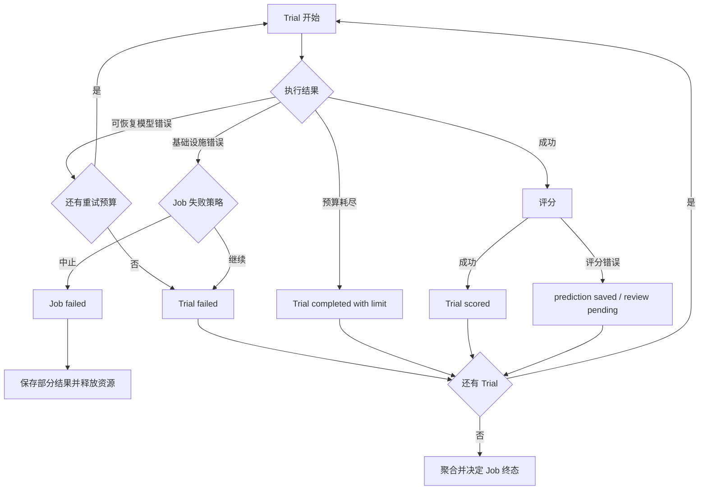

Job 是否成功不能只看“是否出现过异常”。建议同时报告：

- 总 Trial 数、已评分数、失败数、预算耗尽数和取消数。
- 模型、工具、环境、数据和评分错误的分类数量。
- 聚合指标覆盖率。
- 是否满足用户配置的最小成功率或错误阈值。

## 14. 缓存、恢复与重评

预测缓存和评分缓存必须分开，因为模型推理通常昂贵，而评分规则可能频繁变化。

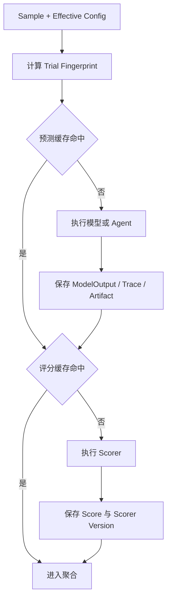

Fingerprint 至少应覆盖：

- Dataset、Benchmark 和 Sample 版本。
- Model、Provider 和生成参数。
- Execution Backend、Strategy、Tool 和 Environment 版本。
- Prompt Template 和系统提示版本。
- 重复运行序号、Seed 和最大预算。

评分缓存额外覆盖 Scorer、Judge Model、官方验证器和聚合配置版本。

大体积消息、工具输出、补丁、图片和命令日志应存入 Artifact Store；TrialResult 只保存引用、摘要、哈希和经过截断的预览。

## 15. Trace、安全与可复现性

### 15.1 Trace 事件

首批统一事件建议包括：

- `run_start`、`run_end`。
- `model_generate`。
- `tool_call`、`tool_result`。
- `environment_exec`、`environment_reset`。
- `error`、`retry`、`nudge`。
- `submit`、`artifact_created`。

### 15.2 敏感信息规则

- Trace 落库前执行字段级脱敏。
- 不保存 API Key、Authorization Header、完整环境变量和凭据文件。
- 工具参数和输出使用允许列表、大小限制和预览截断。
- Artifact Store 使用内容类型、大小和访问权限校验。
- 本地 Shell Environment 只能用于明确授权的开发场景，不能作为生产默认值。

### 15.3 可复现性字段

正式比较至少记录：模型版本、Provider、生成配置、Seed、Benchmark 版本、数据版本、插件版本、Tool 版本、Environment 镜像摘要、Scorer 版本和 EvalHub 版本。

## 16. 目标目录结构

以下目录为目标形态，不要求一次创建：

```text
src/evalhub/
├── domain/
│   ├── entities.py
│   ├── enums.py
│   ├── repositories.py
│   └── trials.py
├── engine/
│   ├── pipeline.py
│   ├── execution.py
│   ├── failures.py
│   ├── cache.py
│   └── reports.py
├── adapters/
│   ├── base.py
│   ├── types.py
│   ├── compatibility.py
│   └── ollama.py
├── datasets/
├── benchmarks/
│   ├── base.py
│   ├── catalog.py
│   └── builtins/
├── evaluators/
│   ├── base.py
│   ├── registry.py
│   └── aggregators.py
├── agent/
│   ├── types.py
│   ├── loop.py
│   ├── strategy.py
│   ├── tools.py
│   ├── environment.py
│   ├── trace.py
│   └── external/
├── plugins/
│   └── catalog.py
├── registry/
│   └── in_memory.py
├── api/
├── cli.py
└── server.py
```

## 17. 兼容迁移策略

### 17.1 现有接口映射

| 当前接口 | 过渡方式 | 目标接口 |
| --- | --- | --- |
| `ModelAdapter.generate(prompt) -> str` | 兼容 Bridge 包装文本输入输出 | `generate(ModelRequest) -> ModelOutput` |
| `EvaluationSample.input: str` | 接受字符串和结构化消息联合类型 | 富 Sample 契约 |
| `BenchmarkRecord.config: dict` | 入口校验后生成类型化运行配置 | `BenchmarkRunConfig` |
| `Evaluator.evaluate(str, str)` | 适配为读取 Trial prediction 和 reference | `Scorer.review(TrialState)` |
| `EvaluationSampleResult` | 保留旧字段并增加状态、Artifact 和 Trace 引用 | `TrialResult` |
| `EvaluationRunner` | 先内部委托新 Pipeline，保留公共入口 | `EvaluationPipeline` |

### 17.2 兼容原则

- 现有 GSM8K、MMLU、Static Adapter 和 Ollama Adapter 必须继续工作。
- CLI 和本地 Web API 的已有请求字段默认保持兼容。
- 新字段优先可选，并提供安全默认值。
- 旧结果读取必须有明确迁移或兼容解析策略。
- 真正的破坏性变更必须单独发布迁移说明，不能夹带在 Agent 功能中。

## 18. 分阶段实施路线

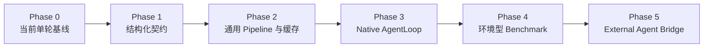

### Phase 0：当前单轮基线

- 保持 GSM8K、MMLU、Ollama、Evaluator 和同步 Runner 可用。
- 建立现有行为回归测试，作为兼容迁移基线。

### Phase 1：结构化契约

- 增加 Message、ModelRequest、ModelOutput、Usage 和 StopReason。
- 增加 TrialStatus、TerminationReason、TrialResult 和 ArtifactRef。
- 用兼容 Bridge 接入现有 Adapter 和 Evaluator。

验收：现有公开行为不变，但内部可以完整表达单轮结构化输出。

### Phase 2：通用 Pipeline 与缓存

- 引入 `BenchmarkPlugin` 和实例级 Plugin Catalog。
- 分离 Predict、Review、Aggregate、Report。
- 增加预测缓存、评分缓存、失败分类和恢复执行。

验收：中断任务可以只补跑缺失 Trial，已有预测可以单独重评。

### Phase 3：Native AgentLoop

- 增加类型化 Native Agent Config。
- 实现 Strategy、ToolExecutor、AgentLoop 和 AgentTrace。
- 第一版只使用 Fake Model、Fake Tool 和受控内置工具验证闭环。

验收：同一基础 Benchmark 可在不修改 Scorer 的情况下切换单轮和 Native Agent。

### Phase 4：环境型 Benchmark

- 增加样本级 Environment 生命周期。
- 支持从补丁、文件或环境状态提取最终制品。
- 接入至少一个轻量代码或终端类 Benchmark。

验收：评分以最终环境状态或官方验证器为准，并能区分模型、工具和环境失败。

### Phase 5：External Agent Bridge

- 定义 AgentRunner 协议和 External Backend。
- 先接入一个 Mock Runner，再接入一个真实 Agent CLI。
- Native 与 External 共用 TrialResult、AgentTrace 和报告。

验收：无需修改外部 Agent 源码即可完成执行、评分、成本统计和 Trace 回放。

## 19. 测试策略

| 层级 | 必测内容 |
| --- | --- |
| 契约测试 | 配置校验、ModelOutput JSON 往返、Trial 状态、Trace 与 Artifact 引用 |
| 兼容测试 | 旧字符串 Adapter、旧 Evaluator、现有 CLI 和 API 响应 |
| Pipeline 单测 | 缓存命中、只重评、部分失败、重试、取消和聚合覆盖率 |
| Benchmark 契约测试 | 样本转换、默认值、显式覆盖、受保护配置和结果提取 |
| AgentLoop 单测 | 直接提交、工具后提交、未知工具、超时、步数耗尽和上下文溢出 |
| 生命周期测试 | 成功、模型错误、工具错误时 Environment 都按所有权正确关闭 |
| Repository 测试 | 幂等写入、任务状态更新、结果查询和并发版本冲突 |
| Walking Skeleton | Fake Model + Fake Tool + Fake Environment 跑通端到端闭环 |

单元测试不得依赖真实网络、Ollama、Docker、公开数据下载或付费 API。外部 Agent 阶段先通过 Mock Runner 和本地随机端口验证协议与生命周期。

## 20. 主要风险与控制措施

| 风险 | 控制措施 |
| --- | --- |
| 接口升级影响现有 Adapter | 使用兼容 Bridge，逐个迁移并保持回归测试 |
| 模块数量增长过快 | 每阶段只创建当前验收所需模块，避免预建空框架 |
| BenchmarkPlugin 变成大对象 | 使用小型钩子和独立 Scorer、Aggregator、Backend |
| 全局插件状态污染测试 | 应用级 Catalog 显式装配，测试使用独立实例 |
| Trace 和 Artifact 体积膨胀 | 元数据与大对象分离、哈希引用、截断预览和保留策略 |
| Agent 运行泄露敏感数据 | 落库前脱敏、工具允许列表、最小权限和隔离环境 |
| Agent 随机性导致结果不可比 | 记录 Seed、配置和版本，支持 repeats 与稳定性指标 |
| 沙箱引入供应链和权限风险 | 延迟到环境型 Benchmark 阶段，并作为可选依赖 |
| 直接移植上游代码产生许可问题 | 优先借鉴思想；直接移植时保留 Apache-2.0 声明 |

## 21. 设计验收标准

本设计完成实施后，应满足以下系统级性质：

1. 同一 Benchmark 可以在单轮与 Native Agent 后端之间切换，而不复制数据加载和评分逻辑。
2. 任一模型后端都通过结构化 ModelRequest 和 ModelOutput 接入。
3. 单条 Trial 失败不会无条件导致整个 Job 丢失其他结果。
4. 预测、评分和聚合可以独立缓存、恢复和重跑。
5. Benchmark 默认安全语义不会被 Job 配置静默覆盖。
6. Native 与 External Agent 使用同一种 AgentTrace 和 TrialResult。
7. Repository 与 Plugin Catalog 可以独立替换和测试。
8. 核心单轮评测不需要安装 Agent、沙箱、MCP 或基础设施依赖。
9. 所有正式结果可以追溯到模型、数据、Benchmark、插件和配置版本。
10. 现有 CLI、Ollama、本地 Benchmark 和公开导入符号在迁移期保持兼容。

## 22. EvalScope 思想取舍总结

### 应吸收

- 类型化任务配置和明确执行模式。
- 结构化 Sample、Message、ModelOutput 和 Task/Trial State。
- 可执行 Benchmark Adapter/Plugin。
- 推理、评分、聚合和报告的分阶段管线。
- 样本级缓存恢复和独立重评。
- Model、Metric、Aggregator、Strategy、Tool、Environment 等扩展点。
- AgentLoop、Strategy、ToolExecutor、Environment 的职责分离。
- Native 与 External 共用 Trace。
- `pass@k`、`vote@k` 等重复运行聚合思想。
- 可选依赖、延迟导入和 Fake 边界测试。

### 不应照搬

- 一个 DataAdapter 承担加载、推理、评分、聚合和报告全部职责。
- 单个大型 TaskConfig 承担全部子系统配置。
- 全局 Registry 和通过扫描导入所有 Benchmark 的注册副作用。
- 将上游完整依赖集合直接变成 EvalHub 核心依赖。
- 在通用契约稳定前先实现 External Agent Bridge。
- 用 Trace 过程质量替代最终任务成功或官方评分器。

## 23. 源码参考索引

本文基于本地 EvalScope `45b52392` 的以下设计进行抽象，不直接复制实现：

| 主题 | EvalScope 文件 |
| --- | --- |
| 类型化任务配置 | `evalscope/config.py` |
| Sample 与 Dataset | `evalscope/api/dataset/dataset.py` |
| Model 与 ModelOutput | `evalscope/api/model/model.py`、`model_output.py` |
| Benchmark DataAdapter | `evalscope/api/benchmark/benchmark.py`、`adapters/default_data_adapter.py` |
| Evaluator 与缓存恢复 | `evalscope/evaluator/evaluator.py`、`api/evaluator/cache.py` |
| 插件注册表 | `evalscope/api/registry.py` |
| AgentLoop 契约 | `evalscope/api/agent/loop.py`、`types.py`、`runner.py` |
| Strategy、Tool、Environment | `evalscope/api/agent/strategy.py`、`tool_executor.py`、`environment.py` |
| AgentTrace | `evalscope/api/agent/trace.py` |
| External Agent | `evalscope/agent/external/` |

EvalHub 当前对照实现：

- `src/evalhub/domain/entities.py`
- `src/evalhub/domain/repositories.py`
- `src/evalhub/adapters/base.py`
- `src/evalhub/engine/runner.py`
- `src/evalhub/evaluators/base.py`
- `src/evalhub/evaluators/registry.py`
- `src/evalhub/registry/in_memory.py`
- `tests/test_runner.py`
