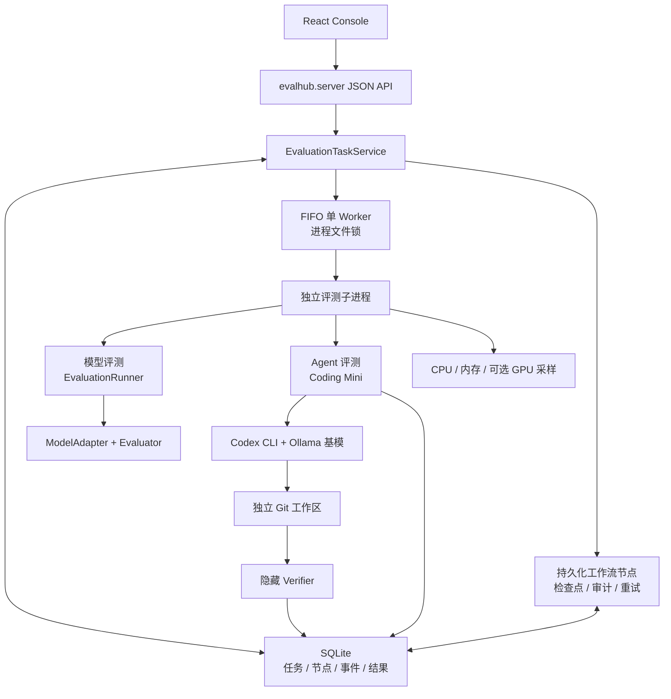
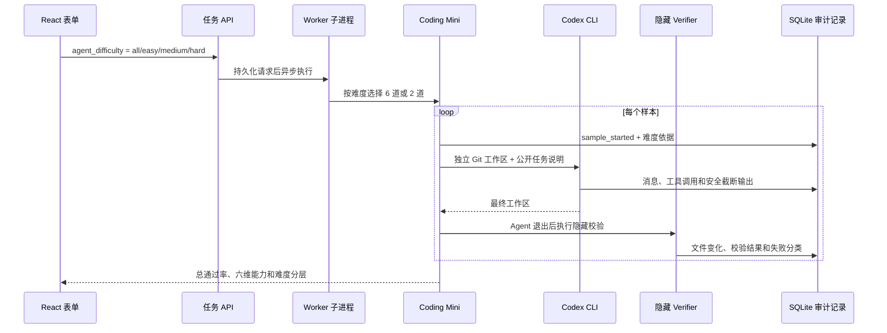

# EvalHub Architecture

## 架构目标

EvalHub 的架构目标是把评测平台拆成稳定的领域核心和可替换的基础设施。核心层不直接依赖 FastAPI、Celery、PostgreSQL 或 MinIO，这样 MVP 可以先用内存实现跑通，后续再替换为企业级组件。

## 分层设计

```text
React Console / CLI
        |
FastAPI API Layer
        |
Application Services
        |
Domain Model
        |
Infrastructure Adapters
```

当前代码已经实现 Domain Model、Evaluator Plugin、Model Adapter、同步 Runner，以及面向本地控制台的 SQLite 单 Worker 任务层。

## 当前本地运行架构



控制台用 `POST /api/evaluations` 创建任务，再轮询任务列表和选中任务详情。任务服务先把系统生成的节点 DAG 与任务一起持久化，再按 FIFO 入队。Benchmark 节点启动独立子进程执行真实样本，Runtime 把样本结果、节点进度、耗时和审计事件持续写回 SQLite。

模型工作流固定包含资产准备、一个或多个 Benchmark、能力聚合和结果收口节点。资产节点记录真实文件或目录内容的 SHA-256；Benchmark 执行前后再次校验摘要，期间发生变化时清空该节点样本检查点并明确阻塞，禁止跨数据 revision 复用结果。版本化 Suite 固定协议参数，例如 MMLU 始终使用全部官方学科。节点成功后不会重复执行；服务异常重启时，中断节点恢复为待执行并跳过已有评分结果的样本检查点，不会因为答案得分低而重新推理。失败节点支持人工重试，瞬时错误在节点级有限自动重试。追加式事件表保留状态变化和诊断信息，便于审计与 debug。

本地任务层不改写领域 Registry。SQLite 保存请求、任务与节点生命周期、资源摘要、样本检查点和最终报告；同一数据库的 OS 文件锁防止多个后端进程同时恢复同一任务。

### 当前 Agent 评测链路

Agent 路径固定 Codex CLI 壳，只替换 Ollama 基模，避免把“模型能力”和“不同 Agent 框架实现”混在
一次比较中。内置 Coding Mini v2 提供 6 个可审计编码任务，简单、中等、困难各 2 个；请求可以
选择全部或单档，题集版本、分级理由和每档通过率随结果持久化。



评分只采用最终工作区的隐藏校验结果。时间线只保存白名单外部事件，不保存内部思维链，也不在
Agent 完成前暴露隐藏断言。这样 0 分可以继续区分为运行失败、未修改和错误修改，而不是只看到
Agent 的自然语言自述。

## 目标生产架构

```text
React Console
     |
FastAPI
     |
Scheduler
     |
RabbitMQ
     |
Celery Worker
     |
+------------------+------------------+
|                                     |
Model Adapter                    Evaluator
|                                     |
Inference Endpoint               Result Store
                                      |
                              PostgreSQL / MinIO
```

## 核心模块

- `evalhub.domain`：实体、枚举和仓储协议。
- `evalhub.adapters`：模型推理适配器接口和具体实现。
- `evalhub.evaluators`：评测器接口、插件注册表和指标实现。
- `evalhub.engine`：评测任务执行、样本级结果生成、报告聚合。
- `evalhub.registry`：Registry 的内存实现，后续可替换为数据库实现。
- `evalhub.tasks`：SQLite 任务仓储、FIFO 调度、隔离评测执行与资源采集。
- `evalhub.agent`：外部 Agent Runner 协议和 Codex CLI 事件标准化。
- `evalhub.benchmarks.coding_mini`：内置分级任务、工作区生成、隐藏校验和能力聚合。
- `evalhub.api`：FastAPI 入口，当前作为可选依赖模块。
- `evalhub.server`：当前本地控制台静态资源和 JSON API 装配入口。

## 扩展原则

新增模型类型时，实现 `ModelAdapter.generate()`。

新增评测指标时，实现 `Evaluator.evaluate()` 并注册到 `EvaluatorRegistry`。

新增结果存储时，实现 Repository 协议，不修改 Runner 主流程。

扩展为分布式异步能力时，保持 `EvaluationRunner` 和任务 API 语义不变，把 `EvaluationTaskService`、SQLite 仓储与本地子进程执行器分别替换为 Scheduler、PostgreSQL 和 Worker。
