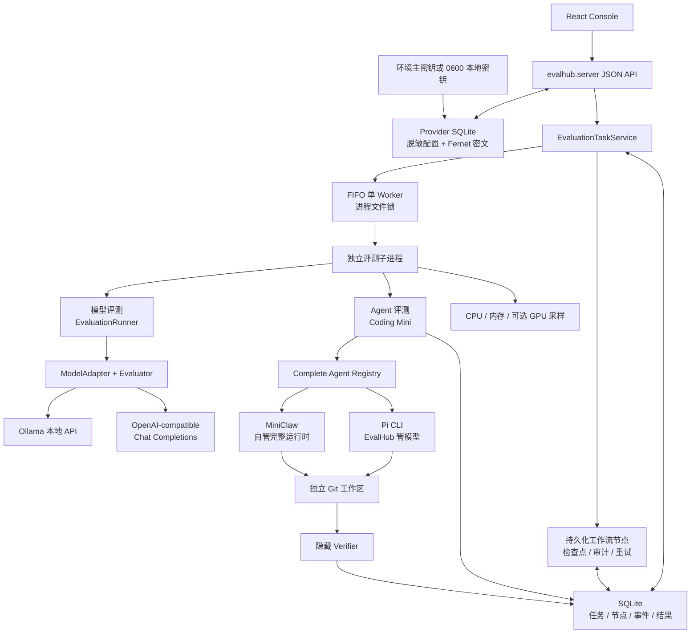
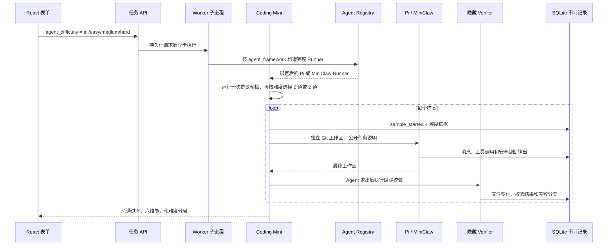

# EvalHub Architecture

## 架构目标

EvalHub 的架构目标是把评测平台拆成稳定的领域核心和可替换的基础设施。核心层不直接依赖 FastAPI、Celery、PostgreSQL 或 MinIO，这样 MVP 可以先用内存实现跑通，后续再替换为企业级组件。

## 分层设计

```text
React Console / CLI
        |
FastAPI API Layer
        |
Application Services
        |
Domain Model
        |
Infrastructure Adapters
```

当前代码已经实现 Domain Model、Evaluator Plugin、Model Adapter、同步 Runner，以及面向本地控制台的 SQLite 单 Worker 任务层。

## 当前本地运行架构



控制台用 `POST /api/evaluations` 创建任务，再轮询任务列表和选中任务详情。任务服务先把系统生成的节点 DAG 与任务一起持久化，再按 FIFO 入队。Benchmark 节点启动独立子进程执行真实样本，Runtime 把样本结果、节点进度、耗时和审计事件持续写回 SQLite。

模型工作流固定包含资产准备、一个或多个 Benchmark、能力聚合和结果收口节点。资产节点记录真实文件或目录内容的 SHA-256；Benchmark 执行前后再次校验摘要，期间发生变化时清空该节点样本检查点并明确阻塞，禁止跨数据 revision 复用结果。版本化 Suite 固定协议参数，例如 MMLU 始终使用全部官方学科。节点成功后不会重复执行；服务异常重启时，中断节点恢复为待执行并跳过已有评分结果的样本检查点，不会因为答案得分低而重新推理。失败节点支持人工重试，瞬时错误在节点级有限自动重试。追加式事件表保留状态变化和诊断信息，便于审计与 debug。

Hexagon 1.2 在工作流创建时组合两条互不放宽的协议轴：`ModelGenerationProfile` 决定 Ollama
顶层 `think` 行为，`BenchmarkSpec` 决定回答协议和 `num_predict` 预算。七项预算依次为 256、1024、
512、512、1024、256、256；选择题、数值、BBH、IFEval 和 HumanEval 各走自己的评分边界。
组合后的有效配置、模型协议版本和答案协议版本全部写入节点输入、最终可复现性账本和比较指纹。
Ollama 返回空文本时，`generation_incomplete` 或 `empty_model_response` 会阻塞节点；非空错误答案
仍是正常执行后的零分样本。IFEval 始终接收原始输出，HumanEval 只为 Docker 提交剥离唯一代码围栏
或识别完整入口函数，隐藏测试不离开沙箱。

本地任务层不改写领域 Registry。SQLite 保存请求、任务与节点生命周期、资源摘要、样本检查点和最终报告；同一数据库的 OS 文件锁防止多个后端进程同时恢复同一任务。

远程模型复用一个 `OpenAICompatibleAdapter`，内置服务商只是带稳定 ID 与默认地址的预设，不按
厂商复制 Adapter。服务商公开配置和 Fernet 密文独立保存到
`.runtime/model_providers.sqlite3`；主密钥优先来自 `EVALHUB_CREDENTIAL_KEY`，否则使用权限为
`0600` 的 `.runtime/provider_credentials.key`。浏览器只获得是否已配置和末四位提示，任务只冻结
`provider_id`、模型 ID 与 Base URL，不保存 API Key。Worker 真正运行时再按 ID 解析最新凭据，
因此密钥轮换不要求改写已排队任务。

服务商边界拒绝含用户信息、查询或 fragment 的地址；远程服务只允许 HTTPS，HTTP 仅允许回环
主机。凭据写入和连接验证要求回环客户端。Chat Completions 调用只转发温度、`top_p`、随机种子
和生成上限，对 429 与有限 5xx 最多额外重试两次，并在错误进入任务记录前精确移除当前 API Key。

### 当前 Agent 评测链路

Agent 路径先从静态 Registry 解析完整候选，再通过统一 `AgentRunner` 执行同一套 Coding Mini。
Pi 继续由 EvalHub 选择 Ollama 或 API 基模，并用 JSONL 与 macOS Seatbelt 限制工具边界；MiniClaw
通过自身虚拟环境内的桥接进程启动，继续使用自己的 `.env`、Home、模型、Provider、工具、策略、
身份、记忆和 Skills。EvalHub 只把公开任务和唯一工作区交给它，不读取或持久化其 API Key。
桥只对 MiniClaw 已校验且再次确认位于当前临时工作区内的文件写入做一次性批准；命令、网络、记忆
和工作区外操作继续遵循交互审批边界。
Coding Mini v3 提供 6 个可审计编码任务，简单、中等、困难各 2 个；协议预检、题集版本、完整
Agent 身份、运行指纹、分级报告和过程指标随结果持久化。



评分只采用最终工作区的隐藏校验结果。时间线只保存白名单外部事件，不保存内部思维链，也不在
Agent 完成前暴露隐藏断言。这样 0 分可以继续区分为运行失败、未修改和错误修改，而不是只看到
Agent 的自然语言自述。工具调用、工具错误、真实耗时、改动文件和失败类型在样本边界采集后统一聚合，
基础设施不可用则阻塞任务，不会被记录为模型零分。

## 目标生产架构

```text
React Console
     |
FastAPI
     |
Scheduler
     |
RabbitMQ
     |
Celery Worker
     |
+------------------+------------------+
|                                     |
Model Adapter                    Evaluator
|                                     |
Inference Endpoint               Result Store
                                      |
                              PostgreSQL / MinIO
```

## 核心模块

- `evalhub.domain`：实体、枚举和仓储协议。
- `evalhub.adapters`：模型推理适配器接口和具体实现。
- `evalhub.evaluators`：评测器接口、插件注册表和指标实现。
- `evalhub.engine`：评测任务执行、样本级结果生成、报告聚合。
- `evalhub.registry`：Registry 的内存实现，后续可替换为数据库实现。
- `evalhub.tasks`：SQLite 任务仓储、FIFO 调度、隔离评测执行与资源采集。
- `evalhub.credentials`：Fernet 主密钥解析、权限校验和凭据认证加解密。
- `evalhub.model_providers`：服务商预设、安全 URL 校验、脱敏对象与独立 SQLite 仓储。
- `evalhub.agent`：完整 Agent Registry、共享 Runner 协议、Pi JSONL 边界和 MiniClaw 子进程桥接。
- `evalhub.benchmarks.coding_mini`：内置分级任务、工作区生成、隐藏校验和能力聚合。
- `evalhub.api`：FastAPI 入口，当前作为可选依赖模块。
- `evalhub.server`：当前本地控制台静态资源和 JSON API 装配入口。

## 扩展原则

新增模型类型时，实现 `ModelAdapter.generate()`；旧适配器可继续返回字符串，需要完成诊断的后端返回
`ModelGeneration`。正式 Hexagon 使用的新 Ollama 模型还必须登记精确模型生成协议。

新增评测指标时，实现 `Evaluator.evaluate()` 并注册到 `EvaluatorRegistry`。

新增结果存储时，实现 Repository 协议，不修改 Runner 主流程。

新增完整 Agent 时，在静态 Registry 中登记安全元数据并实现共享 `AgentRunner`；Runner 必须以参数
列表启动受控入口、把样本说明放入 stdin、限制工作区边界，并只输出白名单事件和脱敏身份快照。

扩展为分布式异步能力时，保持 `EvaluationRunner` 和任务 API 语义不变，把 `EvaluationTaskService`、SQLite 仓储与本地子进程执行器分别替换为 Scheduler、PostgreSQL 和 Worker。
