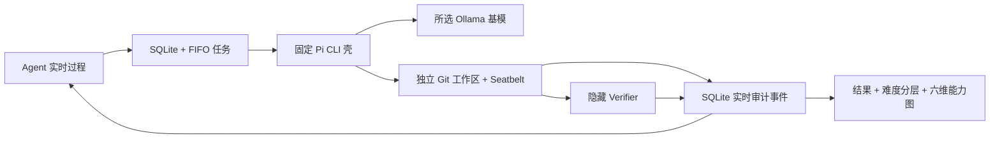

# Local Run Guide

## 目标

本地真实试跑 EvalHub，需要三件事：

1. 下载真实公开 Benchmark 数据集到本地。
2. 启动一个本地模型服务。
3. 通过 CLI 或 Web 控制台发起评测。

后端使用 Python 3.11+，并通过 `psutil` 采集隔离评测进程的 CPU 和内存；Web 控制台使用 Vite、React 和 TypeScript，需要 Node.js 20+ 与 npm。

## 支持的数据集

| 名称 | 来源 | 本地缓存 | 指标 |
| --- | --- | --- | --- |
| `gsm8k` | OpenAI grade-school-math official GitHub | `data/raw/gsm8k/test.jsonl` | `numeric_exact_match` |
| `mmlu` | Hendrycks MMLU official data archive | `data/raw/mmlu/data/test` | `choice_letter` |
| `coding_mini` | EvalHub 内置 3 条编码任务 | `.runtime/agent-runs/` | `hidden_verifier_pass_rate` |

## 准备数据集

```bash
cd /Users/nedonion/PycharmProjects/evalhub
.venv/bin/python run_evalhub.py prepare-dataset gsm8k
.venv/bin/python run_evalhub.py prepare-dataset mmlu
```

第一次运行会从公网下载数据；后续会复用 `data/raw` 下的本地缓存。

## Professional Hexagon Mini Suite

`evalhub-hexagon-v1` 的 `1.1.0` 协议固定执行 30 次调用：知识、指令遵循、数学、综合推理、
代码各 5 条，安全可信由 TruthfulQA 3 条和 BBQ 2 条合并。它是用于本地能力画像的精选 Mini Suite，不是完整
上游 Benchmark 分数，不能用于复述官方排行榜或论文结果。

从仓库根目录依次准备七项官方固定资产：

```bash
.venv/bin/python run_evalhub.py prepare-dataset hexagon-mmlu
.venv/bin/python run_evalhub.py prepare-dataset hexagon-ifeval
.venv/bin/python run_evalhub.py prepare-dataset hexagon-gsm8k
.venv/bin/python run_evalhub.py prepare-dataset hexagon-bbh
.venv/bin/python run_evalhub.py prepare-dataset hexagon-humaneval
.venv/bin/python run_evalhub.py prepare-dataset hexagon-truthfulqa
.venv/bin/python run_evalhub.py prepare-dataset hexagon-bbq
./scripts/build_humaneval_image.sh
./scripts/start_local.sh
```

官方 URL、固定 Git revision（MMLU 为固定归档 SHA-256）和文件 SHA-256 组成冻结来源合同。
`prepare-dataset` 下载固定 URL，并校验缓存或下载文件的 SHA-256；工作流预检会拒绝已安装合同
漂移，而不会在准备时单独查询 revision。完整套件与单项 Hexagon 都会冻结并核对清单 SHA-256；
它会与 source revisions、提示模板版本和 generation config 一起写入最终结果的 `reproducibility`。来源分别是 MMLU、IFEval、GSM8K、
BIG-Bench Hard、HumanEval、TruthfulQA 和 BBQ；固定值及官方链接见
[README](../../README.md#professional-hexagon-mini-suite)。

模型适配器只接收英文官方题面。文本评分器可使用官方参考答案和规则元数据；HumanEval 在生成后
只在 Docker 中使用官方隐藏测试评分。`input_zh`、`reference_zh` 和中文维度名均为非官方、仅供
人工显示的翻译，不会发送给模型或影响得分。

HumanEval 仅能在已运行的 Docker daemon 和本地 `evalhub-humaneval:1.0.0` 镜像均可用时运行。
构建脚本固定为 `./scripts/build_humaneval_image.sh`；容器无网络、无宿主挂载，使用只读根文件系统、
非 root 用户、最小权限和临时 `/tmp`。脚本固定 `python:3.11-slim` 的上游摘要，并把 Dockerfile、
`verify.py`、`worker.py` 的 verifier 身份写入镜像标签。运行前会精确核对标签、用户和入口点；同一轮
评测固定使用首次核验的不可变镜像 ID，恢复时 verifier 身份漂移会清空旧检查点并阻塞。Docker 或镜像不可用时代码节点会 `blocked` 并给出构建命令；
其他节点的已完成结果仍以 `partial` 形式保留，但这种不完整运行不进入模型成绩比较。

## 准备本地模型

推荐先用 Ollama，因为它提供本地 HTTP API，EvalHub 可以直接调用：

```bash
ollama serve
ollama pull qwen2.5:0.5b
```

如果你已经有更大的本地模型，可以把 `--model` 换成对应模型名。

完整安装、PATH 配置、API 验证和故障排查见：

```text
docs/getting-started/20260804_Ollama本地模型安装与验证.md
```

## CLI 试跑

GSM8K：

```bash
.venv/bin/python run_evalhub.py run-benchmark \
  --dataset gsm8k \
  --adapter ollama \
  --model qwen2.5:0.5b \
  --limit 5
```

不传 `--limit` 时默认跑完整数据集：

```bash
.venv/bin/python run_evalhub.py run-benchmark \
  --dataset gsm8k \
  --adapter ollama \
  --model qwen2.5:0.5b
```

MMLU：

```bash
.venv/bin/python run_evalhub.py run-benchmark \
  --dataset mmlu \
  --adapter ollama \
  --model qwen2.5:0.5b \
  --subject abstract_algebra \
  --limit 5
```

## Agent 评测试跑

Agent MVP 不需要下载公开数据集。它固定使用项目内 Pi CLI Agent 壳、内置 Coding Mini 和隐藏
Verifier，只替换 Ollama 基模。Pi 0.74.1 要求 Node.js 20.6 或更高版本；首次运行前在仓库根目录
安装锁定依赖并确认本机 Ollama 模型：

```bash
node --version
npm --prefix agent-runtime ci --ignore-scripts
agent-runtime/node_modules/.bin/pi --version
ollama list
```

然后在 Web 控制台中：

1. 进入“发起评测”，切换到“Agent 评测”。
2. 保持 Benchmark 为 `EvalHub Coding Mini`、Agent 壳为 `Pi CLI`。
3. 选择本地已安装且能实际调用工具的 Ollama 代码模型。
4. 选择全部、简单、中等或困难；全部运行 6 道，单档运行 2 道。
5. 点击“发起 Agent 评测”，在任务中心查看排队、样本进度、实时过程、失败原因、难度分层和六维能力报告。



“Agent 实时过程”按发生顺序展示样本说明、Agent 对外消息、工具命令及安全截断输出、受控文件
变化和隐藏校验。页面不会展示模型内部思维链，也不会在 Agent 退出前泄漏隐藏断言。运行时事件
写入任务的 `agent_benchmark` 节点，因此刷新页面或任务完成后仍可回放。

单条样本会明确归为四类：`runtime_error` 表示 Agent 壳运行失败，`no_action` 表示没有受控文件
变化，`wrong_solution` 表示修改未通过隐藏校验，`passed` 表示最终工作区通过校验。小型通用模型
只用自然语言描述修改时通常属于 `no_action`，不是平台误判。比较不同基模时应固定 Pi 版本、
Ollama 地址和 Coding Mini 脚手架哈希，并优先选择支持工具调用的代码模型。

Coding Mini v2 的 6 道题按固定工程约束静态分级：简单题是单文件局部纯函数，中等题包含多个边界
或可变状态不变量，困难题包含多文件协作、原子性或状态机不变量。难度不是根据某一次模型成绩动态
生成；比较不同基模时还应固定 `benchmark_version`、请求难度和脚手架哈希。

输出字段：

- `status`：任务状态。
- `metric`：使用的 evaluator。
- `total_samples`：本次样本数。
- `passed_samples`：通过样本数。
- `average_score`：平均分。
- `failed_examples`：最多 5 条失败样例，便于 bad case 分析。
- `benchmark_version`：本次使用的固定题集版本。
- `difficulty_report`：每个已运行难度的通过数、总数和通过率。

## Web 控制台

```bash
cd /Users/nedonion/PycharmProjects/evalhub
npm --prefix frontend install
./scripts/start_local.sh
```

脚本会在首次运行时自动安装 `lm_eval[api,ifeval,math,sentencepiece]==0.4.12`。HumanEval 和 MBPP
还要求 Docker Desktop；交互式启动会按需打开它，并自动构建代码评测与固定 verifier 镜像，以只读、
限 CPU、限内存和无特权模式执行模型生成的 Python 代码。Docker 未运行时 Web 控制台仍会启动，
但这两个代码 Benchmark 会显示“Docker 评测镜像尚未就绪”。

Ollama 当前不返回官方多选协议要求的 prompt logprobs，因此 ARC、MuSR、HellaSwag、TruthfulQA
和 BBQ 会显示为阻塞；这表示运行时协议不兼容，不是数据下载失败，也不会用生成式近似伪造分数。
完整的症状、根因、检查命令和重跑原则见
[本地 Benchmark 评测故障排查](20260804_本地Benchmark评测故障排查.md)。

浏览器打开：

```text
http://127.0.0.1:8000
```

`start_local.sh` 会先执行生产构建，再由 Python 从 `frontend/dist` 提供页面。开发前端时，可以另开终端运行：

```bash
npm --prefix frontend run dev
```

开发地址为 `http://127.0.0.1:5173`，Vite 会把 `/api` 代理到 `http://127.0.0.1:8000`。

页面支持：

- 查看并缓存行业核心套件的全部 13 项公开 Benchmark。
- 查看 Ollama 是否安装、是否启动、目标模型是否已下载。
- 点击下载真实数据集。
- 选择数据集、模型、样本范围。模型选择是下拉框，本地已安装模型优先展示，未下载的推荐模型会提示先执行 `ollama pull <model>`。
- 发起可持久化的本地评测任务；已有任务运行时可以继续提交，后续任务按 FIFO 排队。
- 查看真实样本进度、总耗时、CPU、内存和可用时的 Apple Silicon/NVIDIA GPU 指标。
- 点击单个任务查看聚合得分、通过率和失败样例，按需展开原始 JSON。
- 在任务中心按“全部 / 模型评测 / Agent 评测”筛选，同时保留任务在真实 FIFO 队列中的位置。
- 进入“模型成绩”，在同一 Benchmark 或 Suite 内比较模型最佳分、最近分和历史纪录趋势。
- 模型任务查看知识、指令遵循、数学、综合推理、代码、安全可信六维能力图；单项 Benchmark 只展示已评测维度，未覆盖维度显示“未评测”。
- 展开模型任务的工作流节点，查看节点状态、尝试次数、耗时、审计事件和失败样本，并对失败节点发起重试。
- Agent 任务完成后查看规划、代码理解、实现、工具使用、验证和稳健性六维能力图及文本分数。
- Agent 任务运行中查看白名单执行过程，完成后回放工具证据、文件变化、隐藏校验和失败分类。

样本范围默认是 `全部样本`。如果只是验证流程，可以切换到 `快速试跑 5 条`。

## 任务历史与资源口径

- 任务历史存放在 `.runtime/evalhub.db`，该目录被 Git 忽略；正常重启后历史仍可查看。
- 服务重启时，模型评测会把中断节点恢复为待执行，并跳过已经成功的节点和样本检查点；旧版无节点任务仍会保留明确的中断失败状态。
- 已经完成推理和评分的样本不会因答案错误而在重试时再次运行；错误答案仍保留在“失败样本”中用于 debug。
- 行业能力套件固定使用全部 MMLU 官方学科，数据资产 SHA-256 随节点结果保存，避免隐藏表单状态改变评测口径。
- Ollama 在独立服务进程中推理，因此 Ollama 任务的 CPU 使用本机总利用率（0–100%），包含 Ollama；Oracle 等内嵌执行器仍统计评测进程树，多核合计可能超过 100%。
- 内存统计评测子进程及其递归子进程；独立 Ollama 服务内存不计入该卡片，Apple GPU 卡片会展示 AGX 报告的设备统一内存。
- Apple Silicon 通过无需管理员权限的 `ioreg`/AGX `PerformanceStatistics` 读取系统 GPU 利用率；NVIDIA 通过 `nvidia-smi` 读取最繁忙设备。字段不可解析时显示“不可用”，不会用 0% 冒充真实读数。
- 单 Worker 保证同一时间只有一个评测任务运行；同一 SQLite 库还有跨进程文件锁，避免两个后端重复接管。CPU/GPU 的本机数值反映任务运行窗口内的系统负载，不是跨进程精确计费数据。

如需清空本地任务历史，先停止 EvalHub，再手工移走 `.runtime/evalhub.db`。该操作会丢失历史任务和结果，正常使用无需定期清理。

## 注意

`oracle` adapter 是管线自检模式，会直接返回参考答案，只能证明 EvalHub 数据加载、Runner 和 Evaluator 正常，不能作为模型能力评测结果。
