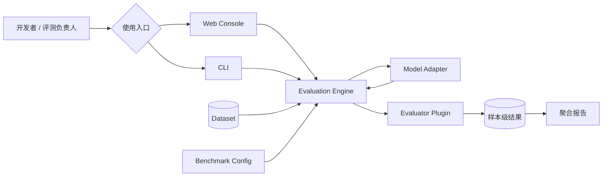
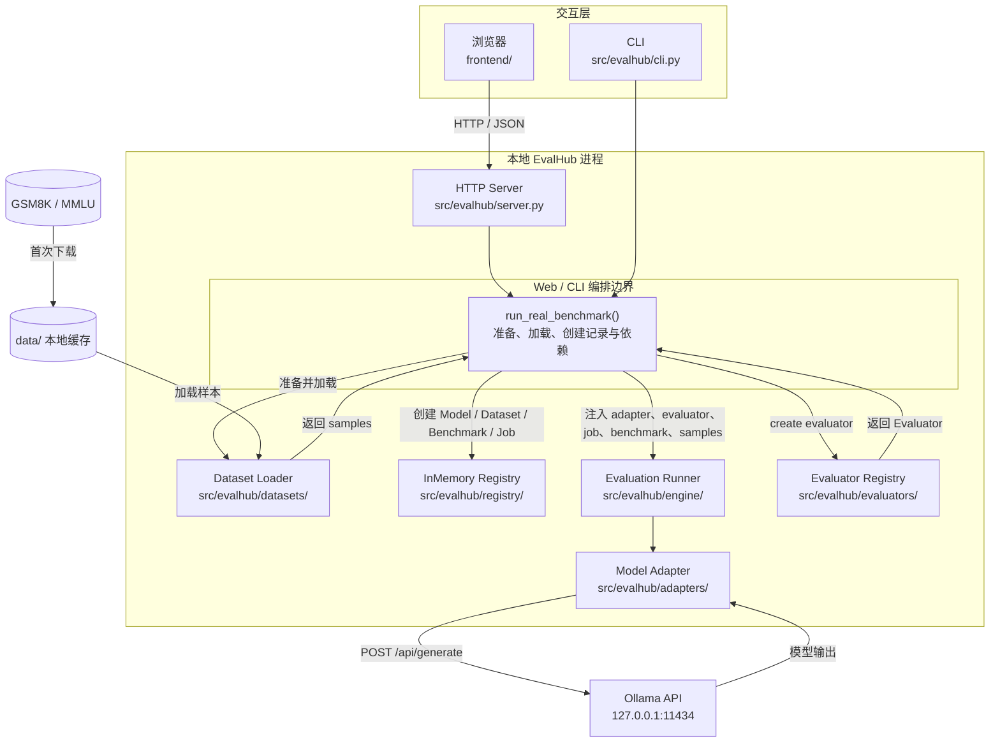
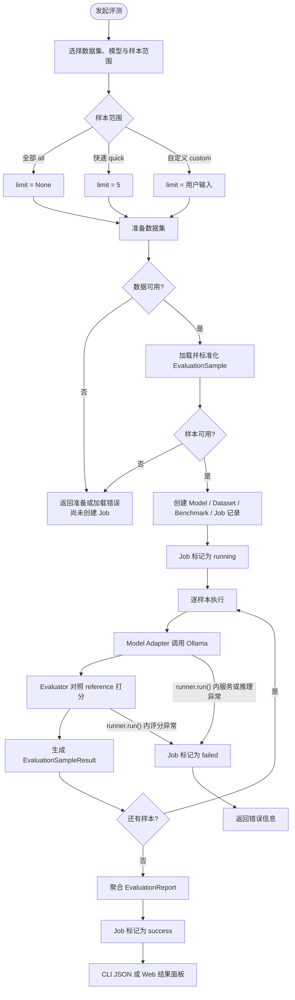
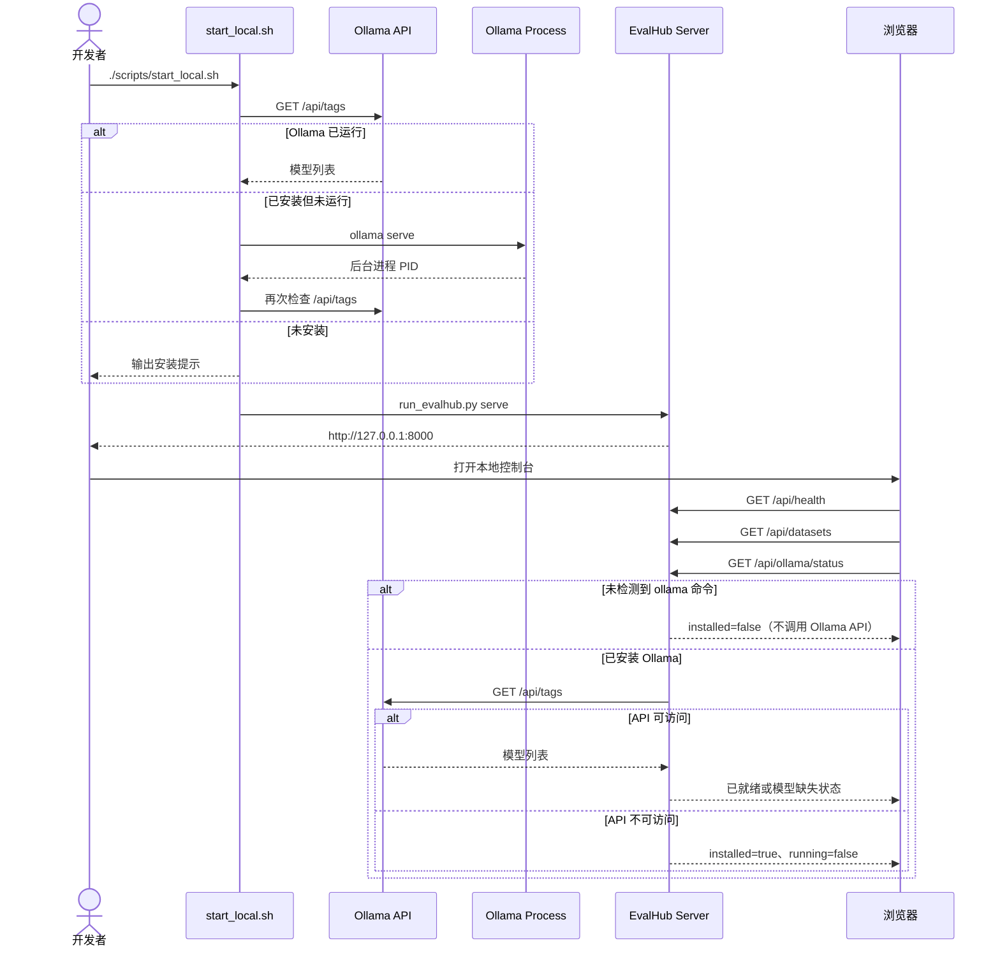

# README Diagrams Implementation Plan

> **For agentic workers:** REQUIRED SUB-SKILL: Use superpowers:subagent-driven-development (recommended) or superpowers:executing-plans to implement this plan task-by-task. Steps use checkbox (`- [ ]`) syntax for tracking.

**Goal:** 为 README 增加 5 张面向新用户的 GitHub Mermaid 图，解释 EvalHub 的系统全景、当前架构、启动顺序、评测流程与企业级演进路线。

**Architecture:** 只修改 Markdown 文档，不增加图片资源或运行时依赖。所有图使用 GitHub 支持的 `flowchart` 与 `sequenceDiagram`，当前实现与规划能力通过分区、标签和统一样式明确区分。

**Tech Stack:** Markdown、GitHub Mermaid、shell 静态检查。

## Global Constraints

- 保留 README 中现有安装、运行、目录结构与链接内容。
- 使用 GitHub 原生 Mermaid，不增加 PNG、SVG 或外部图床。
- 图内以中文为主，保留必要的英文技术名词。
- 当前能力必须能映射到仓库现有源码；未来能力必须标记为“规划”。
- 最终 README 恰好包含 5 个 Mermaid 代码块。
- 不修改或暂存工作区中与本任务无关的文件。

---

### Task 1: Add the onboarding mental model

**Files:**
- Modify: `README.md:1-30`

**Interfaces:**
- Consumes: README 现有项目介绍与“当前能力”清单。
- Produces: “30 秒理解 EvalHub”章节、系统全景图、当前本地 MVP 架构图。

- [ ] **Step 1: Insert the system overview diagram**

在“当前能力”之后、“快速开始”之前增加“30 秒理解 EvalHub”，并插入以下产品心智模型：



- [ ] **Step 2: Insert the current MVP component diagram**

紧接全景图插入当前实现图，使用 subgraph 映射源码与外部依赖：



- [ ] **Step 3: Add a concise reading guide**

在两张图后增加两段说明：当前 MVP 是单机、同步、零前端构建依赖的实现；Web 与 CLI 复用同一条 Python 评测核心链路。说明 `data/` 和 Ollama 均在本机，不把规划组件混入当前图。

- [ ] **Step 4: Verify the section**

Run:

```bash
test "$(rg -c '^```mermaid$' README.md)" -eq 2
rg -n '30 秒理解 EvalHub|当前本地 MVP 架构|Evaluation Engine|InMemory Registry' README.md
git diff --check -- README.md
```

Expected: 三条命令退出码均为 0，README 中有 2 个 Mermaid 块。

---

### Task 2: Document startup and evaluation flows

**Files:**
- Modify: `README.md` 中“真实 Benchmark 试跑”和“本地前后端一键启动”章节。

**Interfaces:**
- Consumes: `scripts/start_local.sh`、`src/evalhub/server.py`、`src/evalhub/cli.py`、`src/evalhub/engine/runner.py` 的实际流程。
- Produces: 一键启动时序图、单次评测流程图及错误路径说明。

- [ ] **Step 1: Insert the evaluation flow before benchmark commands**

在“真实 Benchmark 试跑”介绍后、命令示例前插入：



- [ ] **Step 2: Insert the startup sequence after `start_local.sh`**



- [ ] **Step 3: Add failure behavior notes**

说明 Ollama 未安装时 EvalHub Server 仍会启动，UI 会显示未就绪。数据集准备或加载失败时 API 返回错误，此时尚未创建 Job；进入 `runner.run()` 后的 Ollama 推理或 Evaluator 异常则会将 Job 状态更新为 `failed`。

- [ ] **Step 4: Verify both flows**

Run:

```bash
test "$(rg -c '^```mermaid$' README.md)" -eq 4
rg -n '样本范围|Job 标记为 failed|sequenceDiagram|GET /api/ollama/status' README.md
git diff --check -- README.md
```

Expected: 三条命令退出码均为 0，README 中有 4 个 Mermaid 块。

---

### Task 3: Add the evolution roadmap and validate the README

**Files:**
- Modify: `README.md` 中“目录结构”和“下一步建议”之间。
- Keep: `docs/ARCHITECTURE.md` 作为更完整的架构说明链接。

**Interfaces:**
- Consumes: 当前 README“下一步建议”与 `docs/ARCHITECTURE.md` 的目标生产架构。
- Produces: 五泳道、四阶段演进路线图、图例和最终验证结果。

- [ ] **Step 1: Insert the evolution roadmap**

```mermaid
flowchart TB
    subgraph Experience["体验入口"]
        direction LR
        UX1["① 当前本地 MVP<br/>静态 Web + CLI"] --> UX2["② 平台服务化（规划）<br/>React Console"] --> UX3["③ 分布式执行（规划）<br/>多项目工作台"] --> UX4["④ 质量治理（规划）<br/>自助报告与门禁视图"]
    end

    subgraph Orchestration["任务编排"]
        direction LR
        OR1["① 当前本地 MVP<br/>同步 API / 命令"] --> OR2["② 平台服务化（规划）<br/>Job API + 状态机"] --> OR3["③ 分布式执行（规划）<br/>Scheduler + Queue + 重试 / 取消"] --> OR4["④ 质量治理（规划）<br/>Policy + Release Gate 编排"]
    end

    subgraph Execution["执行与插件"]
        direction LR
        EX1["① 当前本地 MVP<br/>Runner + Adapter + Evaluator"] --> EX2["② 平台服务化（规划）<br/>Worker 契约 + 插件注册"] --> EX3["③ 分布式执行（规划）<br/>弹性 Worker Pool + 远端推理"] --> EX4["④ 质量治理（规划）<br/>LLM Judge + Safety + Agent Eval"]
    end

    subgraph Data["数据与制品"]
        direction LR
        DA1["① 当前本地 MVP<br/>本地 Dataset + InMemory Registry"] --> DA2["② 平台服务化（规划）<br/>PostgreSQL Registry"] --> DA3["③ 分布式执行（规划）<br/>MinIO Artifact + Dataset Cache"] --> DA4["④ 质量治理（规划）<br/>版本、血缘与可复现快照"]
    end

    subgraph Governance["可观测与治理"]
        direction LR
        GO1["① 当前本地 MVP<br/>JSON 报告 + 失败样例"] --> GO2["② 平台服务化（规划）<br/>指标、日志与任务历史"] --> GO3["③ 分布式执行（规划）<br/>Trace + Audit + 成本统计"] --> GO4["④ 质量治理（规划）<br/>Leaderboard + SLA + 发布审计"]
    end

    classDef current fill:#e8f1ff,stroke:#1d6fd8,color:#111827,stroke-width:2px;
    classDef next fill:#ecfdf3,stroke:#16a34a,color:#14532d,stroke-width:2px;
    classDef planned fill:#f8fafc,stroke:#94a3b8,color:#475569,stroke-dasharray:5 5;
    class UX1,OR1,EX1,DA1,GO1 current;
    class UX2,OR2,EX2,DA2,GO2 next;
    class UX3,UX4,OR3,OR4,EX3,EX4,DA3,DA4,GO3,GO4 planned;
```



- [ ] **Step 2: Add the legend and architecture link**

在路线图前说明蓝色实线节点代表当前能力，绿色实线节点代表下一阶段，灰色虚线节点代表后续规划；图后链接 `[docs/ARCHITECTURE.md](docs/ARCHITECTURE.md)`，引导需要更多细节的读者。

- [ ] **Step 3: Verify Mermaid block count and Markdown integrity**

Run:

```bash
test "$(rg -c '^```mermaid$' README.md)" -eq 5
awk '/^```mermaid$/{open_count++} /^```$/{close_count++} END{exit (open_count == 5 && close_count >= 5) ? 0 : 1}' README.md
for file_path in docs/OLLAMA.md docs/CODEX_WORKFLOW.md docs/ARCHITECTURE.md; do test -e "$file_path"; done
git diff --check -- README.md
```

Expected: 所有命令退出码为 0，5 个 Mermaid 块均有闭合围栏，已有相对链接目标存在。

- [ ] **Step 4: Review scope**

Run:

```bash
git diff -- README.md
git status --short
```

Expected: README diff 只包含图解、图例和配套说明；工作区已有其他文件仍保持原状态且未被暂存。
