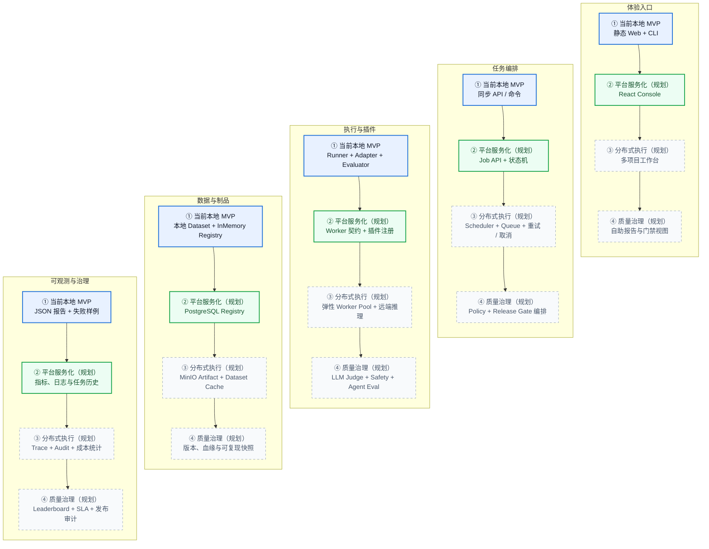

# Documentation Structure and Mermaid Reliability Implementation Plan

> **For agentic workers:** REQUIRED SUB-SKILL: Use superpowers:subagent-driven-development (recommended) or superpowers:executing-plans to implement this plan task-by-task. Steps use checkbox (`- [ ]`) syntax for tracking.

**Goal:** 修复 README 的 Mermaid 解析错误，扩展“演进路线图”，并把 `docs/` 整理为带导航入口的用途型子目录结构。

**Architecture:** README 中的 Mermaid 使用引用标签并通过官方 Mermaid CLI 逐图渲染。文档使用固定八文件路径映射迁移，`docs/README.md` 作为入口，所有当前引用同步到新路径；已有未提交文档内容原样保留且不自动提交。

**Tech Stack:** Markdown、GitHub Mermaid、Mermaid CLI 11.x、ripgrep、Git、Python/Node/shell 回归检查。

## Global Constraints

- 不改变 Python、前端或启动脚本行为。
- `docs/LOCAL_RUN.md` 与 `docs/OLLAMA.md` 的现有未提交内容必须原样保留。
- 不暂存或提交工作区中现有前端、Python、脚本 changes。
- README 中保持恰好 5 个 Mermaid 块。
- README 与 `docs/superpowers/plans/20260804_README图解实施计划.md` 中对应的 5 个 Mermaid 块保持一致。
- `docs/` 根目录最终只保留 `README.md` 与用途型子目录。
- 正式文档使用设计说明中的八条固定路径映射，不增加空目录或占位文档。
- Mermaid 节点与边标签只要包含特殊字符，就必须使用双引号包裹。

---

### Task 1: Fix Mermaid parsing and expand the roadmap

**Files:**
- Modify: `README.md`
- Modify: `docs/superpowers/plans/20260804_README图解实施计划.md`
- Modify: `docs/superpowers/specs/20260804_README图解设计.md`

**Interfaces:**
- Consumes: README 中现有 5 个 Mermaid 块和 Mermaid CLI 解析错误。
- Produces: 5 个可渲染 Mermaid 块、详细“演进路线图”以及同步的设计/计划示例。

- [ ] **Step 1: Preserve RED evidence**

运行当前架构图与 Benchmark 流程图的 Mermaid CLI 渲染，确认分别失败在以下文本：

```text
Workflow[run_real_benchmark()<br/>准备、加载、创建记录与依赖]
Infer -->|runner.run() 内服务或推理异常| Failed
```

Expected: 两次 `mmdc` 均退出 1，错误包含 `got 'PS'`。

- [ ] **Step 2: Quote the architecture diagram labels**

至少将含特殊字符的节点和边改为以下安全形式；同一图内其余含 `<br/>`、`/`、逗号的标签也采用相同引用规则：

```mermaid
Workflow["run_real_benchmark()<br/>准备、加载、创建记录与依赖"]
Browser -->|"HTTP / JSON"| Server
Workflow -->|"创建 Model / Dataset / Benchmark / Job"| Registry
Workflow -->|"注入 adapter、evaluator、job、benchmark、samples"| Runner
Adapter -->|"POST /api/generate"| Ollama
```

- [ ] **Step 3: Quote the Benchmark flow error labels**

```mermaid
Infer -->|"runner.run() 内服务或推理异常"| Failed["Job 标记为 failed"]
Score -->|"runner.run() 内评分异常"| Failed
```

其余包含 `<br/>`、`/`、`?` 或逗号的节点/边文本同步加双引号。

- [ ] **Step 4: Replace the roadmap**

标题使用 `## 演进路线图`。用以下五泳道、四阶段图完整替换原三段路线图：



图前说明蓝色为当前、绿色为下一阶段、灰色虚线为后续规划。图后继续链接架构文档，但路径由 Task 2 更新。

- [ ] **Step 5: Synchronize the historical README diagram artifacts**

将修复后的 5 个 Mermaid 块同步到 `docs/superpowers/plans/20260804_README图解实施计划.md`，并把对应设计说明从“三阶段 flowchart”更新为“五泳道、四阶段”。

- [ ] **Step 6: Verify GREEN with Mermaid CLI**

从 README 提取全部 Mermaid 块到临时目录并逐图渲染：

```bash
mermaid_tmp=$(mktemp -d)
awk -v out_dir="$mermaid_tmp" '
  /^```mermaid$/ { block++; capture=1; next }
  capture && /^```$/ { capture=0; next }
  capture { print > (out_dir "/diagram-" block ".mmd") }
' README.md
for diagram_file in "$mermaid_tmp"/*.mmd; do
  npm exec --yes --package @mermaid-js/mermaid-cli mmdc -- \
    -i "$diagram_file" -o "${diagram_file%.mmd}.svg"
done
```

Expected: 5 个 `mmdc` 调用全部退出 0，临时目录包含 5 个 SVG。

- [ ] **Step 7: Verify README/plan parity**

提取 README 与计划中的 5 个 Mermaid 块并使用 `diff -u` 比较。Expected: 退出 0，无输出。

- [ ] **Step 8: Commit the clean Mermaid deliverable**

```bash
git add README.md \
  docs/superpowers/plans/20260804_README图解实施计划.md \
  docs/superpowers/specs/20260804_README图解设计.md
git commit -m "docs: fix and expand README diagrams"
```

---

### Task 2: Reorganize the documentation tree

**Files:**
- Create: `docs/README.md`
- Move: `docs/LOCAL_RUN.md` → `docs/getting-started/20260804_本地运行指南.md`
- Move: `docs/OLLAMA.md` → `docs/getting-started/20260804_Ollama本地模型安装与验证.md`
- Move: `docs/ARCHITECTURE.md` → `docs/architecture/20260804_系统架构.md`
- Move: `docs/API.md` → `docs/architecture/20260804_API接口草案.md`
- Move: `docs/DATA_MODEL.md` → `docs/architecture/20260804_数据模型.md`
- Move: `docs/PRD.md` → `docs/product/20260804_产品需求文档.md`
- Move: `docs/ROADMAP.md` → `docs/product/20260804_Agent评测路线图.md`
- Move: `docs/CODEX_WORKFLOW.md` → `docs/development/20260804_Codex对话沉淀工作流.md`
- Modify: `README.md`
- Modify: Markdown path references under `docs/`

**Interfaces:**
- Consumes: 8 root-level formal docs, current README links, current user modifications in `20260804_本地运行指南.md` and `20260804_Ollama本地模型安装与验证.md`.
- Produces: navigable docs hierarchy with no stale formal-doc paths.

- [ ] **Step 1: Record pre-move user changes**

```bash
git diff -- docs/LOCAL_RUN.md docs/OLLAMA.md
```

Save the output as review evidence only; do not restore or stage either file.

- [ ] **Step 2: Create category directories and move files without staging**

```bash
mkdir -p docs/getting-started docs/architecture docs/product docs/development
mv docs/LOCAL_RUN.md docs/getting-started/20260804_本地运行指南.md
mv docs/OLLAMA.md docs/getting-started/20260804_Ollama本地模型安装与验证.md
mv docs/ARCHITECTURE.md docs/architecture/20260804_系统架构.md
mv docs/API.md docs/architecture/20260804_API接口草案.md
mv docs/DATA_MODEL.md docs/architecture/20260804_数据模型.md
mv docs/PRD.md docs/product/20260804_产品需求文档.md
mv docs/ROADMAP.md docs/product/20260804_Agent评测路线图.md
mv docs/CODEX_WORKFLOW.md docs/development/20260804_Codex对话沉淀工作流.md
```

使用普通 `mv`，不使用会自动暂存的 `git mv`。

- [ ] **Step 3: Add the docs navigation page**

`docs/README.md` 必须包含：

- 推荐阅读顺序：本地运行 → 架构 → API/数据模型 → PRD/Roadmap → 开发流程。
- 四个分类表格，链接到全部 8 份正式文档。
- `superpowers/specs` 与 `superpowers/plans` 的用途说明。
- 明确根 `README.md` 是项目首页，`docs/README.md` 是详细文档索引。

- [ ] **Step 4: Update every old formal-doc path**

按设计说明中的八条固定映射，更新 `README.md`、移动后的正式文档以及 `docs/superpowers/**/*.md`。只替换完整路径，不改变其他业务文字。

- [ ] **Step 5: Update the root README directory tree**

目录树展示 `docs/README.md`、四个分类目录和 `superpowers/{plans,specs}`，不再列出旧根路径。

- [ ] **Step 6: Verify moves and preservation**

```bash
test ! -e docs/LOCAL_RUN.md
test ! -e docs/OLLAMA.md
test -e docs/getting-started/20260804_本地运行指南.md
test -e docs/getting-started/20260804_Ollama本地模型安装与验证.md
git diff --no-index /dev/null docs/getting-started/20260804_本地运行指南.md >/dev/null || true
git status --short
```

确认两份移动文档仍包含迁移前工作区 diff 中的修改。Task 2 不执行 `git add` 或 `git commit`，避免把用户原有内容误提交。

---

### Task 3: Validate documentation integrity and regressions

**Files:**
- Verify: `README.md`
- Verify: `docs/**/*.md`
- Verify: current non-document working-tree changes remain unstaged.

**Interfaces:**
- Consumes: Task 1 的 Mermaid 修复与 Task 2 的新文档路径。
- Produces: 可渲染、无失效引用、回归测试绿色的本地文档树。

- [ ] **Step 1: Assert old paths are gone and new paths exist**

对设计说明的 8 个旧路径运行 `test ! -e`，对 8 个新路径运行 `test -e`。Expected: 全部退出 0。

- [ ] **Step 2: Scan for stale path references**

```bash
rg -n 'docs/(LOCAL_RUN|OLLAMA|ARCHITECTURE|API|DATA_MODEL|PRD|ROADMAP|CODEX_WORKFLOW)\.md' \
  README.md docs -g '*.md' \
  -g '!docs/superpowers/specs/20260804_文档结构与Mermaid可靠性设计.md' \
  -g '!docs/superpowers/plans/20260804_文档结构与Mermaid可靠性实施计划.md'
```

Expected: 无输出，退出 1。当前迁移设计/计划因记录旧路径映射而排除。

- [ ] **Step 3: Inspect all Markdown links**

```bash
rg -n '\]\([^)]*\.md(?:#[^)]*)?\)' README.md docs -g '*.md'
```

逐项确认相对目标存在；README 至少链接 docs 导航、本地运行、Ollama、架构与开发流程。

- [ ] **Step 4: Re-run all Mermaid parses**

重复 Task 1 Step 6。Expected: 5/5 SVG 生成成功。

- [ ] **Step 5: Run regressions**

```bash
PYTHONPATH=src .venv/bin/python -m pytest
node --check frontend/app.js
bash -n scripts/start_local.sh
.venv/bin/python -m compileall -q src run_evalhub.py tests
git diff --check
```

Expected: 测试全部通过，其他命令退出 0。

- [ ] **Step 6: Review final scope**

```bash
git status -sb
git diff --name-status
git diff --cached --name-status
```

Expected: 现有前端、Python、启动脚本 changes 仍未暂存；Task 2 文档迁移保持未暂存；暂存区为空。
