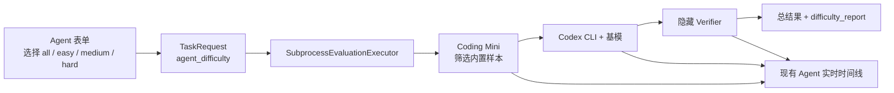
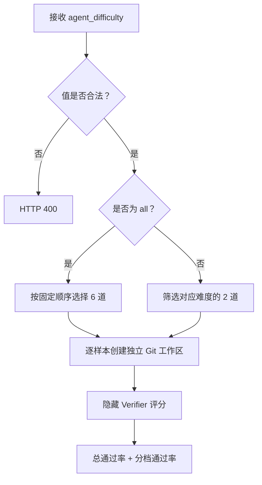

# Agent Benchmark 难度分级设计

状态：方案已确认，待书面审阅  
日期：2026-08-04

## 1. 目标

把 EvalHub Coding Mini 从 3 道未分级样本扩展为 6 道可解释的三级难度题集：

- 简单、中等、困难各 2 道；
- 发起 Agent 评测时可选择全部或单个难度；
- 结果同时保留总通过率和按难度拆分的通过率；
- 每条样本记录难度及分级理由；
- 继续以最终工作区的隐藏校验评分，并复用现有实时审计时间线。

这不是通用 Benchmark 管理系统。首版不支持用户上传题集、动态难度算法、难度加权总分、
外部 Benchmark 下载或数据库题库。

## 2. 最小方案

复用现有链路，只在已经存在的数据和结果中加入难度：



不增加数据库表。`TaskRequest` 已作为 JSON 持久化，完整结果也已作为 JSON 保存；新增字段自然进入
现有存储。执行节点、事件表、worker 进程和 Codex Runner 都保持现状。

## 3. 难度定义

难度由题目作者按可观察的工程约束静态标注，不根据某次模型得分动态改变。

| 难度 | 判定标准 | 预期 Agent 行为 |
| --- | --- | --- |
| 简单 | 单文件、局部纯函数、一个主要缺陷 | 阅读目标函数，修改并做少量边界验证 |
| 中等 | 多个边界或可变状态不变量 | 理解失败路径，覆盖成功与拒绝场景 |
| 困难 | 多文件协作、原子性或状态机不变量 | 先定位调用关系，再修改并运行成组验证 |

每条 `CodingAgentSample` 增加两个字段：

- `difficulty`: `easy`、`medium` 或 `hard`；
- `difficulty_reason`: 一句可展示的静态分级理由。

不引入分值公式或自动校准器。等积累多模型实测结果后，再决定是否需要调整题目分级。

## 4. 题集

| 难度 | 样本 | 任务重点 | 分级理由 |
| --- | --- | --- | --- |
| 简单 | `pricing_total` | 修复遗漏最后一项和空列表 | 单文件纯函数，缺陷定位直接 |
| 简单 | `cart_quantity` | 正确汇总商品数量并处理空购物车 | 单文件纯函数，只有局部聚合语义 |
| 中等 | `slug_normalization` | 统一大小写、分隔符、标点和空输入 | 单函数但包含多个输入边界 |
| 中等 | `inventory_reservation` | 成功扣减，所有拒绝路径保持库存不变 | 涉及可变状态与失败不变量 |
| 困难 | `batch_reservation_atomicity` | 跨模块批量预留，任一失败时全部回滚 | 需要理解两文件调用关系和原子性 |
| 困难 | `retry_state_machine` | 正确推进重试次数与终态，终态不可回退 | 多文件状态定义和多步状态不变量 |

六道题的公开函数契约固定如下，隐藏校验只验证这些公开要求：

- `pricing.total_with_tax(prices, tax_rate)`：所有价格参与小计，空列表返回 `0.0`；
- `cart.total_quantity(lines)`：`lines` 是带 `quantity` 整数的字典列表，返回数量总和，空列表返回 0；
- `slug.normalize_slug(value)`：输出由单连字符连接的小写 ASCII 单词，空输入返回空字符串；
- `inventory.reserve(stock, item, quantity)`：仅正数且库存充足时成功扣减，其他情况不修改库存；
- `batch.reserve_batch(stock, requests)`：`requests` 是 `(item, quantity)` 列表，包含重复商品时累计检查，
  仅全部请求有效且库存充足时统一扣减，否则原字典保持不变；
- `retry.record_failure(job, max_attempts, error)`：`job` 含 `status`、`attempts` 和 `last_error`；
  `running` 或 `retrying` 任务增加一次尝试并记录错误，低于上限时进入 `retrying` 并返回 `True`，
  达到上限时进入 `failed` 并返回 `False`，已有 `succeeded` 或 `failed` 终态不得变化。

所有样本继续满足以下约束：

- 仅使用 Python 标准库；
- 初始工作区小且可在数秒内创建；
- Verifier 不写入 Agent 工作区；
- 不依赖网络、Ollama 之外的服务或预装项目依赖；
- 隐藏校验覆盖任务说明中公开承诺的行为，不设置文字陷阱。

## 5. 请求契约与兼容性

Agent 请求新增：

```json
{
  "evaluation_type": "agent",
  "dataset": "coding_mini",
  "agent_framework": "codex",
  "agent_difficulty": "all"
}
```

`agent_difficulty` 允许 `all`、`easy`、`medium`、`hard`，默认 `all`。模型评测请求若携带该字段，
API 返回 400，避免静默忽略错误配置。

`TaskRequest` 直接增加 `agent_difficulty: str | None = None`，不创建新的请求子类。API 把新 Agent
请求中省略的值归一为 `all`，模型请求保持 `None`。Agent 执行不再用通用 `limit` 截断稳定前缀；
它按 `agent_difficulty` 选择 6 道或对应 2 道。前端 Agent 请求固定发送
`sample_mode="all"`，普通模型评测的 `sample_mode` 行为不变。

已有结果仍可读取，因为前端把新增报告字段视为可选；新任务始终写入新字段。已有任务详情不会被迁移
或重新评分。

## 6. 样本选择与执行



样本顺序固定为简单、中等、困难，档内顺序固定。`scaffold_hash` 继续由实际选择的样本生成，结果
新增 `benchmark_version="coding-mini-v2"`，便于判断两次运行是否使用同一题集。

`sample_started` 事件的 payload 增加 `difficulty` 和 `difficulty_reason`，消息前缀显示中文难度。
后续工具、工作区、Verifier 和样本终态事件继续沿用现有事件契约。

## 7. 结果契约

每条样本结果增加：

```json
{
  "sample_id": "inventory_reservation",
  "difficulty": "medium",
  "difficulty_reason": "涉及可变状态与失败不变量",
  "status": "failed",
  "score": 0.0
}
```

聚合结果增加：

```json
{
  "benchmark_version": "coding-mini-v2",
  "requested_difficulty": "all",
  "difficulty_report": [
    {"difficulty": "easy", "total": 2, "passed": 1, "pass_rate": 0.5},
    {"difficulty": "medium", "total": 2, "passed": 0, "pass_rate": 0.0},
    {"difficulty": "hard", "total": 2, "passed": 0, "pass_rate": 0.0}
  ]
}
```

不增加“难度加权综合分”。`average_score` 仍为所选样本的隐藏校验通过率，六维能力报告仍由所选样本
的既有能力权重聚合。这样不同难度可独立比较，又不制造未经校准的权重。

## 8. 前端

Agent 表单在基模下方增加四个原生单选项：全部、简单、中等、困难。默认全部，并直接显示题量：

- 全部：6 道；
- 单个难度：2 道。

结果页在现有 Agent 能力报告下方增加一个紧凑列表，展示每个已运行难度的通过数和通过率。失败样例
显示难度标签。页面继续复用现有轮询、节点检查器、时间线和结果详情组件，不新建难度页面。

## 9. 错误与安全边界

- 非法 `agent_difficulty` 在 API 边界返回 400；
- 筛选结果为空视为配置错误，不启动 Codex；
- 单样本 Codex 失败仍记录 `runtime_error` 并继续后续样本；
- Verifier 仍在 Agent 退出后执行，代码不进入工作区或提示词；
- Trace 继续只持久化白名单事件和截断文本，不记录思维链；
- 新样本文件路径继续通过现有相对路径校验。

## 10. 验证与验收

自动化检查覆盖：

1. 题集恰好 6 道、每档 2 道、ID 唯一且分级理由非空；
2. `all` 和三个单档选择返回稳定顺序；
3. 非法难度返回 400，模型评测不能携带 Agent 难度；
4. 分档统计只使用隐藏校验结果，零样本不产生除零；
5. Trace 的开始事件包含难度；
6. 前端请求发送选中难度，结果展示分档通过率和失败样例难度；
7. 现有模型评测、任务恢复和旧结果展示保持通过。

交付前运行：

```bash
.venv/bin/python -m ruff check .
.venv/bin/python -m pytest
cd frontend && npm test -- --run
cd frontend && npm run typecheck
cd frontend && npm run build
git diff --check
```

真实验收至少运行一次 `all` 的 Codex + Ollama 评测，确认：

- 进度从 0/6 到 6/6；
- 三档报告各有 2 道；
- 实时时间线能看到每道题的难度和失败证据；
- 刷新页面后结果与事件保持不变；
- 浏览器控制台无 warning/error。

## 11. 明确延后

首版不做以下事项：

- 根据历史通过率自动调整难度；
- 难度加权排行榜；
- 可视化题库编辑器；
- 用户自定义 Benchmark 上传；
- Docker 环境和外部公开 Agent Benchmark；
- 每档超过 2 道的统计置信度声明。

当 6 道题无法区分目标模型、需要团队维护独立题库，或需要引用公开 Benchmark 官方分数时，再扩展
题集来源和校准机制。
