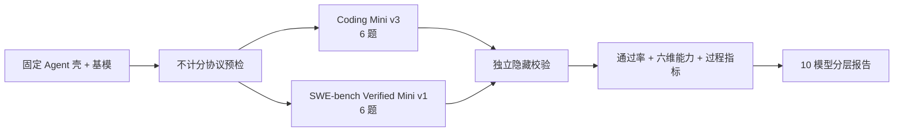

# Agent 双六题套件与过程指标设计

状态：用户已确认
日期：2026-08-05

## 1. 目标

EvalHub 用固定 Pi Agent 壳比较不同基模。本次设计解决三个问题：

1. 把工具协议问题与代码实现能力分开，避免把协议失败笼统解释为模型零分；
2. 保留一个快速本地回归套件，同时增加一个真实 SWE-bench Verified 六题套件；
3. 在通过率和六维能力之外展示工具调用、耗时、文件变化和失败类型。

两个套件都固定为 6 题。它们是工程诊断集，不宣称等价于完整 SWE-bench Verified 的统计结论。

## 2. 非目标

- 不接入完整 500 题 SWE-bench Verified；
- 不允许用户上传任意容器或题目；
- 不引入 LLM-as-a-Judge、动态难度或不同模型使用不同评分标准；
- 不自动执行模型作为普通文本输出的 JSON 工具请求；
- 不增加通用 Agent 框架、通用沙箱平台或新的前端图表依赖。

## 3. 总体流程



协议预检只提供诊断，不改变题目正确性标准，也不阻止用户继续评测。正式得分始终来自最终工作区
的独立校验。

## 4. Agent 协议预检

每个“Agent 壳 + Provider + 模型”组合在正式题目前运行一次固定探针：

1. 请求结构化调用 `write`；
2. 在隔离工作区创建内容精确为 `OK\n` 的文件；
3. 读取工具执行事件；
4. 检查模型是否正常结束本轮。

预检结果固定为：

| 状态 | 判定 |
| --- | --- |
| `compatible` | 产生结构化工具调用、工具成功执行且正常结束 |
| `degraded` | 工具成功执行，但缺少最终消息或结束协议异常 |
| `incompatible` | 没有结构化工具调用、参数无效或工具未实际执行 |

普通文本中的 `{"tool": ...}` 不会被 EvalHub 转换为可执行调用。这既避免执行模型伪造的命令，也
保证所有模型面对相同的 Pi 工具协议。预检结果写入任务结果和报告，但不计入 6 题通过率。

## 5. EvalHub Coding Mini v3

Mini v3 继续使用六个自包含 Python Git 工作区、标准库和独立隐藏校验，不需要 Docker。每题默认
上限 180 秒，简单、中等、困难各两题。

| 难度 | 样本 | 公开任务重点 |
| --- | --- | --- |
| 简单 | `path_normalization` | 规范化用户路径，保留根语义并拒绝目录逃逸 |
| 简单 | `config_precedence` | 按参数、环境映射、文件值、默认值的固定优先级解析配置且不修改输入 |
| 中等 | `pagination_merge` | 跨模块读取分页数据，去重并检测重复游标，避免无限循环 |
| 中等 | `cache_expiry` | 使用注入时钟实现 TTL、命中、过期和清理语义，不依赖墙上时钟 |
| 困难 | `reservation_idempotency` | 跨库存与审计模块实现批量原子性、重复请求累计和幂等键 |
| 困难 | `async_worker_cleanup` | 正确处理异步取消、异常传播、队列确认和资源关闭 |

每个说明只公开可观察契约，不提示目标文件或修复步骤。初始工作区包含足够的调用关系和公开测试，
要求 Agent 先探索再修改；隐藏校验覆盖说明中的边界，不设置未公开文字陷阱。

版本固定为 `coding-mini-v3`。v2 历史结果保留原版本，不重新评分，也不与 v3 趋势混合。

## 6. SWE-bench Verified Mini v1

真实套件直接使用官方数据集的问题说明、基础提交和测试补丁，不改写题意。为兼顾仓库多样性和
Docker 构建时间，清单固定为三个 Python 仓库、每个仓库两题：

| 仓库 | 官方 instance ID |
| --- | --- |
| Requests | `psf__requests-2931` |
| Requests | `psf__requests-6028` |
| Xarray | `pydata__xarray-2905` |
| Xarray | `pydata__xarray-7229` |
| pytest | `pytest-dev__pytest-7324` |
| pytest | `pytest-dev__pytest-10356` |

清单版本固定为 `swebench-verified-mini-v1`，并保存数据集名称、六个 instance ID、基础提交和官方
测试清单的 SHA-256 指纹。升级清单必须发布新版本，不能覆盖历史成绩。

执行复用 SWE-bench 官方 Docker 环境：

1. EvalHub 为六个固定实例构建或缓存官方基础镜像；
2. 固定 Pi 运行时作为薄层加入实例镜像，Agent 在同一容器工作区读写和运行测试；
3. 本地 Ollama 通过 `host.docker.internal` 访问，API 模型只连接控制器创建的私有凭据代理；
4. Agent 完成后导出补丁；
5. 新建干净验证容器应用补丁和官方测试补丁，避免 Agent 污染 Verifier；
6. 官方 fail-to-pass 与 pass-to-pass 测试共同决定通过或失败。

首次启用前必须用官方 gold patch 在当前 macOS Docker 环境验证 6/6。任何 gold 失败都视为
`executor_not_ready`，不得产生模型分数。

设计依据：[SWE-bench 官方仓库](https://github.com/swe-bench/SWE-bench)、
[SWE-bench Verified 数据集](https://huggingface.co/datasets/princeton-nlp/SWE-bench_Verified) 和
[SWE-bench Verified 说明](https://openai.com/index/introducing-swe-bench-verified/)。任务结构同时
遵循 Terminal-Bench 的“固定环境、独立程序化校验、真实多步工具操作”原则：
[Terminal-Bench 官方仓库](https://github.com/harbor-framework/terminal-bench)。

## 7. 过程指标契约

每个样本结果保留现有字段，并在 `diagnostics` 中稳定提供：

```json
{
  "outcome": "wrong_solution",
  "tool_call_count": 12,
  "tool_error_count": 1,
  "changed_files": ["retry.py"],
  "wall_time_seconds": 84.2,
  "final_message_present": true,
  "verifier_passed": false
}
```

任务结果新增 `execution_summary`：

```json
{
  "total_tool_calls": 53,
  "average_tool_calls": 8.83,
  "total_tool_errors": 1,
  "total_wall_time_seconds": 421.6,
  "average_wall_time_seconds": 70.27,
  "max_wall_time_seconds": 151.4,
  "total_changed_files": 9,
  "outcome_counts": {
    "passed": 5,
    "no_action": 0,
    "wrong_solution": 1,
    "runtime_error": 0,
    "protocol_error": 0
  }
}
```

工具次数以 Pi 的 `tool_execution_start` 事件为准；即使超时或缺少最终消息，也由 Benchmark 内部
事件计数器保留。耗时从 Agent 调用前开始，到正常结束、异常或超时为止。`total_changed_files` 是
各隔离样本的改动文件数量之和，不把不同样本中的同名文件错误合并。

缺少最终消息不再抹掉正确工作区或过程指标：隐藏校验仍评分，并把预检/样本协议状态标为
`degraded`。预检为 `incompatible` 且样本没有工作区动作时归为 `protocol_error`；预检兼容、模型
主动结束但没有调用工具或修改文件时归为 `no_action`。错误修改统一归为 `wrong_solution`，超时、
进程失败或无法执行的工具参数归为 `runtime_error`。

## 8. 十模型分层主榜

主报告固定比较 4 个 API 模型和 6 个本地模型，只保留两个 Qwen：

| 来源 | 模型 | 层次 |
| --- | --- | --- |
| API | `moonshotai/Kimi-K2.7-Code` | coding API |
| API | `zai-org/GLM-5.2` | general API |
| API | `deepseek-v4-pro` | pro API |
| API | `deepseek-ai/DeepSeek-V4-Flash` | flash API |
| 本地 | `qwen3:14b` | 14B |
| 本地 | `gemma4:12b` | 12B |
| 本地 | `granite3.3:8b` | 8B |
| 本地 | `qwen3:4b` | 4B |
| 本地 | `granite4.1:3b` | 3B |
| 本地 | `deepseek-r1:1.5b` | 1.5B |

`qwen2.5-coder:7b` 和 `qwen2.5:1.5b` 从主榜移到协议诊断附录，保留其历史结果和不兼容证据。
不同 Provider 的同名模型必须显示完整 Provider 与模型 ID，不能把官方 DeepSeek 与 SiliconFlow
调用混为同一端点。

## 9. 页面与报告

任务详情在六维图下增加一个紧凑的“执行过程指标”区：顶部展示总工具调用、平均耗时、改动文件和
工具错误；下方表格逐题展示结果、工具次数、耗时、改动文件和失败类型。已有审计时间线继续承载
具体命令和工具输出，不在结果卡片重复完整日志。

README 报告显示：

- 两个套件分别排名，不把 Mini 与 SWE-bench 分数合并；
- 每个模型的通过率、协议状态、总工具次数和平均耗时；
- 10 个模型的六边形小多图；
- 题集版本、运行日期、Agent 壳版本和 Provider；
- “6 题小样本诊断集，不代表完整上游榜单”的醒目标注。

## 10. 错误与安全边界

- API Key 继续只存在于加密 Provider 仓储和父进程代理，不进入 Agent 环境、配置或报告；
- 预检和正式任务都拒绝任意远程 Base URL，只允许已批准的官方 Provider；
- Agent 工作区与隐藏校验隔离，SWE-bench 使用全新验证容器；
- 容器构建失败、Docker 不可用和 gold 校验失败均为执行器阻塞，不记模型零分；
- 模型产生错误补丁、无动作或错误工具参数属于可观察模型/协议结果，不重试成另一套评分标准。

## 11. 验证与完成标准

1. 协议预检能稳定区分正常工具调用、缺少最终消息、文本伪工具和无效工具参数；
2. Mini v3 的六个 gold 实现全部通过，已知错误实现分别触发对应隐藏校验；
3. SWE-bench Verified Mini 的六个官方 gold patch 在 macOS Docker 上全部通过；
4. 失败、超时和无最终消息仍保留准确的工具次数、耗时与文件变化；
5. API、SQLite 持久化和前端能向后兼容读取 v2 历史结果；
6. 10 个主榜模型在同一套件版本下完成后才生成比较报告；
7. Python 测试、前端测试、Ruff、前端构建和 `git diff --check` 全部通过。

## 12. 实施顺序

1. 修正 Pi 运行结果与 Benchmark 事件计数，补齐协议预检和过程指标；
2. 增加 Mini v3 六个 fixture、隐藏校验和版本隔离；
3. 在任务详情展示聚合与逐题过程指标；
4. 冻结 SWE-bench 六题清单，完成 gold Docker 验证后接入正式运行；
5. 用固定 10 模型矩阵运行并更新 README 报告。

该顺序先交付轻量且可验证的诊断能力，再启用成本更高的真实仓库套件，不提前建设通用沙箱平台。
