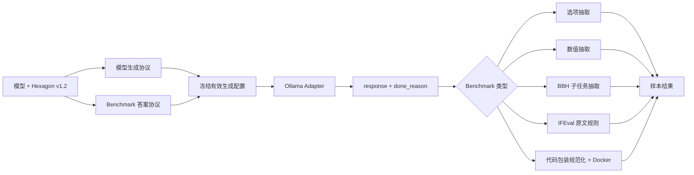

# 模型与 Benchmark 协议兼容设计

## 目标

修复 EvalHub 专业六边形套件中“模型能够生成有效答案，但传输、生成预算或答案解析协议导致
空回答和误判零分”的问题。模型生成差异与 Benchmark 官方评分语义必须分别适配：模型侧只
负责稳定地产生可评分输出，Benchmark 侧只负责按固定官方协议解释该输出。不同模型不得使用
不同的正确性标准。

本设计覆盖控制台当前全部 13 个可选 Ollama 模型：仓库维护的 12 个推荐模型，以及本机已安装、
会被控制台优先列出的 `granite3.3:8b`。其中 9 个已安装模型必须完成真实验证；4 个未安装推荐
模型完成静态合同验证，并在安装后才允许声明真实兼容。

## 已确认的问题

当前失败不是单一模型能力问题：

- `gemma4:12b` 的 30 条结果中有 26 条空回答；4 条非空回答全部得分。
- `qwen3:14b` 的最近一次任务在 26 条已保存结果中有 22 条空回答；`qwen3:4b` 的 25 条文本
  结果全部为空。
- `deepseek-r1:1.5b`、Qwen3 和 Gemma 4 都支持 thinking。当前统一的 `num_predict=256`
  会同时消耗内部思考和最终答案 token，但请求没有显式控制 `think`。
- 本机复现显示，默认 thinking 的简单选择题可以返回 `response=""` 和
  `done_reason="length"`；同一请求使用 `think=false` 后会返回最终答案。
- 非 thinking 模型能够生成文本，但当前 `hexagon-gsm8k` 目录错误地选择 `exact_match`。
  已观察到包含正确 `Final answer: 500` 的回答仍得 0 分。
- BBH 的五个子任务答案域不同。当前统一字符串精确匹配会把“解释 + 正确最终结论”误判为 0。
- HumanEval 把原始模型文本直接拼接到官方函数前缀；Markdown 代码围栏或完整函数输出会因包装
  格式失败，而不是因实现错误失败。
- IFEval 必须对完整回答应用官方规则，不能使用通用答案抽取，也不能因 token 预算过小截断回答。

## 设计原则

1. 模型生成协议与 Benchmark 答案协议正交组合，不维护 13 × 7 份手写分支。
2. 所有模型共享同一 Benchmark 正确性标准；只允许适配传输、thinking 和无语义的输出包装。
3. 不用后处理“修正”答案内容，不接受同义答案猜测，也不引入 LLM-as-a-Judge。
4. 官方输入、参考答案、规则和隐藏测试保持不变；协议变化通过 Suite 版本和指纹审计。
5. 空最终回答、未注册模型协议和不可解析传输响应属于协议失败，不伪装为模型能力零分。
6. 模型生成了非空但错误或不符合官方规则的回答，仍按该 Benchmark 记零分。

## 方案

采用双轴声明式协议：

```text
ModelGenerationProfile(model)
    + BenchmarkAnswerProtocol(benchmark)
    -> EffectiveGenerationConfig
    -> Ollama response + termination metadata
    -> Benchmark-specific evaluator / sandbox
    -> Sample score
```

### 模型生成协议

为 13 个当前可选模型声明生成能力，而不是在 Adapter 中按名称散落条件分支。协议至少记录：

- 精确 Ollama 模型标签。
- 是否支持布尔 `think` 控制。
- 模型 Benchmark 使用的 thinking 策略；当前固定为支持时关闭。
- 协议验证状态：`verified` 或 `static_only`。

当前模型分组如下：

| 模型 | thinking 控制 | 本机状态 |
| --- | --- | --- |
| `granite4.1:3b` | 不需要 | 已安装，待新协议实测 |
| `granite3.3:8b` | 不需要 | 已安装，待新协议实测 |
| `qwen3:4b` | `think=false` | 已安装，待新协议实测 |
| `qwen3:8b` | `think=false` | 未安装 |
| `qwen3:14b` | `think=false` | 已安装，待新协议实测 |
| `ministral-3:8b` | 不需要 | 未安装 |
| `gemma4:12b` | `think=false` | 已安装，待新协议实测 |
| `lfm2.5:8b` | `think=false` | 未安装 |
| `north-mini-code-1.0:q4_K_M` | `think=false` | 未安装 |
| `qwen2.5:0.5b` | 不需要 | 已安装，待新协议实测 |
| `qwen2.5:1.5b` | 不需要 | 已安装，待新协议实测 |
| `deepseek-r1:1.5b` | `think=false` | 已安装，待新协议实测 |
| `qwen2.5-coder:7b` | 不需要 | 已安装，待新协议实测 |

模型评测关闭 thinking，因为六边形套件只评分最终答案，Ollama 的 `num_predict` 不能分别限制
thinking 和最终答案。Agent 评测不使用这套模型生成协议，仍由 Pi CLI 管理其思考和工具调用，
避免改变现有 Coding Mini 语义。

未注册的自定义本机模型仍可显示，但不能直接进入正式 Suite；创建任务时返回
`model_protocol_not_registered`。这避免未知模板悄悄产生不可比较分数。后续接入模型只需新增
一条模型生成协议和对应合同测试。

### Benchmark 答案协议

每个 Benchmark 继续通过现有 `BenchmarkSpec` 冻结生成预算、评估器类型和提示版本。不同模型
使用同一份 Benchmark 配置。

| Benchmark | 最终答案协议 | 生成上限 | 评分方式 |
| --- | --- | ---: | --- |
| MMLU | A-D 选项 | 256 | 提取显式或末尾独立选项字母 |
| TruthfulQA | A-B 选项 | 256 | 同一选择题评估器 |
| BBQ | A-C 选项 | 256 | 同一选择题评估器 |
| GSM8K | 十进制数值 | 512 | 提取最终数值后用 `Decimal` 比较 |
| BBH | 子任务答案域 | 512 | 按任务提取布尔、Yes/No、数值、valid/invalid 或选项 |
| IFEval | 完整自然语言回答 | 1024 | 不改写输出，执行官方提示级严格规则 |
| HumanEval | Python 候选实现 | 1024 | 只规范化代码包装，再进入现有 Docker 隐藏测试 |

选择题评估器继续优先读取 `Answer:` / `Final answer:` 标记，其次读取最后一个独立合法选项。
它不会按模型名称改变规则。

GSM8K 必须恢复设计文档规定的 `numeric_exact_match`。评估器只比较最后一个合法十进制数，
因此解释文字不影响分数，错误最终数值仍得 0。

BBH 新增一个任务感知的答案评估器，并只支持固定清单中的五个答案域：

- `boolean_expressions`：`True` / `False`。
- `causal_judgement`：`Yes` / `No`。
- `date_understanding`：`(A)` 至 `(F)`。
- `disambiguation_qa`：`(A)`、`(B)` 或 `(C)`。
- `formal_fallacies`：`valid` / `invalid`。

BBH 提取顺序固定为：显式最终答案标记、末尾 boxed 值、最后一行的完整合法答案、整段仅含合法
答案。分析过程中的中间候选不能覆盖后面的最终结论；无法高置信度提取时记正常零分并保留原因。

IFEval 直接接收 Ollama 的最终 `response`，不去除 Markdown、不提取结论、不折叠空白。任何规范化
都可能改变标点、JSON、引号或占位符规则，因此只能增加生成预算并保证 thinking 不占用预算。

HumanEval 只处理无语义包装：允许原始续写、单个 Python Markdown 代码块或包含目标入口函数的
完整 Python 定义。Docker controller 根据规范化结果选择“拼接官方 prompt 的续写”或“独立完整
函数”，两者使用相同隐藏测试。围栏外的解释不会进入执行；多个代码块、缺少目标函数的完整定义
或无法确定模式时按候选失败处理，不能猜测或拼装实现。所有候选仍只在现有受限容器中执行。

### Ollama 响应边界

`OllamaAdapter` 必须返回最终文本并校验终止状态：

- `think` 是 `/api/generate` 请求的顶层字段，不能放在 `options`。
- `temperature`、`top_p`、`num_predict` 和 `seed` 继续放在 `options`。
- 响应必须包含字符串 `response`、布尔 `done` 和字符串 `done_reason`。
- `response` 为空且 `done_reason=length` 时抛出稳定的 `generation_incomplete` 错误。
- 其他空最终回答抛出 `empty_model_response`。
- 非空回答即使以 `length` 结束也交给 Benchmark 评分，同时把终止原因写入样本诊断；是否满足
  IFEval 或 HumanEval 完整性仍由官方规则或隐藏测试决定。

空最终回答导致对应 Benchmark 节点 `blocked`，不产生原始分数，也不进入能力聚合。错误答案、
答案格式不合法和隐藏测试失败仍是成功执行后的零分样本。

### 配置合并与可复现性

工作流创建时完成以下合并并冻结：

```text
BenchmarkSpec.generation_config
    + ModelGenerationProfile.think
    -> node.input.effective_generation_config
```

执行器只能读取节点中冻结的有效配置，不能在恢复时重新查询当前推荐目录。结果账本新增模型生成
协议版本、答案协议版本和每个 Benchmark 的有效生成配置。比较指纹包含这些字段。

本次改变生成配置和多个答案协议，因此 Hexagon Suite 从 `1.1.0` 升级到 `1.2.0`。旧任务保持
原始结果和协议指纹，不允许用重试把旧节点升级为新协议；用户必须创建新任务。

## 数据流



## API 与页面

现有任务创建请求不增加用户可调的 thinking 开关。正式 Suite 的协议参数由 Registry 决定，避免
用户改变后仍与其他模型横向比较。

模型选项增加只读的协议状态：

- `benchmark_protocol`: `verified`、`static_only` 或 `unsupported`。
- `benchmark_protocol_reason`: 未实测或不支持时的说明。

未安装模型保持 `static_only`；安装并通过真实兼容探针后才能显示 `verified`。任务详情的可复现性
账本显示模型协议版本、答案协议版本、thinking 策略、生成预算和终止原因。历史 API 字段保持兼容，
新增字段均为可选字段。

## 兼容矩阵与准入

自动化测试通过组合两个轴生成 13 × 7 的 91 个合同组合，不写 91 份重复 fixture。每个组合必须
能够解析出唯一有效配置、已注册评估器和明确的运行状态。

模型准入分两层：

1. 静态合同：模型标签、thinking 策略、七个 Benchmark 配置和评估器全部可解析。
2. 真实探针：本机 Ollama 对七类各运行一条固定样本，响应非空、终止状态可解释并完成评分路径。

9 个已安装模型必须完成真实探针；实现完成后再分别运行完整 30 题 Suite，确认没有协议导致的空
回答或误判。4 个未安装推荐模型不自动下载，保持 `static_only`，避免未经用户授权消耗约 36 GB
磁盘和较长下载时间。

协议实现依据 Ollama 官方 `/api/generate` 与 thinking 文档：

- `https://docs.ollama.com/api/generate`
- `https://docs.ollama.com/capabilities/thinking`

## 测试

### 单元与合同测试

- Ollama 请求把 `think` 放在顶层，并按模型协议决定是否发送。
- 空 `response` 分别产生 `generation_incomplete` 和 `empty_model_response`。
- 非空且 `done_reason=length` 的回答保留文本和终止诊断。
- 13 个模型均能与七个 Benchmark 解析出有效协议组合。
- 未注册模型在正式 Suite 创建前被明确阻塞。
- GSM8K 的目录、样本元数据和 Registry 全部使用 `numeric_exact_match`。
- GSM8K 的解释加正确最终数值得分，错误最终数值得 0。
- BBH 五种答案域各覆盖裸答案、显式最终答案、解释后结论和不可解析反例。
- IFEval 输出逐字进入规则评估器。
- HumanEval 覆盖原始续写、单围栏代码、完整目标函数、多个围栏和错误入口函数。
- Suite v1.2 指纹包含模型协议、答案协议和有效生成配置。
- 旧 v1.1 任务仍能读取，但不能按 v1.2 协议重试。

### 真实验证

- 对 9 个已安装模型运行七类单样本探针，记录模型摘要、Ollama 版本、响应状态和评分路径。
- 对通过探针的 9 个模型分别运行完整 Hexagon 30 题。
- 真实验证只判断协议链路是否完整；分数高低仍由模型能力决定。
- 任一未执行模型或 Benchmark 必须在交付说明中列明原因，不能宣称全部实测通过。

### 仓库验证

执行相关 pytest、完整 pytest、Ruff、前端测试与构建、`git diff --check`。HumanEval 真实验证要求
Docker daemon 和固定 verifier 镜像就绪；不可用时必须保持该协议未验证状态。

## 文档影响

实施时同步更新：

- `docs/architecture/20260804_系统架构.md`：补充双轴协议解析和冻结数据流。
- `docs/architecture/20260804_API接口草案.md`：新增模型协议状态与可复现性字段。
- `docs/getting-started/20260804_本地Benchmark评测故障排查.md`：增加 thinking、空回答、
  `done_reason`、GSM8K 和 BBH 误判排查。
- `README.md`：说明正式模型对比只允许已验证协议的模型。

## 非目标

- 不修改官方参考答案、规则、隐藏测试或样本选择。
- 不按模型名称放宽正确答案，不为小模型提供额外提示内容。
- 不自动下载四个未安装模型。
- 不把 Hexagon Mini Suite 分数宣传为官方全量 Benchmark 分数。
- 不改变 Pi Agent / Coding Mini 的生成和评分协议。

## 完成标准

1. 13 个当前可选模型全部有明确生成协议；未知模型不会静默进入正式比较。
2. 七个 Hexagon Benchmark 各有独立且与来源语义一致的答案协议。
3. 已安装 thinking 模型不再因 256 token 全部用于内部思考而产生空最终回答。
4. GSM8K 和 BBH 的有效最终答案不会仅因解释文字被误判。
5. IFEval 保留完整原文评分，HumanEval 只适配代码包装且始终在 Docker 内执行。
6. 空最终回答和协议不兼容不进入能力分数，真实错误答案仍记零分。
7. Suite v1.2 的配置、协议版本和终止诊断可从任务结果完整追溯。
8. 9 个已安装模型完成七类真实探针和完整 30 题验证；4 个未安装模型明确标记待实测。
