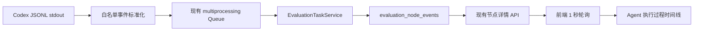
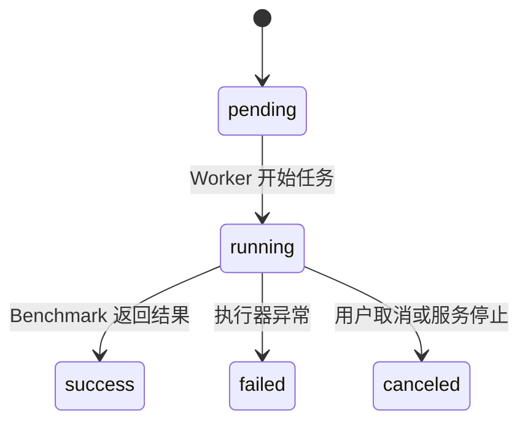
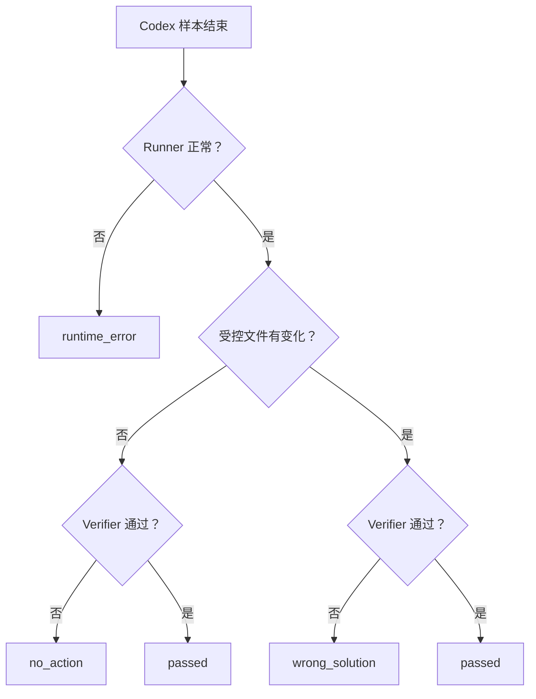
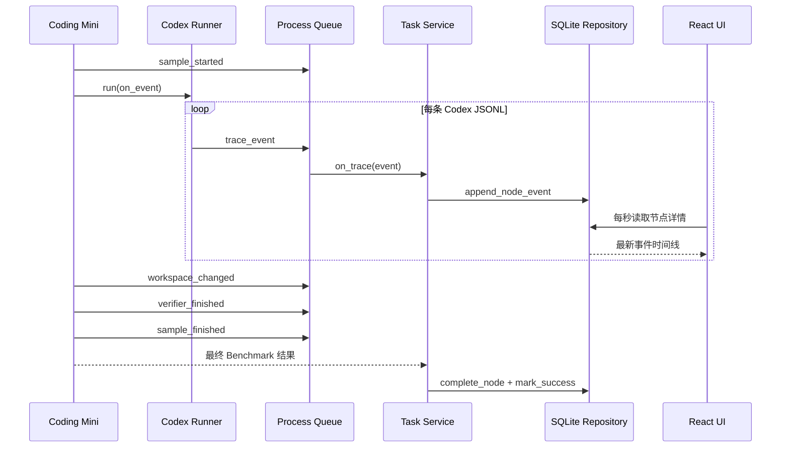

# EvalHub Agent 实时执行过程设计

## 1. 目标

让用户在现有任务详情中实时看到 Codex Agent 的可验证执行过程，并能区分以下失败：

- Agent 运行环境失败。
- 模型只输出文字、没有调用工具或修改文件。
- 模型修改了文件，但实现未通过隐藏校验。
- Agent 修改和验证均成功。

本功能只展示外部可观察动作，不展示模型内部思维链。

## 2. 范围

首版只覆盖当前固定组合：

```text
evaluation_type = agent
agent_framework = codex
dataset = coding_mini
adapter = ollama
```

首版不增加：

- WebSocket 或 SSE。
- 新数据库表。
- 通用 Trace 平台。
- 原始 JSONL 文件归档。
- 多 Agent 协议或远程 Agent Bridge。

旧 Agent 任务没有过程节点时，继续展示原有结果，不做数据迁移。

## 3. 方案选择

采用“Codex 流式 JSONL + 现有 SQLite 节点事件 + 1 秒轮询”。



选择理由：

- 复用现有节点、审计事件、API 和轮询能力。
- 事件可在服务重启后回放。
- 一秒延迟满足本地评测控制台，不需要维护长连接。
- 事件与任务、样本和执行尝试具有稳定关联。

## 4. Agent 执行节点

新 Agent 任务创建时附带一个轻量节点：

```text
node_key = agent:coding_mini
kind = agent_benchmark
max_attempts = 1
```

Agent 仍沿用当前直接执行路径，不接入模型 Benchmark 的准备、聚合和终结 DAG。该节点只负责：

- 保存运行状态。
- 保存实时过程事件。
- 保存最终 Agent Benchmark 输出摘要。

任务生命周期与节点生命周期保持一致：



## 5. Coding Mini 任务公开信息

时间线在每个样本开始时展示 Agent 实际收到的任务说明，但不提前展示隐藏断言。

| 样本 | 初始缺陷 | Agent 目标 | 主要能力 |
| --- | --- | --- | --- |
| `pricing_total` | 合计遗漏最后一个价格 | 保留签名并正确处理全部价格和空列表 | 规划、代码理解、实现 |
| `slug_normalization` | 只处理单个空格 | 把 ASCII 单词规范化为单连字符 slug | 实现、工具使用、验证 |
| `inventory_reservation` | 先扣库存再判断，异常路径会污染状态 | 只允许正数且库存充足的预留，失败不修改库存 | 理解、工具、验证、稳健性 |

样本结束后才展示隐藏校验结果。这样用户能理解题目和失败原因，同时 Agent 无法直接读取答案。

## 6. 标准事件契约

数据库继续使用现有 `EvaluationNodeEvent`。过程事件采用以下 `event_type`：

| 事件 | 时机 | 主要 payload |
| --- | --- | --- |
| `sample_started` | 工作区创建完成、Codex 启动前 | `sample_id`、`instruction` |
| `agent_session_started` | Codex 会话或回合开始 | `sample_id`、`source_type` |
| `agent_message` | Codex 输出对外消息 | `sample_id`、`text` |
| `tool_started` | 命令或工具开始 | `sample_id`、`tool_name`、`command` |
| `tool_finished` | 命令或工具结束 | `sample_id`、`tool_name`、`exit_code`、`output` |
| `workspace_changed` | Codex 退出后检查工作区 | `sample_id`、`changed_files` |
| `verifier_finished` | 隐藏校验结束 | `sample_id`、`passed`、`message` |
| `sample_finished` | 单条样本完成分类 | `sample_id`、`outcome`、`score` |
| `runner_error` | Codex 缺失、超时、非零退出或无最终消息 | `sample_id`、`error_type`、`message` |

每条事件使用数据库自增 `id` 作为稳定顺序，不额外设计序列协议。

`actor` 固定使用下列值之一：

- `benchmark`：样本、工作区和 Verifier 阶段。
- `codex`：Codex JSONL 标准化事件。
- `worker`：任务和节点生命周期事件。

## 7. Codex JSONL 标准化

`CodexAgentRunner` 从一次性 `subprocess.run` 改为读取 `subprocess.Popen.stdout`。每读取一行：

1. 尝试解析 JSON 对象。
2. 只识别会话、消息、命令、工具和文件动作。
3. 转换为稳定的 EvalHub 事件。
4. 通过回调立即发送。
5. 未识别事件只计入总数，不保存原始正文。

Runner 使用两个标准库后台读取线程分别消费 stdout 与 stderr，主线程通过有超时的内存队列接收
新行并检查整体截止时间，避免模型长时间无输出时绕过原有超时。stderr 只保留安全截断后的诊断摘要。

已知事件按以下方式转换：

```text
thread.started / turn.started
  -> agent_session_started

item.started + command_execution / mcp_tool_call
  -> tool_started

item.completed + command_execution / mcp_tool_call
  -> tool_finished

item.completed + agent_message
  -> agent_message
```

解析器必须容忍 Codex 版本增加未知事件或字段，不因单行未知 JSON 让样本失败。

## 8. 文件变化与失败分类

Agent 退出后，以样本初始 Git 提交为基准读取受控工作区变化。忽略：

- `.evalhub/`
- `__pycache__/`
- `*.pyc`

单条样本最终分类为：

| outcome | 条件 |
| --- | --- |
| `runtime_error` | Codex 未安装、超时、非零退出或没有最终消息 |
| `no_action` | Codex 正常返回，但受控文件没有变化且 Verifier 失败 |
| `wrong_solution` | 受控文件发生变化，但 Verifier 失败 |
| `passed` | 隐藏 Verifier 通过 |



分类进入 `sample_results[].diagnostics`，使最终 JSON 和实时事件使用同一事实来源：

```json
{
  "outcome": "no_action",
  "tool_call_count": 0,
  "changed_files": [],
  "final_message_present": true,
  "verifier_passed": false
}
```

`tool_call_count` 只按 `tool_started` 计数，同一个工具的完成事件不重复累计。

## 9. 跨进程与持久化流程



跨进程消息增加一种类型：

```json
{
  "type": "trace_event",
  "event": {
    "event_type": "tool_finished",
    "actor": "codex",
    "message": "python -m pytest",
    "payload": {}
  }
}
```

## 10. UI 设计

任务资源区域与最终结果之间增加 `AgentExecutionTimeline`。Agent 任务在运行中和完成后都显示。

```text
AGENT EXECUTION                                      LIVE
Agent 执行过程                              12 EVENTS

pricing_total                                      no_action
10:21:03  样本开始    修复 total_with_tax，处理空列表
10:21:04  Codex       会话启动
10:21:07  Agent 消息  先检查 pricing.py
10:21:08  工具        读取 pricing.py
10:21:11  文件变化    无受控文件变化
10:21:12  隐藏校验    失败
10:21:12  结论        未产生代码修改
```

交互规则：

- 默认按时间正序展示，运行中事件追加在底部。
- 按样本分组，当前样本展开；已完成样本可折叠。
- 命令输出和长 Agent 消息默认显示摘要，用户可展开查看截断后的正文。
- `runtime_error`、`no_action`、`wrong_solution` 和 `passed` 使用不同状态标签。
- 页面始终保留可复制的文本，不只依赖颜色或图标。
- 旧任务没有 Agent 节点时不显示空时间线。

前端继续使用当前任务轮询。Agent 任务活动时，选中节点详情每秒刷新一次；任务终止后停止轮询。

## 11. 安全与体积限制

- 不保存或展示模型内部思维链。
- 不持久化未知 JSONL 原文。
- Agent 消息最大保留 1,000 字符。
- 命令与工具输出最大保留 2,000 字符。
- 只保存工具名称、命令、退出码、截断输出和受控文件相对路径。
- 不读取或展示环境变量、`.env`、令牌和用户 Codex 配置。
- 工作区路径对外只展示相对样本路径。

## 12. 兼容与错误处理

- `on_trace` 是可选回调；不传时 Runner 和 Benchmark 仍可独立使用。
- 单行 JSON 无法解析或类型未知时忽略展示，但继续运行。
- 事件持久化失败使任务失败，避免页面显示不可审计的结果。
- Codex 失败仍生成 `runner_error` 和 `sample_finished`，后续样本继续运行。
- 用户取消时保留已写入事件，并把活动 Agent 节点标记为取消。
- 旧任务结果、普通模型评测和同步评测接口保持兼容。

## 13. 测试策略

默认测试不调用真实 Codex、Ollama 或网络：

- Codex Runner 测试 Fake 流式进程，验证事件逐行产生、未知事件容忍、超时和错误。
- Coding Mini 测试 `passed`、`no_action`、`wrong_solution` 和 `runtime_error` 分类。
- 执行器测试 `trace_event` 能跨进程队列转发。
- 仓储测试事件追加、顺序和任务边界。
- 服务测试 Agent 节点创建、开始、成功、失败和取消。
- API 测试 Agent 节点和实时事件返回。
- 前端测试运行中时间线、题目说明、工具事件、文件变化和失败分类。
- 浏览器集成验证真实 Agent 任务运行时事件增长，完成后仍可回放。

## 14. 验收标准

1. 新 Agent 任务详情包含一个 `agent_benchmark` 节点。
2. 用户能在第一个样本完成前看到样本开始和 Codex 事件。
3. UI 展示 Agent 收到的题目说明，但运行前不泄漏隐藏断言。
4. 工具事件包含名称、命令、完成状态和安全截断输出。
5. 样本结束后展示受控文件变化和隐藏校验结果。
6. 最终明确区分 `runtime_error`、`no_action`、`wrong_solution` 和 `passed`。
7. 服务重启或页面刷新后，已经持久化的过程仍可回放。
8. 旧 Agent 任务与普通模型评测继续正常展示。
9. 不新增依赖、数据库表、SSE、WebSocket 或通用 Trace 平台。
10. 后端测试、Ruff、前端测试、类型检查、构建和浏览器真实验证通过。
