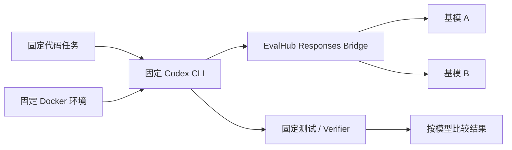
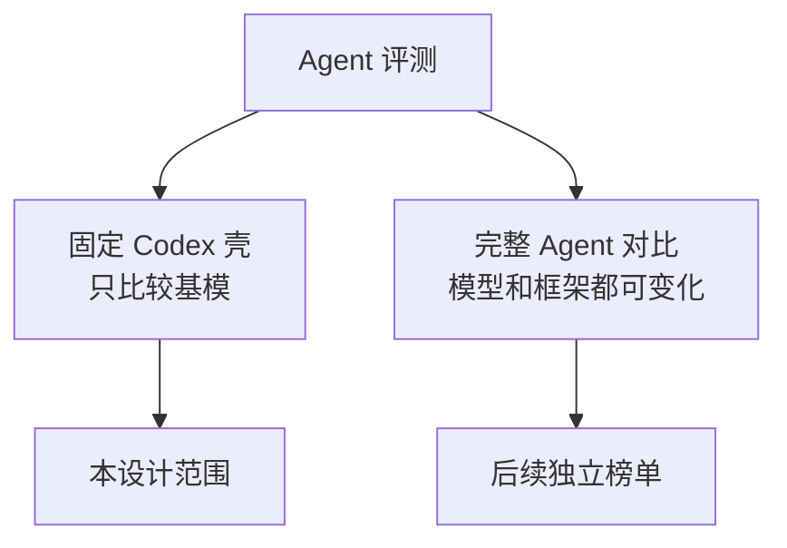
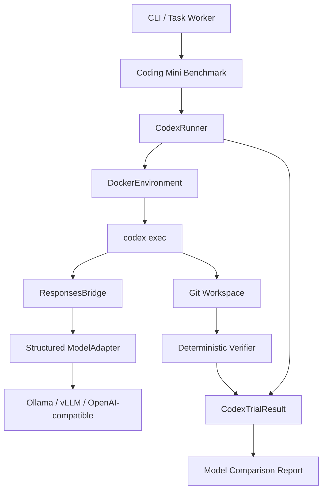
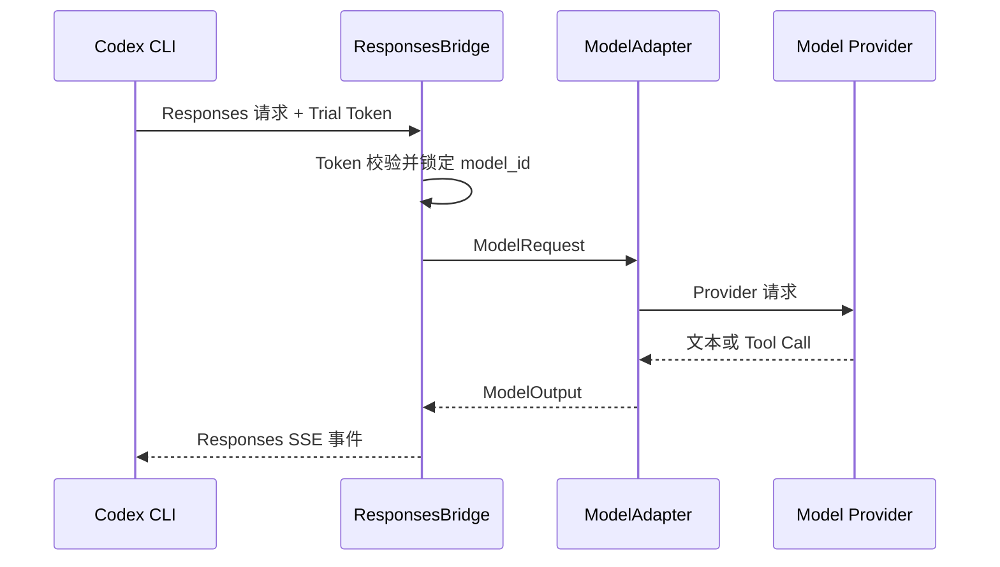
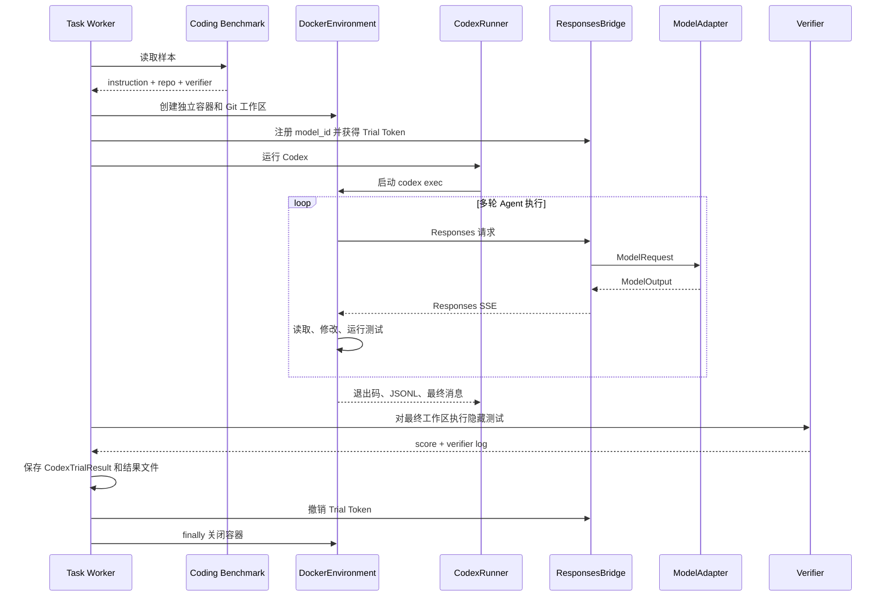
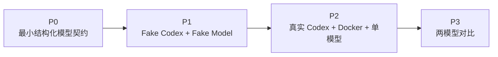

# EvalHub 固定 Codex Agent 壳基模评测工程设计

## 1. 文档信息

- 状态：待评审。
- 日期：2026-08-04。
- 目标：固定 Codex CLI、任务环境和评分方式，只替换底层模型，比较不同基模驱动代码 Agent 的能力。
- 上位设计：[EvalHub 借鉴 EvalScope 的目标架构设计](../../architecture/20260804_EvalHub借鉴EvalScope的目标架构设计.md)。
- 产品路线：[EvalHub Agent Benchmark Roadmap](../../product/20260804_Agent评测路线图.md)。

本文只规划首个可运行闭环，不提前建设通用 Agent 市场、分布式调度、执行缓存或完整 SWE-bench。

## 2. 核心结论

首版采用下面的固定实验结构：



一次正式对比中，只有以下内容允许变化：

- `model_id`。
- 明确写入实验配置的生成参数。

以下内容必须固定：

- Codex CLI 版本。
- Codex 配置、项目规则和 Skills。
- Docker 镜像与资源限制。
- Benchmark 样本和初始 Git 状态。
- 超时、网络策略和 Verifier。

结果必须命名为“Model X under Codex Scaffold Y”，不能解释成模型的全部 Agent 能力。

## 3. 目标与非目标

### 3.1 首版目标

- 用一个固定 Codex CLI 壳运行代码任务。
- 通过 EvalHub Bridge 把 Codex 请求路由给不同 ModelAdapter。
- 每条样本在独立 Docker 工作区运行。
- 收集 Codex JSONL、最终消息、Git Patch、测试日志、耗时和模型用量。
- 用最终代码状态和确定性测试评分。
- 同一组样本顺序运行至少两个模型并生成对比结果。
- 保持现有 GSM8K、MMLU、Ollama、CLI 和同步 Runner 兼容。

### 3.2 首版不做

- 不接入 Codex 以外的 External Agent。
- 不建立 Agent Scaffold 数据库和插件市场。
- 不实现并行容器池或多机调度。
- 不实现预测缓存、评分缓存和 Artifact Store。
- 不提供浏览器、桌面或宿主机 Shell Agent。
- 不运行完整 SWE-bench。
- 不用 LLM Judge 判断代码是否正确。

当第二个 External Agent 出现时，再从 CodexRunner 中提取通用 AgentRunner 注册层；首版不为尚不存在的实现预留抽象。

## 4. 评测语义

固定 Codex 壳比较的是：

```text
基模在相同 Codex Prompt、工具、上下文管理和代码环境下完成任务的能力
```

它与“比较完整 Agent 产品”不同：



同组结果必须证明控制变量一致。至少记录：

| 类别 | 记录内容 |
| --- | --- |
| Codex | CLI 版本、容器镜像摘要、配置摘要 |
| Prompt | 任务模板、`AGENTS.md` 和 Skills 内容摘要 |
| Model | 模型名、版本、Provider 和生成参数 |
| Benchmark | 名称、版本、样本 ID 和初始仓库提交 |
| Environment | 镜像摘要、CPU、内存、网络和超时 |
| Verifier | 测试命令、版本和结果摘要 |
| EvalHub | 代码版本和运行时间 |

如果除 Model 以外的固定项不同，报告必须拆组，不能把结果放进同一列直接排名。

## 5. 最小系统架构



首版只保留四个执行组件：

1. `CodexRunner`：构造和管理 Codex CLI 进程。
2. `ResponsesBridge`：在 Codex Responses 协议和 ModelAdapter 之间转换。
3. `DockerEnvironment`：准备隔离工作区、执行命令并清理容器。
4. `CodingMiniBenchmark`：提供任务、初始仓库和 Verifier。

领域层只增加本闭环真正需要的运行配置和结果类型，不增加 Catalog、Resolver、Artifact Store 或通用外部 Agent 注册系统。

## 6. 最小数据契约

### 6.1 CodexRunConfig

一组模型对比共享一个配置：

```text
CodexRunConfig
├── model_ids
├── codex_cli_version
├── codex_image
├── codex_image_digest
├── benchmark_name
├── benchmark_version
├── sample_ids
├── generation_config
├── timeout_seconds
├── cpu_limit
├── memory_limit
├── network_enabled
└── repeat_count
```

首版不把 Scaffold 单独注册成持久实体。运行时计算 `scaffold_hash`，用于确认同组结果的固定项一致：

```text
scaffold_hash = sha256(
  codex_cli_version
  + codex_image_digest
  + codex_config
  + instruction_template
  + rules_and_skills
  + environment_limits
  + benchmark_version
  + verifier_version
)
```

### 6.2 CodexTrialResult

```text
CodexTrialResult
├── job_id
├── sample_id
├── model_id
├── scaffold_hash
├── status
├── task_score
├── error_type
├── error_message
├── wall_time_seconds
├── model_call_count
├── input_tokens
├── output_tokens
├── result_dir
└── created_at
```

首版状态收敛为：

- `success`：Verifier 通过。
- `task_failed`：Agent 正常结束，但 Verifier 未通过。
- `incompatible`：模型无法满足 Codex 协议。
- `timeout`：超过 Trial 墙钟预算。
- `error`：模型、Bridge、Agent、环境或 Verifier 异常，细分写入 `error_type`。
- `canceled`：用户取消。

`error_type` 只用于诊断，可取 `model`、`bridge`、`agent`、`environment`、`verifier` 或 `data`，不再复制一套复杂状态机。

### 6.3 结果文件

首版直接保存到任务运行目录：

```text
.runtime/agent-runs/<job_id>/<sample_id>/
├── codex-events.jsonl
├── final-message.txt
├── patch.diff
├── verifier.log
└── result.json
```

目录已属于运行产物，不进入 Git。后续确实需要跨机器存储时再引入 Artifact Store。

## 7. CodexRunner

### 7.1 职责

- 验证容器中的 Codex CLI 版本。
- 使用参数列表构造 `codex exec`，不拼接未验证 Shell 字符串。
- 注入 Bridge URL、短期 Trial Token 和固定 Provider 配置。
- 使用独立的 Codex 状态目录，禁止复用宿主机登录信息。
- 收集 JSONL、最终消息、退出码、超时和取消信息。
- 在任何结束路径终止子进程并交给环境关闭容器。

CodexRunner 不负责：

- 选择 Benchmark。
- 判断代码是否正确。
- 直接读取 Provider API Key。
- 管理任务队列。

### 7.2 概念命令

```bash
codex exec \
  --ephemeral \
  --ignore-user-config \
  --json \
  --sandbox workspace-write \
  --output-last-message /evalhub-output/final-message.txt \
  --cd /workspace \
  --model EVALHUB_MODEL_ALIAS \
  TASK_INSTRUCTION
```

Provider 的 Base URL、Responses Wire API 和 Token 环境变量由 Runner 通过受控配置注入，Benchmark 样本不能覆盖这些值。

### 7.3 运行状态隔离

- 容器内使用独立 `CODEX_HOME` 和 HOME。
- 不挂载宿主机 Codex 配置、Keychain、历史 Session 或个人 Skills。
- `--ignore-user-config` 和 `--ephemeral` 为固定选项。
- 项目级 `AGENTS.md` 和允许的 Skills 必须随 Benchmark 版本化并进入 `scaffold_hash`。

## 8. ResponsesBridge

现有 `ModelAdapter.generate(prompt: str) -> str` 无法表达 Codex 的工具调用。首版需要最小结构化模型契约：

```text
ModelRequest
├── messages
├── tools
├── generation_config
└── metadata

ModelOutput
├── message
├── tool_calls
├── stop_reason
├── usage
└── error
```

旧 Adapter 继续通过文本兼容桥服务现有 Benchmark；只有实现结构化输出的 Adapter 才能声明 Codex 兼容。

### 8.1 Bridge 流程



Trial Token 与 `job_id + sample_id + model_id` 绑定。请求正文不能改变真正的模型路由。

### 8.2 首版协议范围

只实现固定 Codex CLI 版本实际使用、且有契约测试覆盖的 Responses 子集：

- 创建 Response。
- 流式 SSE。
- 文本输入输出。
- 工具定义、工具调用和工具结果。
- 完成、用量和错误事件。
- 取消和客户端断开。

未支持字段返回结构化错误，不静默忽略。升级 Codex CLI 前必须先更新协议夹具。

Bridge 复用项目已有 FastAPI/Uvicorn 可选依赖，不引入另一套 HTTP 框架。它只监听任务 Worker 和容器能访问的受控地址，不作为公共服务暴露。

## 9. DockerEnvironment

Codex 和模型生成的命令都视为不受信任输入。真实评测默认禁止在宿主机执行。

### 9.1 首版默认限制

| 配置 | 默认值 |
| --- | --- |
| Trial 超时 | 600 秒 |
| CPU | 2 个逻辑核 |
| 内存 | 4 GiB |
| 可写空间 | 4 GiB |
| 容器用户 | 非 root |
| 公网访问 | 关闭 |
| 允许网络 | 仅 EvalHub Bridge |
| 真实 Trial 并发 | 1 |

### 9.2 强制安全边界

- 不挂载 Docker Socket、SSH Agent、云凭据和宿主 HOME。
- 初始仓库以样本 Artifact 创建，不挂载用户真实开发目录。
- Provider 凭据只存在于 Bridge 进程，容器只获得短期 Trial Token。
- 工作区之外只读，输出目录有大小限制。
- 超时、取消和异常都会终止进程树并删除容器。
- 隔离创建失败时返回 `environment` 错误，不允许降级到宿主机。

如果批处理必须跳过 Codex 内部交互审批，只允许在上述外层 Docker 隔离已经验证生效时使用；该选项不能在 Local Environment 开启。

## 10. Coding Mini Benchmark

第一版先使用 10 至 20 条内部小型代码任务验证系统，不直接接完整公开 Benchmark。

每条样本包含：

```text
CodingSample
├── id
├── instruction
├── repository_artifact
├── repository_commit
├── allowed_paths
├── verifier_command
├── timeout_seconds
└── capability_tags
```

首批任务覆盖：

- 修复单函数边界缺陷。
- 增加一个小函数并通过测试。
- 修复 CLI 参数解析。
- 修复异常处理。
- 根据失败测试定位实现问题。

约束：

- 仓库小且依赖离线可用。
- 初始提交和测试固定。
- 隐藏测试在 Agent 结束后执行，不向 Codex 暴露。
- 评分依据最终测试结果，不依据最终回答文本。

Coding Mini 闭环稳定后，再单独规划 SWE-bench Verified Mini；它不进入本设计首版任务。

## 11. 单条 Trial 流程



Verifier 自身失败时保存 Patch 和运行日志，结果标记为 `error/verifier`，以后可以手工重跑 Verifier；首版不建设自动重评队列。

## 12. 模型兼容性门禁

并非所有文本模型都能驱动 Codex。每个模型在正式运行前执行 3 条确定性探测：

1. 基础 Responses 文本往返。
2. 单次工具调用并生成合法参数。
3. 读取工具结果后给出最终提交。

任一探测失败则标记为 `incompatible`，记录具体步骤和原因，不进入任务成功率分母。

兼容性探测不是单独平台：它与 Coding Mini 使用相同 Bridge 和 Adapter，只换成三个固定小样本。

## 13. 指标与报告

### 13.1 主指标

- `task_success_rate`：Verifier 通过的有效 Trial 比例。
- `valid_trial_rate`：排除数据、环境和 Verifier 故障后的有效执行比例。
- `timeout_rate`：超过墙钟预算的比例。

### 13.2 诊断指标

- 平均墙钟耗时。
- 模型调用次数。
- 输入和输出 Token。
- 模型、Bridge、Agent、环境和 Verifier 错误数。
- Git Patch 大小和 Codex 退出码。

命令次数、Patch 大小和轨迹只用于诊断，不直接决定成功。不同正确路径都应被 Verifier 接受。

报告最小结构：

```text
Codex: <pinned-cli-version>
Scaffold Hash: <hash>
Benchmark: evalhub-coding-mini@v1

┌─────────┬─────────┬─────────┬─────────┬────────┬──────────┐
│ Model   │ Success │ Valid   │ Timeout │ Tokens │ Wall Time│
├─────────┼─────────┼─────────┼─────────┼────────┼──────────┤
│ Model A │   ...   │   ...   │   ...   │  ...   │   ...    │
│ Model B │   ...   │   ...   │   ...   │  ...   │   ...    │
└─────────┴─────────┴─────────┴─────────┴────────┴──────────┘
```

报告同时列出不兼容模型、无效样本和基础设施错误，不能只展示一个平均分。

## 14. 目标文件范围

首版控制在以下核心文件内：

```text
src/evalhub/
├── domain/
│   └── agent_trials.py       # CodexRunConfig 与 CodexTrialResult
├── agent/
│   ├── codex.py              # CodexRunner
│   ├── bridge.py             # ResponsesBridge
│   └── environment.py        # DockerEnvironment
└── benchmarks/
    └── coding_mini.py        # 样本准备与 Verifier

tests/
├── test_agent_trials.py
├── test_codex_runner.py
├── test_responses_bridge.py
├── test_agent_environment.py
└── test_coding_mini.py
```

实现时可以增加必要的 `__init__.py` 和测试夹具，但不提前创建空 Catalog、Registry、Backend、Cache 或 Artifact 模块。

正在开发的 `evalhub.tasks` 继续负责任务排队、进度和资源采集。Codex 逻辑通过一个明确的执行函数接入，不写入 Task Service 内部状态机。

## 15. 分阶段交付



### P0：最小结构化模型契约

- 增加 Codex 需要的 Message、ToolCall、ModelRequest 和 ModelOutput。
- 给现有文本 Adapter 提供兼容包装。
- 增加 CodexRunConfig 和 CodexTrialResult。

验收：现有测试不变，Fake Adapter 能表达一次工具调用。

### P1：无外部依赖闭环

- 实现 ResponsesBridge 的最小协议转换。
- 使用 Fake Codex 可执行文件测试命令、JSONL、超时和取消。
- 使用 Fake ModelAdapter 测试文本和工具调用。
- 使用临时 Git 仓库测试 Coding Mini Verifier。

验收：默认 pytest 不需要网络、Docker、Codex、Ollama 或付费 API。

### P2：真实单模型闭环

- 实现 DockerEnvironment。
- 使用预构建且版本锁定的 Codex 镜像。
- 跑通一个兼容模型和 3 条 Coding Mini 样本。

验收：Codex 在容器内修改代码，隐藏测试决定成功；宿主机配置和凭据不可见。

### P3：两模型对比

- 为两个模型执行兼容性门禁。
- 用相同 Scaffold 和样本顺序运行两个模型。
- 输出主指标、Token、时延和错误分类。

验收：报告中的 `scaffold_hash` 相同，只有 model_id 和明确的生成参数不同。

## 16. 测试策略

### 16.1 默认单元测试

- 配置校验和 `scaffold_hash` 稳定性。
- Codex 命令构造和不安全参数保护。
- Trial Token 不能跨模型、样本或过期后使用。
- Responses 文本、工具调用、错误和 SSE 转换。
- Fake Codex 正常退出、非零退出、无最终消息、超时和取消。
- Coding Mini 工作区准备、Patch 提取和 Verifier。
- 所有异常路径都会撤销 Token 并调用环境清理。

### 16.2 显式集成测试

- Bridge 本地随机端口往返。
- Docker 非 root、资源限制、网络限制和清理。
- 一条真实 Codex + Fake Model 任务。
- 一条真实 Codex + 真实 ModelAdapter 任务。

集成测试使用显式标记，默认 `.venv/bin/python -m pytest` 不下载数据、不启动外部服务、不调用付费 API。

## 17. 主要风险

| 风险 | 首版控制措施 |
| --- | --- |
| Codex 升级改变协议 | 锁定 CLI 和镜像；升级前更新契约夹具 |
| 模型不能驱动 Codex | 三条兼容性探测，失败单独报告 |
| Bridge 改变模型语义 | 保存脱敏后的请求事件摘要并做端到端契约测试 |
| Agent 命令危害宿主机 | 强制 Docker、非 root、无敏感挂载、禁止降级 |
| 不同模型实验条件不同 | 计算并比较 `scaffold_hash` |
| 隐藏测试泄漏 | Agent 结束后再执行 Verifier |
| 首版范围膨胀 | 只实现四个组件和 Coding Mini，不接 SWE-bench |

## 18. 验收标准

首版完成时必须满足：

1. 固定一个 Codex CLI 版本和 Docker 镜像。
2. 同一组 Coding Mini 样本可以顺序运行至少两个模型。
3. Codex 通过 EvalHub ResponsesBridge 调用指定 ModelAdapter。
4. 模型真实凭据不进入 Trial 容器、Trace 或结果文件。
5. 每条真实 Trial 使用独立、非 root、资源受限的 Docker 工作区。
6. 任务成功只由最终环境和确定性 Verifier 决定。
7. 不兼容、超时、任务失败和系统错误分开统计。
8. 同组结果具有相同 `scaffold_hash`。
9. 超时、取消和错误路径都能终止进程并清理容器。
10. 现有文本评测接口和 Benchmark 保持兼容。
11. 默认测试不依赖网络、Docker、Codex、Ollama 或付费 API。

## 19. 后续演进触发条件

只有出现真实需求时才增加以下能力：

- 出现第二个 External Agent：提取通用 AgentRunner 和 Runner Registry。
- 运行产物需要跨机器保存：引入 Artifact Store。
- Verifier 经常变化且模型调用成本显著：拆分执行缓存与评分缓存。
- 单机串行成为实际瓶颈：引入容器池和并发调度。
- Coding Mini 连续稳定且环境隔离通过安全验证：单独规划 SWE-bench Verified Mini。

## 20. 参考边界

本地 EvalScope 可参考：

- `evalscope/agent/external/runners/codex.py`：Codex CLI 和 Provider 注入。
- `evalscope/agent/external/bridge/`：Responses Bridge 与 Trace。
- `evalscope/benchmarks/swe_bench/`：工作区、Patch 和 Verifier 边界。

只借鉴职责划分和已验证的协议事实，不把 EvalScope 的全量注册系统、依赖或抽象原样搬入 EvalHub。
