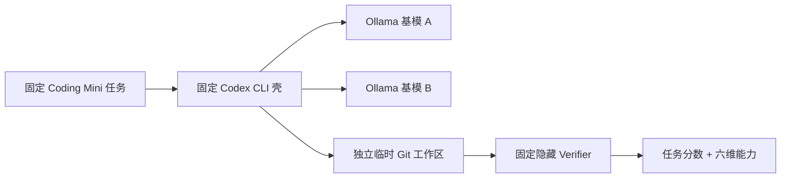
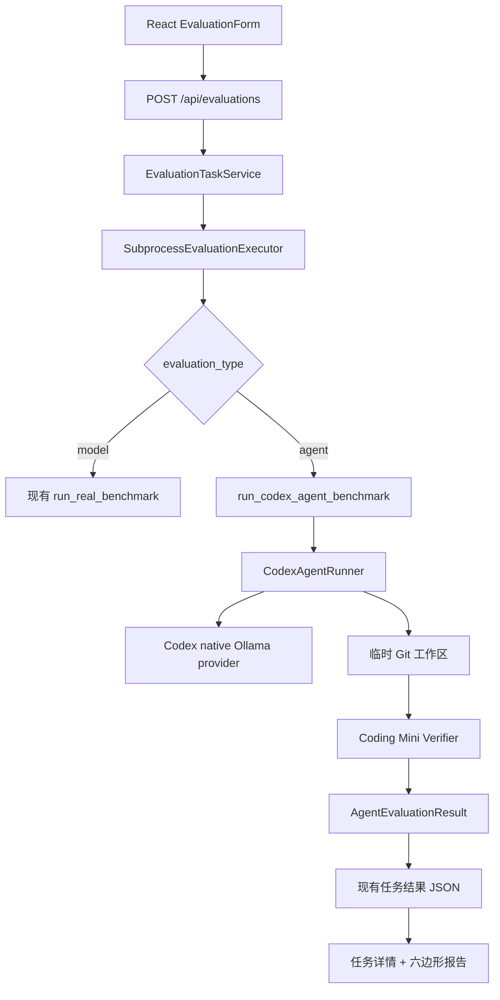
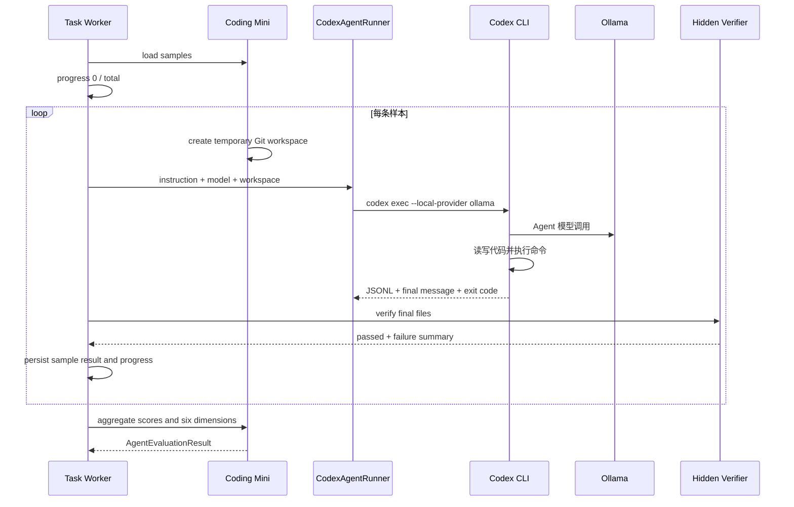
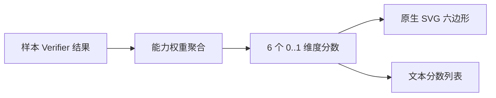
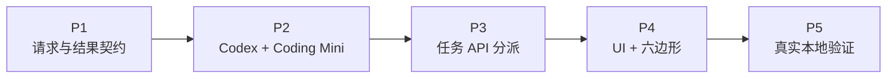

# EvalHub 固定 Codex Agent 壳基模评测工程设计

## 1. 目标

在现有 EvalHub 本地控制台中增加一个可以真实运行的 Agent 评测闭环：

1. 用户在 UI 选择“Agent 评测”、Codex 壳和 Ollama 基模。
2. 后端创建持久化任务并显示排队、运行、完成、失败或取消状态。
3. Codex CLI 在独立临时 Git 工作区完成 Coding Mini 任务。
4. 隐藏 Verifier 根据最终代码状态评分。
5. UI 展示任务结果、失败样例和六边形能力报告。

本设计只覆盖单机、本地开发和可信用户场景。多租户隔离、远程模型 Bridge 和完整 SWE-bench 不进入首版。

## 2. 方案复审结论

上一版方案包含 Responses Bridge、Docker Environment、Scaffold Registry、Artifact Store 和执行缓存。结合当前仓库与本机 Codex CLI 能力复审后，首版删去这些预设层：

- Codex CLI 已原生支持 `--oss --local-provider ollama`，首版直接调用 Ollama，不建设 Responses Bridge。
- Codex CLI 已提供 `workspace-write` sandbox，首版使用临时工作区和原生 sandbox，不建设 Docker 管理器。
- 当前只有一个 Codex 壳，不建设通用 Agent Runner Registry。
- 现有任务中心已经提供 SQLite、FIFO Worker、进度、资源、取消和结果详情，直接扩展其请求和执行分派。
- 六边形报告使用原生 SVG，不增加图表依赖。

当出现远程 Provider、多租户或第二个 External Agent 时，再分别引入 Bridge、容器隔离和通用 Runner 协议。

## 3. 评测语义

评测固定 Codex 壳，只替换底层模型：



同组比较固定：

- Codex CLI 版本。
- Codex 命令参数和项目指令模板。
- Coding Mini 版本和样本顺序。
- 初始文件、Verifier、超时和 sandbox 模式。

只允许变化：

- Ollama `model`。
- 用户明确提交的模型地址。

结果应解释为“某基模在固定 Codex 壳下的代码 Agent 能力”，不是模型的全部通用能力。

## 4. 最小架构



首版新增两个后端模块和一个前端报告组件：

- `evalhub.agent.codex`：Codex 命令构造、执行、事件解析和结果收集。
- `evalhub.benchmarks.coding_mini`：样本、工作区、隐藏 Verifier 和能力聚合。
- `AgentCapabilityHexagon.tsx`：六维 SVG 能力报告。

其他修改都发生在现有任务请求、执行分派、API 类型和结果详情中。

## 5. 请求契约

现有 `TaskRequest` 增加两个带兼容默认值的字段：

```text
evaluation_type: "model" | "agent" = "model"
agent_framework: "codex" | None = None
```

Agent 请求示例：

```json
{
  "evaluation_type": "agent",
  "agent_framework": "codex",
  "dataset": "coding_mini",
  "adapter": "ollama",
  "model": "qwen2.5-coder:7b",
  "base_url": "http://127.0.0.1:11434",
  "sample_mode": "quick"
}
```

兼容规则：

- 缺少 `evaluation_type` 的旧请求继续按模型评测运行。
- Agent 评测首版只接受 `dataset=coding_mini`、`agent_framework=codex` 和 `adapter=ollama`。
- 模型名不能为空。
- `quick` 固定运行 3 条覆盖全部六维能力的任务。
- `all` 运行当前版本全部 Coding Mini 任务。
- `custom` 沿用现有正整数数量校验。

## 6. Coding Mini Benchmark

首版提供 3 条轻量、离线、确定性 Python 任务。每条任务包含：

```text
CodingAgentSample
├── id
├── instruction
├── files
├── verifier
└── capability_weights
```

任务覆盖：

| 样本 | 主要行为 | 主要能力 |
| --- | --- | --- |
| `pricing_total` | 修复价格合计遗漏和空列表边界 | 规划、代码理解、实现 |
| `slug_normalization` | 实现 ASCII slug 规范化 | 实现、工具使用、验证 |
| `inventory_reservation` | 修复库存成功与拒绝路径 | 代码理解、工具使用、验证、稳健性 |

每个样本由 Python 代码构造到独立目录，不下载公开数据集。Verifier 在 Codex 进程结束后运行，并只返回：

- `passed`。
- 稳定的失败摘要。
- 用于六维聚合的能力权重。

Verifier 的隐藏断言不写入 Agent 可读工作区。

## 7. CodexAgentRunner

每个样本的概念命令：

```bash
codex exec \
  --oss \
  --local-provider ollama \
  --model MODEL_NAME \
  --ephemeral \
  --ignore-user-config \
  --json \
  --sandbox workspace-write \
  --output-last-message RESULT_FILE \
  --cd SAMPLE_WORKSPACE \
  TASK_INSTRUCTION
```

Runner 行为：

1. 使用参数列表启动子进程，不拼接 Shell 字符串。
2. 通过受控环境变量把任务请求中的 Ollama 地址传给 Codex。
3. 使用样本工作区内独立 `CODEX_HOME`，不复用用户历史 Session、项目配置和个人 Skills。
4. 解析 JSONL，记录 Agent 最终消息和可用的模型事件数量。
5. 超时或取消时终止 Codex 进程。
6. 返回退出码、最终消息、事件数量、耗时和错误摘要。

首版不使用 `--dangerously-bypass-approvals-and-sandbox`，也不允许 Codex 写出样本工作区。

## 8. Agent 运行流程



单条样本失败不会丢失前面结果；CLI 缺失、Ollama 不可用等全局前置错误直接让任务失败并给出明确提示。

## 9. 结果契约

Agent 结果沿用普通 EvaluationResult 的公共字段，并增加 Agent 专属字段：

```json
{
  "job_id": "job_x",
  "status": "success",
  "evaluation_type": "agent",
  "dataset": "coding_mini",
  "benchmark": "EvalHub Coding Mini",
  "model": "qwen2.5-coder:7b",
  "adapter": "ollama",
  "metric": "hidden_verifier_pass_rate",
  "total_samples": 3,
  "passed_samples": 2,
  "average_score": 0.6667,
  "failed_sample_ids": ["repair_error_path"],
  "failed_examples": [],
  "agent": {
    "framework": "codex",
    "cli_version": "pinned-at-runtime",
    "scaffold_hash": "sha256..."
  },
  "capability_report": {
    "overall_score": 0.6667,
    "dimensions": []
  },
  "sample_results": []
}
```

任务列表继续只返回轻量摘要，并增加 `evaluation_type` 与 `agent_framework`，让用户能区分普通评测和 Agent 评测。

## 10. 六维能力模型

六边形固定使用以下顺序，避免不同任务报告的顶点含义漂移：

1. `planning`：任务拆解与修改路径选择。
2. `code_understanding`：理解现有代码和缺陷上下文。
3. `implementation`：实现结果是否正确。
4. `tool_use`：是否有效使用搜索、命令和测试工具。
5. `verification`：是否通过验证发现并修正问题。
6. `robustness`：异常、边界和失败路径是否处理正确。

每条样本通过后，对其能力权重记 1；失败记 0。维度得分为覆盖该维度样本的加权平均。`quick` 的 3 条固定任务共同覆盖全部六维，避免用没有样本的零分误导用户。



六边形是能力分布可视化，不代替主指标。UI 同时展示总成功率和每个维度的数值。

## 11. UI 设计

### 11.1 发起评测

现有“新建评测”增加顶部二选一：

- 模型评测。
- Agent 评测。

选择 Agent 评测后：

- Benchmark 固定显示“EvalHub Coding Mini”。
- Agent 壳固定显示“Codex CLI”。
- 模型继续使用 Ollama 已安装模型下拉框。
- 地址继续使用现有 Ollama 地址。
- 样本范围沿用全部、快速和自定义。
- 按钮文案变为“发起 Agent 评测”。

模型评测现有行为不变。

### 11.2 任务状态

现有任务列表继续显示：

- 排队、运行、成功、失败和取消。
- 进度、耗时、CPU、内存和可用时的 GPU。
- Agent 任务额外显示“Codex Agent”标签。

### 11.3 结果与六边形报告

```text
┌ Agent 能力报告 ─────────────────────────────────────┐
│ 总成功率 66.67%        Codex · qwen2.5-coder:7b    │
│                                                     │
│        规划                                         │
│         /\                                          │
│  稳健性 /  \ 代码理解                               │
│        |    |                                       │
│    验证 \  / 工具使用                               │
│          实现                                       │
│                                                     │
│ 规划 0.75 · 理解 0.80 · 实现 0.67 · ...             │
└─────────────────────────────────────────────────────┘
```

视觉延续现有蓝白、边框驱动控制台。六边形是唯一新增视觉签名：

- 使用主蓝表示模型能力区域。
- 网格和标签使用现有中性色。
- 不使用渐变、3D、动画或外部图表库。
- SVG 提供标题和描述，旁边始终存在文本分数列表。
- 小屏时图表和列表纵向排列，不产生横向滚动。

## 12. 错误与安全边界

| 错误 | 用户可见结果 |
| --- | --- |
| 未安装 Codex CLI | 任务失败，提示安装或检查 PATH |
| Ollama 不可用或模型不存在 | 任务失败，保留诊断信息 |
| 单样本 Codex 超时 | 样本失败，继续后续样本 |
| Codex 非零退出 | 样本失败，保存安全 stderr 摘要 |
| Verifier 异常 | 任务失败，避免把平台错误记成模型零分 |
| 用户取消 | 终止外层评测子进程，任务标记取消 |

安全约束：

- 每条样本只操作新建临时目录。
- 使用 Codex `workspace-write` sandbox。
- 不读取或输出真实密钥、用户 Codex 配置和 `.env`。
- 每个样本使用独立 `CODEX_HOME`，并随任务运行目录一起保留，便于本地诊断。
- 结果只保存截断后的消息和错误摘要。
- 该 MVP 仅用于本机可信用户；生产多租户上线前必须增加外层容器隔离。

## 13. 文件范围

```text
src/evalhub/
├── agent/
│   ├── __init__.py
│   └── codex.py
├── benchmarks/
│   ├── __init__.py
│   └── coding_mini.py
└── tasks/
    ├── models.py
    ├── executor.py
    └── presentation.py

frontend/src/
├── components/dashboard/
│   ├── EvaluationForm.tsx
│   ├── EvaluationTaskPanel.tsx
│   ├── EvaluationResultDetail.tsx
│   └── AgentCapabilityHexagon.tsx
├── lib/evaluation.ts
└── types.ts
```

API 路由继续复用 `/api/evaluations`，不新增一套 `/api/agents` 调度系统。

## 14. 测试策略

默认测试不调用真实 Codex、Ollama 或网络：

- Codex 命令构造、JSONL 解析、超时和错误使用 Fake Process。
- Coding Mini 使用 Fake Runner 修改临时工作区并运行真实 Verifier。
- 任务执行器测试 Agent 与 Model 两个分派分支。
- API 测试验证 Agent 请求解析与兼容默认值。
- 前端测试验证模式切换、Agent 请求、任务标签和六边形报告。
- SVG 测试验证六个顶点、能力多边形和可访问文本。

显式本地集成验证使用已安装 Codex CLI 和 Ollama 模型，至少运行一条 Coding Mini 样本。
模型必须能在 Codex 壳中实际发起工具调用；缺乏工具调用能力的小型通用模型可能只描述修改而不落盘，
此时隐藏 Verifier 会正确给出 0 分，而不会相信自然语言中的“已完成”声明。

## 15. 分阶段实施



每个阶段都以先失败测试、再最小实现、再回归验证的方式完成。

## 16. 验收标准

1. UI 可以在模型评测和 Agent 评测之间切换。
2. UI 可以选择 Ollama 基模并发起 Codex Agent 评测。
3. 请求立即返回持久化任务，页面显示真实排队和运行状态。
4. 后端真实调用 Codex CLI，而不是用前端模拟结果。
5. Agent 任务在独立临时 Git 工作区执行，并由隐藏 Verifier 判分。
6. 用户可以查看任务结果、失败信息和样本级结果。
7. 成功的 Agent 任务显示六边形能力报告和六个文本分数。
8. 普通模型评测现有行为保持兼容。
9. 后端单元测试、Ruff、前端测试、类型检查和构建通过。
10. 在本机可用的 Codex + Ollama 环境下完成至少一条真实端到端 Agent 样本。

## 17. 后续触发条件

- 需要远程或多 Provider 模型：增加 Responses Bridge。
- 需要不可信用户或共享部署：增加 Docker/远程 Sandbox。
- 出现第二个 Agent CLI：提取 AgentRunner 协议和 Registry。
- Coding Mini 稳定且需要公开可比结果：单独接入 SWE-bench Verified Mini。
- 运行产物需要跨机器保留：再引入 Artifact Store。
