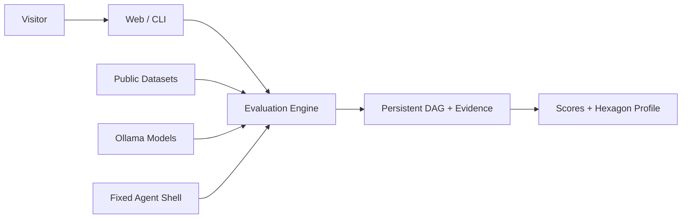

# README 访客优先改版设计

## 目标

把仓库根目录 README 从完整运行手册改为通用项目主页，让第一次访问仓库的人能按顺序回答四个问题：

1. EvalHub 是什么。
2. 它能做什么、与普通模型测试脚本有什么区别。
3. 产品界面和评测结果长什么样。
4. 如何在本地启动，以及去哪里继续阅读详细文档。

README 只保留建立项目认知和完成首次启动所需的信息。协议细节、数据来源哈希、完整命令、目录树、
故障排查和演进路线继续由 `docs/` 承载。

## 读者与表达原则

面向所有第一次进入仓库的 visitor，不为招聘、企业采购或某一类开发者单独优化。

- 首屏先给定位和入口，再展示图片，避免图片先于解释出现。
- 使用中文主文案，保留 Benchmark、Agent、Ollama 等项目必要术语。
- 只描述当前已经实现并可以从仓库验证的能力。
- 使用 GitHub 原生 Markdown、少量居中 HTML 和 Shields 徽章，不引入文档生成器。
- README 控制在约 200 行；需要持续维护的事实尽量链接到正式文档。

## 页面结构

### 1. 首屏

首屏由以下内容组成：

- 居中的 `EvalHub` 标题。
- 一句话定位：本地优先的 LLM 与 Agent Benchmark 评测平台。
- 两句以内的说明：统一模型、数据集、工作流、证据和六维能力报告。
- 只放真实且稳定的徽章，例如 Python 3.11+、React、Local First。
- 锚点导航：功能、快速开始、界面预览、架构、文档。
- 一张宽幅主图，使用当前“发起模型评测”界面截图，并提供有意义的替代文本。

仓库当前没有 GitHub Actions 和 `LICENSE`，因此不展示测试状态或许可证徽章。是否添加开源许可证是
独立的法律选择，不在 README 排版任务中代替项目维护者决定。

### 2. 核心能力

用四项短说明代替当前十三条长列表：

| 能力 | 访客需要理解的内容 |
| --- | --- |
| 模型 Benchmark | 运行真实公开数据集，保留样本级结果与聚合得分 |
| Agent 评测 | 固定 Agent 壳、任务和隐藏 Verifier，比较不同本地基模 |
| 可复现工作流 | 持久化 DAG、检查点、重试、资源指标与审计事件 |
| 六维能力画像 | 统一展示知识、指令、数学、推理、代码和安全可信 |

不在首页枚举内部 Registry、Evaluator 类名或规划中的基础设施。

### 3. 快速开始

快速开始提前到能力介绍之后，提供一条从仓库根目录可执行的主路径：

```bash
git clone https://github.com/NEDONION/evalhub.git
cd evalhub
python3 -m venv .venv
.venv/bin/python -m pip install -e ".[dev]"
npm --prefix frontend install
./scripts/start_local.sh
```

前置条件只保留 Python 3.11+、Node.js 20+、npm；Ollama 用于本地模型推理，Docker 用于代码类
Benchmark。详细安装、CLI 和故障排查链接到本地运行指南。

### 4. 界面预览

复用现有 5 张 GitHub user-attachments，不删除、不替换，也不复制图片文件到仓库：

1. 主图：发起模型评测界面。
2. 模型评测：任务 DAG、资源指标和执行审计。
3. Agent 评测：实时过程与失败样本审计。
4. 评测结果：Agent 六维能力画像。
5. 资产管理：模型下载和数据集缓存。

后四张图使用两列 HTML 表格呈现，配短标题和准确的 `alt`。Agent 实时过程截图包含失败堆栈，标题
明确标注为“失败样本审计”，使它成为错误可追踪能力的示例，而不是被误读为产品当前不可用。

### 5. 工作原理

README 只保留一张 Mermaid 总览图：



删除启动时序图、完整评测流程图和 Agent 演进路线图；它们属于详细运行、架构或产品文档。

### 6. 评测范围与透明限制

用一个紧凑表格概括三类入口：单项公开 Benchmark、30 次模型调用的 Hexagon Mini Suite、固定 Agent
壳的 Coding Mini。正文明确：Mini Suite 不是上游完整榜单分数；代码评测依赖 Docker；当前 Ollama
缺少 prompt logprobs，部分官方协议会阻塞而不会生成近似分数。

公开数据集 revision、SHA-256、提示模板和 verifier 身份不再铺在首页，统一链接到本地运行指南及专业
六边形评测复盘。

### 7. 文档、贡献与状态

结尾提供：

- 文档中心、本地运行、系统架构、Agent 路线图四个入口。
- 简短贡献说明和本地检查命令。
- `Local MVP` 状态提示，避免把规划中的 PostgreSQL、Celery、RabbitMQ、MinIO 写成当前能力。

不保留完整目录树和“下一步建议”清单；目录会持续变化，路线图已有专门文档。

## 验证

1. README 首个宽图之前已经出现定位、徽章、导航和核心价值。
2. README 只包含一张 Mermaid 图，且使用 GitHub 支持的 `flowchart` 语法。
3. 所有相对文档链接指向仓库中存在的文件，所有图片有描述性替代文本。
4. 当前 README 的 5 个 GitHub user-attachments URL 各保留一次，主图 1 张、预览图 4 张。
5. 快速开始不包含个人绝对路径，命令与 `pyproject.toml`、`frontend/package.json`、
   `scripts/start_local.sh` 一致。
6. 不展示不存在的 CI、Release 或许可证状态，不把规划能力写成已实现能力。
7. 运行 `git diff --check`；README 仅为文档重排，不额外运行外部数据集或 Ollama 集成测试。
